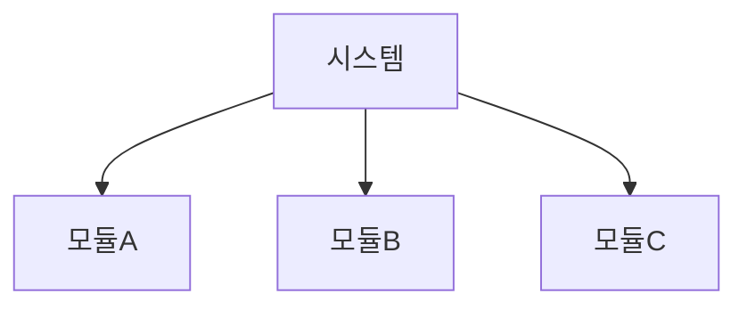
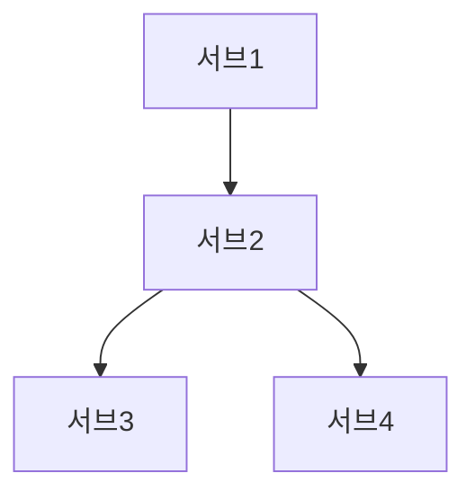
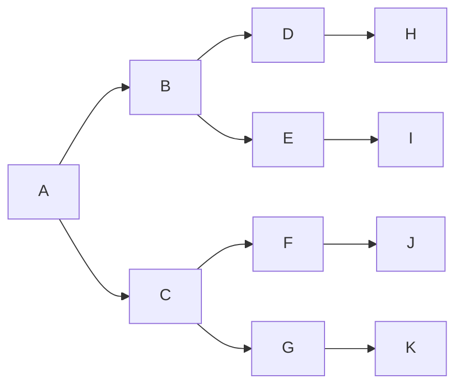
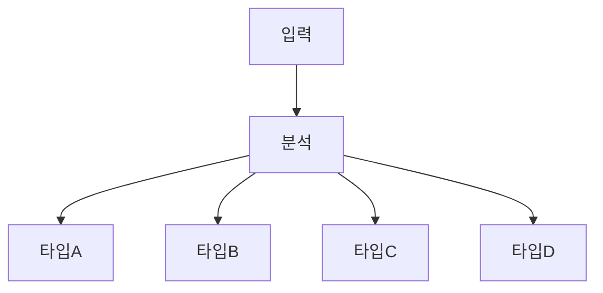
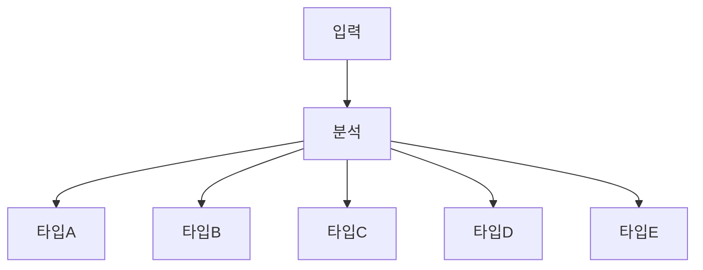
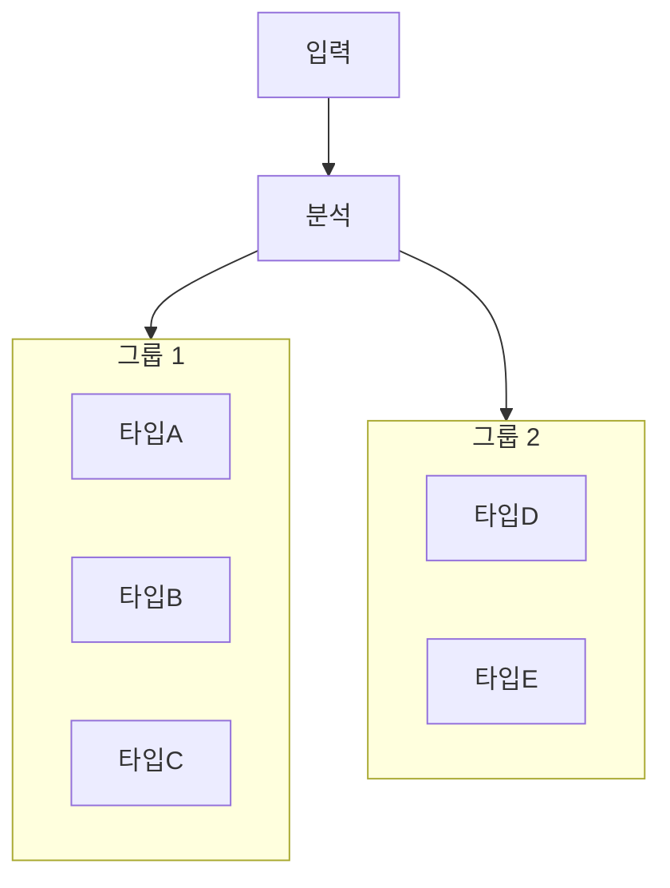

# 다이어그램 출력 규칙 — 터미널 vs 문서 분리

**트리거**: 계획 수립, 설계 문서, 아키텍처 설명 등 다이어그램이 필요한 모든 상황

## 핵심 원칙 (RESPONSE_STYLE.md 기준)

출력 위치에 따라 형식이 결정된다. (`docs/RESPONSE_STYLE.md` 시각화 규칙 참조)

| 출력 위치 | 형식 | 이유 |
|-----------|------|------|
| **터미널 채팅 응답** | ASCII art 필수 (최대 65자) | Mermaid/PNG 인라인 렌더링 불가 |
| **저장 파일 (.md)** | Mermaid 코드 블록 기본 | 문서 뷰어에서 렌더링 가능 |

## 적용 기준

| 대상 | 형식 |
|------|:----:|
| Phase 1 계획 문서 (`docs/01-plan/`) | **Mermaid** |
| Phase 2 설계 문서 (`docs/02-design/`) | **Mermaid** |
| PRD 문서 (`docs/00-prd/`) | **Mermaid** |
| 아키텍처 설명 (터미널 채팅 응답) | **ASCII** |
| 워크플로우/흐름도 (터미널 채팅 응답) | **ASCII** |
| UI 레이아웃/와이어프레임 (터미널 채팅 응답) | **ASCII** |
| 저장 파일 내 기술 다이어그램 ASCII (흐름/시퀀스/아키텍처) | `--mockup <파일>` → **Mermaid 코드 블록** 변환 |
| 저장 파일 내 UI 화면/컴포넌트 ASCII 목업 | `--mockup <파일>` → **3-Tier 라우팅** (HTML 선택 시 B&W Refined Minimal 기본 적용) |

## 적용 제외 대상 (--mockup 사용)

아래 컨텍스트에서는 ASCII 대신 `--mockup`으로 목업을 생성한다. B&W Refined Minimal은 HTML 목업의 기본 스타일이며, 3-Tier 라우팅이 출력 형식을 결정한다 (정본: `mockup-hybrid/SKILL.md` v2.0):

| 대상 | 처리 방식 |
|------|-----------|
| PRD 내 UI 화면 목업 | `--mockup` (HTML 선택 시 B&W Refined Minimal 기본 적용) |
| 최종 보고서/이해관계자 전달물의 시각화 | `--mockup` |
| 화면 설계 목업 (docs/mockups/) | `--mockup` |

**구분 원칙**: 터미널에서 즉시 확인하는 기술 다이어그램 → ASCII / 문서로 저장·전달되는 목업 → `--mockup` (3-Tier 라우팅 자동 선택, B&W Refined Minimal 기본)

## HTML 목업 사이즈 규약

| 속성 | 값 |
|------|-----|
| width | auto |
| height | auto |
| max-width | 720px |
| max-height | 1280px |

> ASCII 다이어그램에는 사이즈 규약 없음.

## ASCII 다이어그램 스타일 가이드

### Flowchart (흐름도)

```
                  +------------------+
                  |   사용자 요청     |
                  +--------+---------+
                           |
                           v
                  +--------+---------+
                  |   복잡도 판단     |
                  +--+-----+------+--+
                     |     |      |
            0-1      |  2-3|   4-5|
                     v     v      v
               +-----+ +------+ +------+
               |LIGHT| |STAND.| |HEAVY |
               +--+--+ +--+---+ +--+---+
                  |        |        |
                  v        v        v
               [단일]  [루프]   [병렬]
```

### Sequence (시퀀스)

```
  User        Lead       Planner    Executor    Architect
   |            |            |           |           |
   |--요청----->|            |           |           |
   |            |--계획----->|           |           |
   |            |<--plan.md--|           |           |
   |            |--구현----------------->|           |
   |            |<--완료-----------------|           |
   |            |--검증----------------------------->|
   |            |<--APPROVE--------------------------|
   |<--완료-----|            |           |           |
```

### Tree (트리 구조)

```
  src/
  ├── agents/
  │   ├── config.py
  │   ├── parallel_workflow.py
  │   └── teams/
  │       ├── coordinator.py
  │       ├── base_team.py
  │       └── dev_team.py
  └── lib/
      ├── gmail/
      └── slack/
```

### Table (데이터 비교)

```
  +----------+--------+---------+--------+
  | 모드     | Phase2 | QA 횟수 | 검증   |
  +----------+--------+---------+--------+
  | LIGHT    | 스킵   | 1회     | Arch.  |
  | STANDARD | 설계   | 3회     | +CR    |
  | HEAVY    | 상세   | 5회     | +CR    |
  +----------+--------+---------+--------+
```

### Component (UI 와이어프레임)

```
  +------------------------------------------+
  | [Logo]        Navigation          [User] |
  +------------------------------------------+
  |          |                               |
  | Sidebar  |       Main Content            |
  |          |                               |
  | [Menu1]  |  +-------------------------+ |
  | [Menu2]  |  |     Card Component      | |
  | [Menu3]  |  |  Title: ...             | |
  |          |  |  Description: ...       | |
  |          |  |  [Action Button]        | |
  |          |  +-------------------------+ |
  |          |                               |
  +----------+-------------------------------+
```

## Mermaid 노드 레이블 줄바꿈 규칙 (CRITICAL)

**트리거**: 저장 파일(.md)에 Mermaid 다이어그램 작성 시

### 줄바꿈 방법 비교

| 방법 | GitHub | VS Code | 로컬 mermaid.js | 결론 |
|------|:------:|:-------:|:---------------:|------|
| `\n` 리터럴 | 리터럴로 표시 | 리터럴로 표시 | 렌더링됨 | **사용 금지** |
| `<br/>` 태그 | 줄바꿈 | 줄바꿈 | 줄바꿈 | **권장** |
| 실제 줄바꿈 + 백틱 | 지원 (v10.1+) | 지원 | 지원 | 조건부 허용 |

### 올바른 예시 (CORRECT)

```
A["이미지 입력<br/>(str | PIL.Image)"] --> B[HybridPipeline.analyze]
H --> I["List[UIElement]<br/>element_type='graphic'<br/>layer=1"]
```

### 금지 예시 (WRONG — 반복 발생 패턴)

```
A["이미지 입력\n(str | PIL.Image)"] --> B[HybridPipeline.analyze]
H --> I["List[UIElement]\nelement_type='graphic'\nlayer=1"]
```

**`\n` 리터럴은 GitHub/VS Code에서 줄바꿈으로 처리되지 않는다. `<br/>` 사용 필수.**

---

## Mermaid 가독성 제어 규칙 (CRITICAL)

**트리거**: Mermaid flowchart/graph 다이어그램 작성 시

### 왜 텍스트가 작아지는가

> Dagre 엔진은 리프 노드 총합으로 SVG 폭을 계산하고, `useMaxWidth: true`(기본값)가 뷰포트 폭에 맞게 축소하여 텍스트가 작아진다.

### 규칙 1: 깊이별 노드 수 제한 (기존)

한 레벨(같은 깊이)에 배치되는 노드는 **최대 4개**까지만 허용한다. 5개 이상이면 텍스트가 축소되어 가독성이 떨어진다.

| 한 층 노드 수 | 처리 |
|:-------------:|------|
| 1~4개 | 허용 |
| 5개+ | **분할 필수** — subgraph 또는 2단 구조로 재배치 |

**예외**: 단일 깊이(더 깊은 분기 없음)에서 5~6개는 허용. 누적 폭 문제가 없기 때문.

### 규칙 2: 리프 노드 총합 제한 (신규 — 근본 원인 대응)

깊이별로 4개 이하여도 트리가 분기하면 최하단 리프 총합이 폭발한다. **리프 노드 총합이 실제 횡적 폭을 결정**한다.

| 리프 총합 | 처리 |
|:---------:|------|
| 1~6개 | 허용 |
| 7~8개 | 다이어그램 분할 또는 LR 방향 전환 필수 |
| 9개+ | 다이어그램 분할 필수 (Overview + Detail) |

### 규칙 3: 노드 레이블 길이 제한

| 언어 | 최대 길이 | 초과 시 |
|------|:---------:|---------|
| 한글 | 8자 | `<br/>`로 2줄 분할 |
| 영문 | 15자 | `<br/>`로 2줄 분할 |
| 3줄 이상 | 금지 | 약어 사용 |

### 분할 전략: 깊이별 위반 시

| 상황 | 해결 방법 |
|------|----------|
| 같은 카테고리 5개+ 병렬 | subgraph로 그룹핑 (2~3개씩) |
| 서로 다른 카테고리 혼합 | 별도 subgraph로 분리 |
| 단순 나열 | 2행으로 재배치 (상위 2~3 + 하위 2~3) |

### 분할 전략: 리프 총합 위반 시 — Overview + Detail 패턴

노드 15개+ 또는 리프 총합 7개+ → 단일 다이어그램을 **여러 개로 분할**:





> Overview는 상위 구조만, Detail은 각 모듈 내부를 별도 다이어그램으로 분리.

### 분할 전략: LR 방향 전환

깊은 트리(깊이 4+)에서 폭이 폭발할 때 → `flowchart LR`로 전환하여 폭을 높이로 변환:



> 파이프라인 직렬 흐름, 데이터 변환 체인, 분기 후 합류 패턴에 적합.

### `%%{init}%%` 설정 무효 경고

> **⚠️ `%%{init: {'flowchart': {'nodeSpacing': N}}}%%` 등의 설정은 GitHub Markdown에서 완전히 무시됩니다.** 자체 호스팅 환경에서만 동작합니다. ELK 엔진도 GitHub 미지원.

### 올바른 예시 (CORRECT — 깊이별 4개 이하)



### 금지 예시 (WRONG — 5개 이상)



### 5개→분할 예시 (subgraph)



---

## 단계적 다이어그램 빌드업 규칙

**트리거**: 노드 6개 이상 또는 subgraph 포함 다이어그램을 문서에 삽입하는 모든 상황

### 핵심 원칙

복잡한 다이어그램은 한 번에 완성본을 보여주지 않는다. Stage별로 노드를 1~2개씩 추가하며 설명한 뒤, 최종 완성 다이어그램을 제시한다.

### 적용 기준

| 기준 | 처리 |
|------|------|
| 노드 5개 이하, subgraph 없음 | 단일 다이어그램 OK |
| 노드 6개 이상 또는 subgraph 포함 | **단계적 빌드업 필수** |

### 빌드업 패턴

| Stage | 다이어그램 | 텍스트 |
|:-----:|-----------|--------|
| 1 | 시작 노드 + 첫 연결 (2노드) | 1줄 캡션 |
| 2 | +1~2 노드 추가. 신규 노드 강조 | 1줄 캡션 |
| 3 | +1~2 노드 추가. 신규 노드 강조 | 1줄 캡션 |
| N | 최종 완성 다이어그램 | 2줄 인사이트 |

### 노드 강조 방법 (Mermaid)

- 현재 Stage 신규 노드: `%% NEW` 주석 + 대괄호 표기 `["[NEW] 노드명"]`
- 이전 Stage 노드: 기본 표기
- **`classDef`, `:::class` 스타일 사용 금지** — 기본형만 허용


### 금지

- 노드 6개+ 다이어그램을 단일 Stage로 제시 금지
- Stage 사이에 3줄 이상 텍스트 삽입 금지 (캡션만)

---

## 금지 사항

- **터미널 채팅 응답**에서 Mermaid 코드 블록 사용 금지 (렌더링 불가)
- 다이어그램을 PNG/SVG 파일로만 제공하고 끝내기 금지
- 텍스트 설명만으로 복잡한 흐름을 대체하기 금지
- **저장 파일**에서 ASCII 다이어그램 강제 금지 (Mermaid 사용)
- **Mermaid 노드 레이블**에서 `\n` 리터럴 사용 금지 — `<br/>` 사용 (모든 렌더러 호환)
- **Mermaid 다이어그램**에서 한 층(같은 깊이) 5개 이상 노드 배치 금지 — subgraph 또는 2단 재배치로 분할
- **리프 노드 총합 7개 이상** 단일 다이어그램 금지 — Overview + Detail 분할 또는 LR 전환
- **`%%{init}%%`** 설정으로 GitHub 가독성 문제 해결 시도 금지 (GitHub에서 무시됨)
- **`classDef`, `:::class`** 스타일 사용 금지 — 기본형 노드만 허용
- **노드 레이블 3줄 이상** 금지 — 약어 사용
