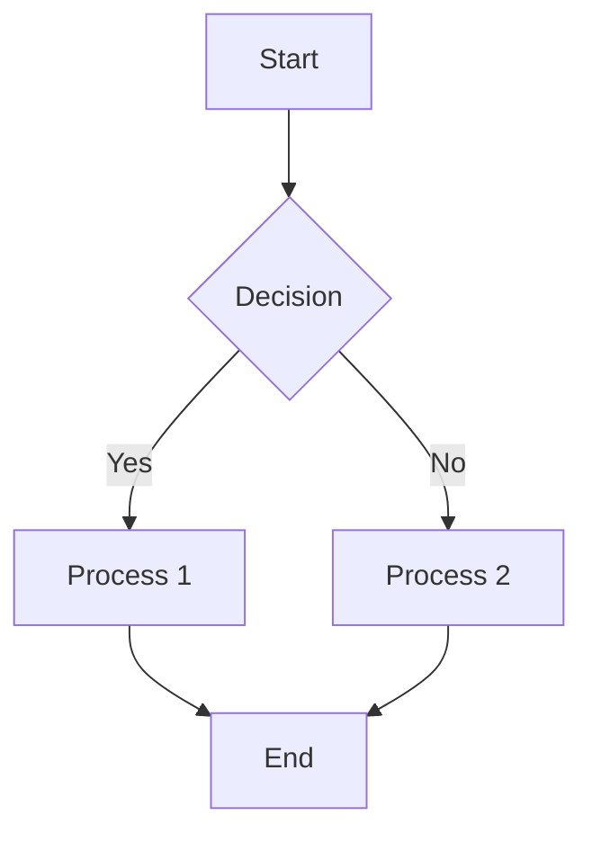

# Diagram Design Standards

**Version**: 1.0.0 | **Based on**: OpenAI Codex Agent Loop Best Practices

이 문서는 프로젝트 전체에서 사용되는 다이어그램의 크기, 폰트, 노드 규격을 정의합니다.

---

## 1. Viewport 표준

### 출력 크기

| 용도 | Viewport | 비고 |
|------|----------|------|
| **PRD 다이어그램** | 900×600 | 기본값, 문서 삽입용 |
| **아키텍처 다이어그램** | 1200×800 | 넓은 흐름도 |
| **모바일 목업** | 375×667 | iPhone SE 기준 |
| **태블릿 목업** | 768×1024 | iPad 기준 |
| **데스크톱 목업** | 1440×900 | 데스크톱 기준 |

### 스크린샷 명령어

```powershell
# PRD 다이어그램 (기본)
npx playwright screenshot "file.html" "output.png" --full-page --viewport-size="900,600"

# 아키텍처 다이어그램 (넓음)
npx playwright screenshot "file.html" "output.png" --full-page --viewport-size="1200,800"

# 모바일 목업
npx playwright screenshot "file.html" "output.png" --full-page --viewport-size="375,667"
```

---

## 2. 폰트 크기 표준

### Typography Scale

| 요소 | 크기 | 용도 |
|------|------|------|
| **Title (H1)** | 24px | 다이어그램 제목 |
| **Section (H2)** | 18px | 섹션 헤더 |
| **Node Label** | 14px | 노드 내 텍스트 |
| **Sub-label** | 12px | 부가 설명, 범례 |
| **Caption** | 11px | 작은 주석, 화살표 라벨 |

### Font Stack

```css
font-family: -apple-system, BlinkMacSystemFont, 'Segoe UI', Roboto, 'Noto Sans KR', sans-serif;
```

### 가독성 규칙

- **최소 크기**: 11px (화살표 라벨)
- **노드 내 텍스트**: 14px (기본), 복잡한 노드는 12px
- **제목**: 24px (bold), 중앙 정렬

---

## 3. 노드 크기 표준

### Flow Diagram Nodes

| 노드 유형 | 크기 (W×H) | 용도 |
|-----------|------------|------|
| **Start/End** | 80×40 px | 시작/종료 (둥근 모서리) |
| **Process** | 140×60 px | 일반 프로세스 |
| **Decision** | 100×100 px | 분기점 (다이아몬드) |
| **Data** | 140×50 px | 데이터 입출력 |
| **Sub-process** | 160×70 px | 서브 프로세스 |

### Agent Workflow Nodes

| 노드 유형 | 크기 (W×H) | 용도 |
|-----------|------------|------|
| **Phase Box** | 300×auto px | 단계 컨테이너 |
| **Agent Node** | 120×50 px | 에이전트 표시 |
| **Tool Node** | 100×40 px | 도구 표시 |
| **Connector** | 60×2 px | 수평 연결선 |
| **Vertical Line** | 2×40 px | 수직 연결선 |

### 색상 규격

| 요소 | 색상 | Hex |
|------|------|-----|
| **Primary Node** | 검정 | #333333 |
| **Background** | 흰색 | #FFFFFF |
| **Border** | 검정 | #333333 (2px) |
| **Success Label** | 초록 | #2E7D32 |
| **Error Label** | 빨강 | #C62828 |
| **Secondary BG** | 회색 | #F5F5F5 |
| **Muted Text** | 회색 | #666666 |

---

## 4. 간격 및 레이아웃

### Spacing Scale

| 크기 | 값 | 용도 |
|------|-----|------|
| **xs** | 8px | 노드 내 패딩 |
| **sm** | 16px | 요소 간 간격 |
| **md** | 24px | 행 간 간격 |
| **lg** | 40px | 섹션 간 간격 |
| **xl** | 60px | 브랜치 간 간격 |

### Grid System

```
┌─────────────────────────────────────────────────────────────┐
│  padding: 20px                                              │
│  ┌───────────────────────────────────────────────────────┐  │
│  │  Title (24px, center, mb: 40px)                       │  │
│  └───────────────────────────────────────────────────────┘  │
│                                                             │
│  ┌─────────┐  ← gap: 24px →  ┌─────────┐                   │
│  │  Node   │                 │  Node   │                   │
│  └─────────┘                 └─────────┘                   │
│                                                             │
│  └───────────── max-width: 800px (center) ────────────────┘ │
└─────────────────────────────────────────────────────────────┘
```

---

## 5. ASCII 다이어그램 표준

커맨드/에이전트 문서 내 ASCII 다이어그램 규격:

### 박스 문자

```
┌──────┐   상단 모서리: ┌ ┐
│      │   수직선: │
└──────┘   하단 모서리: └ ┘
           수평선: ─
```

### 화살표

```
→ (오른쪽)    ← (왼쪽)
↓ (아래)     ↑ (위)
▼ (채워진 아래)  ▲ (채워진 위)
```

### 예시: 워크플로우

```
/auto "작업"
    │
    ▼
┌─────────────────────────────────────────────────────────────┐
│ Phase 0: 작업 분석                                           │
│   - 복잡도 평가                                              │
│   - 영향 범위 추정                                           │
└─────────────────────────────────────────────────────────────┘
    │
    ├─ 복잡 ──────────────────────┐
    │                             ▼
    │                    ┌────────────────┐
    │                    │   RALPLAN      │
    │                    └────────────────┘
    │
    └─ 단순 ──► 직접 실행
```

### 너비 가이드

- **최대 너비**: 70자 (터미널 호환)
- **박스 너비**: 내용 + 좌우 패딩 2자
- **들여쓰기**: 4스페이스 단위

---

## 6. Mermaid 다이어그램 표준

### 기본 설정

```mermaid
%%{init: {
  'theme': 'base',
  'themeVariables': {
    'fontSize': '14px',
    'fontFamily': '-apple-system, BlinkMacSystemFont, Segoe UI, Roboto, sans-serif',
    'primaryColor': '#333',
    'primaryTextColor': '#fff',
    'primaryBorderColor': '#333',
    'lineColor': '#333',
    'secondaryColor': '#f5f5f5',
    'tertiaryColor': '#fff'
  }
}}%%
```

### Flowchart 예시



---

## 7. HTML 템플릿 적용

### mockup-flow.html 표준 적용

```css
/* Node Standards */
.node-start, .node-end {
  width: 80px;
  height: 40px;
  font-size: 14px;
}
.node-process {
  width: 140px;
  height: 60px;
  font-size: 14px;
}
.node-decision {
  width: 100px;
  height: 100px;
  font-size: 14px;
}

/* Spacing Standards */
.flow { gap: 24px; }
.flow-row { gap: 16px; }
.branch { gap: 60px; }

/* Typography */
.title { font-size: 24px; }
.arrow-label { font-size: 11px; }
.legend-item { font-size: 12px; }
```

---

## 8. 적용 체크리스트

다이어그램 생성 시 확인:

- [ ] Viewport: 900×600 (PRD) 또는 1200×800 (아키텍처)
- [ ] Title: 24px, 중앙 정렬
- [ ] Node Label: 14px
- [ ] 최소 폰트: 11px 이상
- [ ] Node 크기: 표준 규격 준수
- [ ] 간격: 24px (행 간), 60px (브랜치 간)
- [ ] 색상: #333 (기본), #2E7D32 (성공), #C62828 (실패)

---

**Version History**

| 버전 | 날짜 | 변경 |
|------|------|------|
| 1.0.0 | 2026-01-28 | 초기 버전 (OpenAI Codex 분석 기반) |
