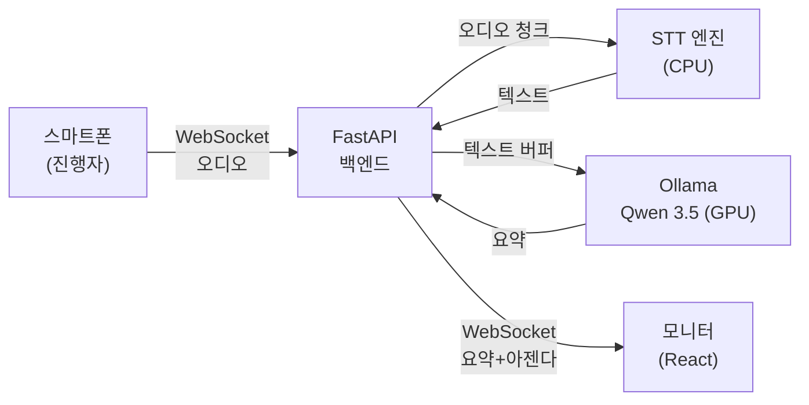
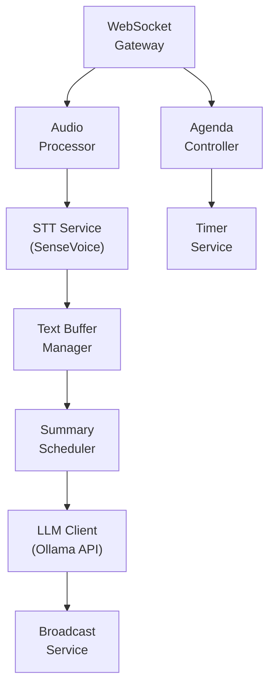
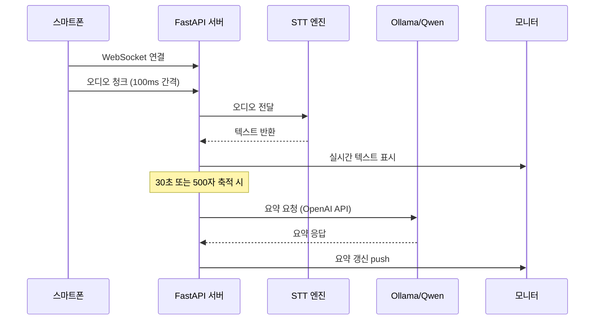

# 실시간 회의 관리 시스템 (Auto Meeting) PRD

> **Version**: v1.4 | **Date**: 2026-03-20 | **Status**: Draft
> **Appetite**: Big 6주

## Market Context

### 페인포인트

- 회의 중 수기 기록 → 핵심 내용 누락, 참석자 집중력 분산
- 회의록 작성에 30분+ 추가 소요 → 비생산적 반복 작업
- 아젠다 시간 관리 부재 → 회의 시간 초과, 후순위 안건 논의 불가
- 클라우드 AI 회의 솔루션 (Otter.ai, Fireflies 등) → 월 구독료 + 데이터 외부 유출 우려

### 기존 솔루션 비교

| 솔루션 | 실시간 STT | AI 요약 | 아젠다 추적 | 데이터 위치 | 비용 |
|--------|:----------:|:-------:|:-----------:|:-----------:|:----:|
| Otter.ai | O | O | X | 클라우드 | $16.99/월 |
| Fireflies.ai | O | O | X | 클라우드 | $18/월 |
| Notion AI | X | O | X | 클라우드 | $10/월 |
| **Auto Meeting** | **O** | **O** | **O** | **로컬** | **무료** |

### 차별점

1. **완전 로컬 처리** — 음성 데이터, 텍스트, 요약 모두 사내 서버에서 처리 (데이터 유출 제로)
2. **아젠다 시간 추적** — 기존 솔루션에 없는 실시간 아젠다별 타이머/프로그레스 바
3. **초기 비용 이후 무료** — 클라우드 구독 없이 기존 GPU 서버 활용

## 1. 개요

- **목적**: 회의실에서 스마트폰으로 음성을 캡처하고, 로컬 AI가 실시간으로 STT + 요약 + 아젠다 추적을 수행하여 대형 모니터에 표시하는 시스템
- **배경**: `C:\claude\auto_meeting\docs\firstlook.md` 기반. 사용자가 Google Workspace 기반을 검토했으나 실시간 WebSocket/오디오 스트리밍에 구조적 한계 확인 → 별도 웹앱 개발로 결정
- **범위**:
  - **In Scope**: 스마트폰 음성 캡처, 실시간 STT, AI 요약, 아젠다 CRUD/시간추적, 모니터 디스플레이
  - **Out of Scope**: 화자 분리(Speaker Diarization), 다국어 동시통역, 모바일 네이티브 앱, 클라우드 배포

## 2. 사용자 페르소나

| 페르소나 | 역할 | 주요 행동 | 니즈 |
|---------|------|----------|------|
| **진행자** | 회의 주재, 아젠다 관리 | 스마트폰으로 회의 시작/종료, 아젠다 전환 | 시간 내 아젠다 소화, 실시간 요약 확인 |
| **참석자** | 회의 참여, 발언 | 모니터로 요약/아젠다 확인 | 기록 부담 없이 논의에 집중 |
| **관리자** | 사전 아젠다 등록, 회의록 관리 | 웹에서 아젠다 CRUD, 회의 후 요약 확인 | 회의 전 준비, 회의 후 기록 아카이빙 |

## 3. 사용자 여정

### Happy Path

```
[회의 전]
관리자 → 웹에서 아젠다 등록 (제목, 목표시간) → 저장

[회의 시작]
진행자 → 스마트폰 브라우저 접속 → "회의 시작" 탭
       → 녹음 시작 → 음성이 WebSocket으로 서버 전송

[회의 중]
서버 → STT 실시간 변환 → 텍스트 버퍼 축적
     → 30초 주기로 LLM 요약 갱신 → WebSocket으로 모니터 푸시

모니터 → 실시간 요약 표시 + 현재 아젠다 강조 + 타이머

진행자 → 스마트폰에서 "다음 아젠다" 탭 → 아젠다 전환
       → "회의 종료" 탭 → 최종 회의록 생성

[회의 후]
관리자 → 웹에서 최종 회의록 확인/편집/다운로드
```

### Edge Case

| 상황 | 처리 |
|------|------|
| 네트워크 끊김 | 스마트폰 로컬 버퍼링 → 재연결 시 일괄 전송 |
| STT 오인식 | 회의 후 텍스트 수동 편집 기능 |
| 아젠다 시간 초과 | 모니터에 경고 표시 (빨간 프로그레스 바) |
| 동시 발언 | 단일 오디오 스트림 처리 (화자 분리 Out of Scope) |
| LLM 서버 다운 | STT는 계속 동작, 요약만 "서버 응답 없음" 표시 |

## 4. 기능 요구사항

### P0 — MVP (필수)

| ID | 기능 | 설명 | 기술 |
|----|------|------|------|
| FR-001 | 스마트폰 음성 캡처 | 브라우저에서 마이크 접근, 실시간 오디오 스트리밍 | MediaRecorder API + WebSocket |
| FR-002 | 실시간 STT | 오디오 → 텍스트 실시간 변환 (한국어) | 오픈소스 STT (섹션 6 참조) |
| FR-003 | 실시간 AI 요약 | 축적된 텍스트를 주기적으로 요약 | 로컬 Ollama/Qwen 3.5 (port 9000) |
| FR-004 | 아젠다 사전 등록 | 회의 전 아젠다 CRUD (제목, 목표시간, 순서) | REST API + DB |
| FR-005 | 아젠다 시간 추적 | 아젠다별 경과시간 타이머, 목표 대비 프로그레스 바 | 프론트엔드 타이머 + 서버 동기화 |
| FR-006 | 모니터 디스플레이 | 실시간 요약 + 아젠다 + 타이머를 대형 모니터에 표시 | WebSocket push + React UI |
| FR-007 | 회의 시작/종료 제어 | 진행자 스마트폰에서 녹음 시작/정지/종료 | 프론트엔드 컨트롤 패널 |

### P1 — 확장 (다음 스프린트)

| ID | 기능 | 설명 |
|----|------|------|
| FR-008 | 회의록 아카이빙 | 회의 종료 후 최종 요약 + 전체 텍스트 저장/검색 |
| FR-009 | 아젠다 자동 감지 | STT 텍스트에서 현재 논의 아젠다 자동 판별 |
| FR-010 | 회의록 편집 | 회의 후 텍스트/요약 수동 수정 UI |
| FR-011 | 키워드 하이라이트 | 요약에서 핵심 키워드/결정사항/Action Item 강조 |

### P2 — 미래 (백로그)

| ID | 기능 | 설명 |
|----|------|------|
| FR-012 | 화자 분리 | 발언자별 텍스트 분리 (Speaker Diarization) |
| FR-013 | 다국어 지원 | 영어/일본어 등 추가 언어 STT |
| FR-014 | Slack/Teams 연동 | 회의록 자동 공유 |

## 5. 비기능 요구사항

| ID | 항목 | 요구사항 | 비고 |
|----|------|---------|------|
| NFR-001 | STT 지연 | 음성 입력 후 텍스트 표시까지 ≤ 3초 | CPU INT8 RTF 1.23 (52분 기준). GPU 모드 또는 청크 병렬화 필요 |
| NFR-002 | 요약 갱신 주기 | 30초 간격 또는 500자 축적 시 (먼저 도달하는 조건) | LLM 호출 빈도 제어 |
| NFR-003 | 동시 접속 | 모니터 1대 + 스마트폰 5대 이상 동시 지원 | WebSocket 연결 관리 |
| NFR-004 | 가용성 | 1시간 연속 회의 중 시스템 중단 없음 | 메모리 누수 방지 |
| NFR-005 | 데이터 보안 | 모든 데이터 로컬 처리, 외부 API 호출 제로 | 핵심 차별점 |
| NFR-006 | 브라우저 호환 | Chrome/Safari 모바일 + Chrome 데스크톱 | MediaRecorder API 지원 브라우저 |
| NFR-007 | VRAM 예산 | STT ≤ 0GB (CPU), LLM ≤ 10GB → 총 ≤ 10GB / 16GB | GPU 경합 방지 |
| NFR-008 | 한국어 STT 정확도 | WER ≤ 15% (일상 회의 환경) | 조용한 회의실 기준 |

## 6. 기술 스택 결정

### 레이어별 선택

| 레이어 | 선택 | 근거 |
|--------|------|------|
| **STT** | 오픈소스 (아래 후보 비교) | 클라우드 API 비용 제거, 데이터 로컬 보존 |
| **AI 요약** | Ollama + Qwen 3.5 9B (port 9000) | 기존 `C:\claude\vllm` 인프라 재사용, OpenAI 호환 API |
| **VRAM 전략** | STT = CPU, LLM = GPU | GPU 경합 제로 (128GB RAM으로 CPU STT 충분) |
| **프론트엔드** | React + Next.js | SPA + WebSocket 실시간 UI |
| **백엔드** | FastAPI (Python) | STT/LLM Python 생태계 통합 용이 |
| **실시간 통신** | WebSocket (Socket.IO) | 양방향 오디오/텍스트/요약 스트리밍 |
| **DB** | SQLite | 경량, 단일 서버, 동시성 낮음 |

### STT 엔진 최종 선정: faster-whisper + Whisper Large-v3 (CPU INT8)

POC 비교 테스트(2026-03-19)를 통해 최종 결정:

#### 비교 테스트 결과 (동일 2분 회의 오디오)

| 모델 | 디바이스 | 추론(초) | RTF | 세그먼트 | 한국어 품질 | 판정 |
|------|---------|:-------:|:---:|:-------:|:---------:|:----:|
| ghost613/faster-whisper-large-v3-turbo-korean | CPU INT8 | 21.2 | 0.18 | 2 | 낮음 (의미 불명) | 탈락 |
| **openai/whisper-large-v3 (faster-whisper)** | **CPU INT8** | **26.4** | **0.22** | **16** | **우수** | **채택** |
| SenseVoice-Small (이전 POC) | CPU | 5.7 | 0.05 | - | 매우 낮음 | 탈락 |

#### 최종 선정 근거

- **whisper-large-v3**: 실제 회의 내용을 정확히 인식 ("돔님도 안오셨어요", "케빈님도 오전 반차", "서머리가 하나 있으면 좋겠어요")
- **ghost613 turbo-korean**: 속도는 빠르나 한국어 회의 인식 품질 부적격 ("마이크라고 돕우고 좋고 작품들이")
- **SenseVoice-Small**: 중국어 중심 학습, 한국어 거의 인식 불가
- **GPU (RTX 5080)**: CTranslate2가 Blackwell(sm_120) 미지원으로 CPU 모드 사용. 향후 CTranslate2 업데이트 시 GPU 전환 가능

#### 채택 스택

```
faster-whisper + Whisper Large-v3 (CPU INT8) + Ollama/Qwen 3.5 (GPU, AI 요약)
- STT: CPU 전용 (RTF 0.22, 4.5x 실시간), RAM 1.77GB
- LLM: GPU 전용 (Qwen 3.5 9B, VRAM 6.6GB)
- GPU 경합 제로, 한국어 정확도 최상
```

### 로컬 인프라 현황 (`C:\claude\vllm`)

| 항목 | 값 |
|------|-----|
| GPU | RTX 5080 16GB GDDR7 |
| RAM | 128 GB DDR5-5600 |
| CPU | Intel Core Ultra 9 285K (24C/24T) |
| LLM 엔진 | Ollama (Docker Compose) |
| 모델 | Qwen 3.5 9B Q8_0 (~6.6GB VRAM) |
| API | OpenAI 호환 (`localhost:9000`) |
| Web UI | Open WebUI (`localhost:9001`) |

## 7. 시스템 아키텍처

### Overview



### Detail: 백엔드 내부 구조



### 데이터 흐름 시퀀스



## 8. 리스크 평가

| ID | 리스크 | 영향 | 확률 | 완화 방안 |
|----|--------|------|------|----------|
| R-001 | STT 한국어 정확도 부족 | 요약 품질 저하 | 하 | Whisper Large-v3 채택 (POC 검증 완료, 회의 내용 정확 인식) |
| R-002 | VRAM 경합 (STT + LLM 동시) | 추론 지연/OOM | 하 | STT=CPU 전략으로 GPU 경합 제로 |
| R-003 | 회의실 소음/반향 | STT 오인식 증가 | 중 | 지향성 마이크 권장, 노이즈 필터 전처리 |
| R-004 | LLM 요약 지연 (>5초) | 실시간 체감 저하 | 중 | 요약 주기 조절 (30초→60초), 스트리밍 응답 |
| R-005 | 장시간 회의 메모리 누수 | 시스템 크래시 | 중 | 텍스트 버퍼 슬라이딩 윈도우 (최근 10분만 요약 입력) |
| R-006 | 스마트폰↔서버 네트워크 끊김 | 음성 데이터 손실 | 하 | 클라이언트 로컬 버퍼링 + 재연결 자동 전송 |
| R-007 | Ollama Docker 불안정 | LLM API 응답 없음 | 하 | healthcheck + 자동 재시작 (docker-compose) |
| R-008 | `.gitignore` 화이트리스트로 POC 파일 untracked | 파일 사라짐 | **발생** | `git add -f` 명시적 추적 |
| R-009 | Windows에 openssl CLI 미설치 | SSL 인증서 생성 실패 | **발생** | cryptography 패키지로 대체 |
| R-010 | websockets 15.x API 호환성 | process_request 시그니처 변경 | **발생** | aiohttp로 전환 |
| R-011 | MediaRecorder timeslice 모드 헤더 누락 | WebM 디코딩 실패 | **발생** | stop/start 방식으로 전환 |
| R-012 | 3초 독립 STT 청크 → 문맥 없는 인식 | 한국어 정확도 매우 낮음 | **발생** | 15초 서버 누적 + Qwen 품질 판정 |

## 9. 배포 환경 (Docker 전용)

> **CRITICAL**: 모든 개발/수정/운영은 Docker Compose 환경에서 수행한다. 로컬 직접 실행 금지.

### 실행 방법

```bash
cd C:\claude\auto_meeting
docker compose up -d --build     # 최초 실행 (빌드 + 모델 다운로드)
docker compose logs -f stt-server # 로그 확인
docker compose down               # 중지
docker compose up -d --build      # 코드 수정 후 재빌드
```

### 접속 URL

| 페이지 | URL | 용도 |
|--------|-----|------|
| 모니터 | `https://<서버IP>:8765/` | 회의실 대형 모니터 표시 |
| 레코더 | `https://<서버IP>:8765/recorder` | 진행자 스마트폰 녹음 |

### Docker 서비스 구성

| 서비스 | 이미지 | 역할 | 포트 |
|--------|--------|------|------|
| `ollama` | ollama/ollama | Qwen 3.5 요약 엔진 | 11434 |
| `ollama-init` | ollama/ollama | 모델 자동 설치 (1회) | - |
| `stt-server` | 자체 빌드 | Whisper STT + aiohttp | 8765 |

### Docker Volume (데이터 영속성)

| Volume | 마운트 | 용도 |
|--------|--------|------|
| `auto-meeting-ollama-data` | /root/.ollama | Ollama 모델 캐시 |
| `auto-meeting-whisper-cache` | /data/whisper-cache | Whisper 모델 캐시 (~3GB) |
| `auto-meeting-stt-results` | /data/results | 세션 결과 JSON |
| `auto-meeting-stt-certs` | /data/certs | SSL 인증서 |

### 환경변수 (docker-compose.yml에서 설정)

| 변수 | 기본값 | 설명 |
|------|--------|------|
| `OLLAMA_URL` | `http://ollama:11434/v1/chat/completions` | Ollama API |
| `WHISPER_MODEL` | `large-v3` | Whisper 모델 |
| `WHISPER_DEVICE` | `cpu` | STT 디바이스 (`cpu`/`cuda`) |
| `CHUNK_SECONDS` | `15` | STT 누적 단위 (초) |

### 파일 구조

```
auto_meeting/
├── Dockerfile           # STT 서버 이미지
├── docker-compose.yml   # 3개 서비스 오케스트레이션
├── requirements.txt     # Python 의존성
├── .dockerignore
├── poc/
│   ├── poc_realtime_stt.py       # STT 서버 (Docker에서 실행)
│   ├── test_e2e_realtime_stt.py  # E2E 테스트 (24건)
│   └── results/                  # 세션 결과 (로컬은 참조용)
└── docs/
    ├── firstlook.md
    └── 00-prd/prd-auto-meeting.prd.md
```

> **삭제된 파일**: poc_websocket_server.py, poc_pipeline.py, poc_qwen_summary.py, poc_sensevoice.py, poc_whisper_korean.py — POC 실험 완료 후 혼동 방지를 위해 제거. 결과는 `poc/results/` JSON에 보존.

## 10. 구현 상태

| 항목 | 상태 | 비고 |
|------|------|------|
| PRD 작성 | 완료 | v1.4 |
| 기술 스택 결정 | 완료 | faster-whisper + Whisper Large-v3 (CPU INT8) + Ollama/Qwen 3.5 |
| Ollama 인프라 | 완료 | Docker Compose 통합 (port 11434) |
| POC 검증 | 완료 | SenseVoice 탈락, ghost613 탈락, Whisper Large-v3 채택 |
| **STT 서버 (Docker)** | **완료** | 코드 리뷰 12건 + 4건 추가 수정, E2E 24건 PASS |
| **Docker 배포** | **완료** | Dockerfile + docker-compose.yml + 자동 재시작 |
| 백엔드 (FastAPI) | 예정 | WebSocket + STT + LLM 통합 |
| 프론트엔드 (React) | 예정 | 모니터 UI + 스마트폰 컨트롤 |
| 통합 테스트 | 예정 | 실제 회의실 환경 검증 |

### POC 검증 결과 요약 (2026-03-19)

| POC | 성능 | 한국어 품질 | 판정 |
|-----|------|:---------:|:----:|
| SenseVoice-Small (CPU) | RTF 0.05, 1.87GB | 매우 낮음 | 탈락 |
| ghost613 turbo-korean (CPU INT8) | RTF 0.18, 1.07GB | 낮음 (의미 불명) | 탈락 |
| **Whisper Large-v3 (CPU INT8)** | **2분: RTF 0.22 / 52분: RTF 1.23, 829seg, 17953자** | **우수 (회의 내용 정확 인식)** | **채택** |
| Qwen 3.5 9B 요약 | 7-21초, Action Item 추출 | 우수 | 채택 |
| E2E 파이프라인 | 24초 (텍스트 모드) | - | 채택 |

**다음 액션**: 백엔드 (FastAPI + WebSocket + STT + LLM 통합) 구현

## Changelog

| 날짜 | 버전 | 변경 내용 | 변경 유형 | 결정 근거 |
|------|------|-----------|----------|----------|
| 2026-03-20 | v1.4 | Docker 전용 운영 전환. POC 실험 파일 6개 삭제, 코드 리뷰 16건 수정, 배포 섹션 추가 | TECH | 로컬/Docker 혼동 방지 + 상시 운영 설계 |
| 2026-03-19 | v1.3 | WebSocket POC 4건 버그 수정 + 15초 누적 STT + Qwen 품질 판정. 리스크 R-008~R-012 추가 | TECH | 실제 스마트폰 테스트에서 발견된 연쇄 버그 해결 |
| 2026-03-19 | v1.2 | STT 엔진 최종 선정: faster-whisper + Whisper Large-v3 (CPU INT8). ghost613 turbo/SenseVoice 탈락 | TECH | 2분 회의 오디오 3종 비교 POC 결과 |
| 2026-03-19 | v1.1 | POC 검증 결과 반영 — SenseVoice 정확도 이슈, Qwen 요약 채택 | TECH | 실제 회의 오디오 STT 테스트 결과 |
| 2026-03-18 | v1.0 | 최초 작성 | - | - |
