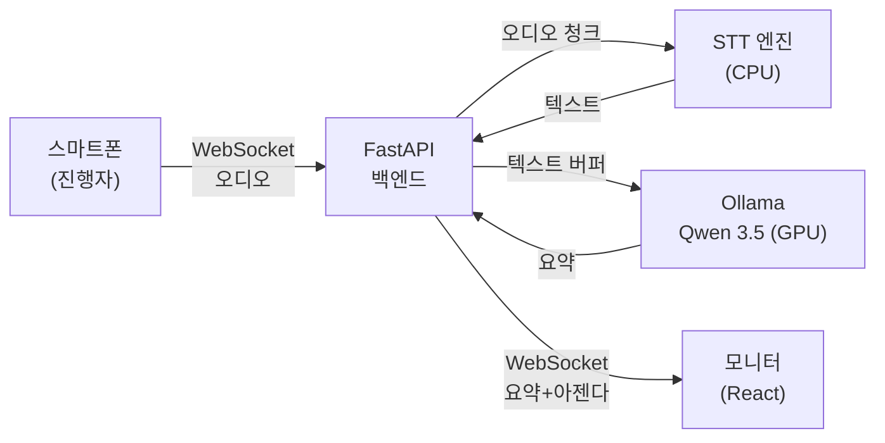
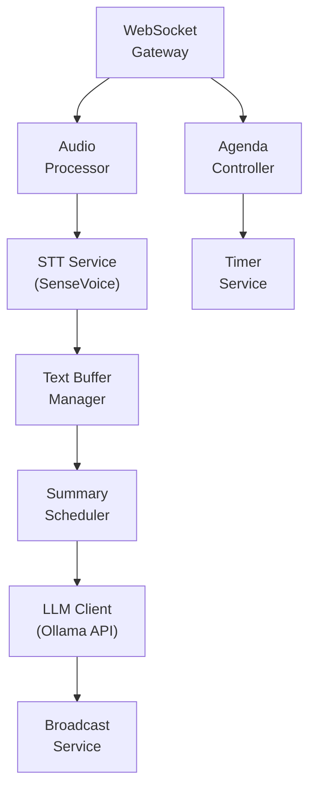
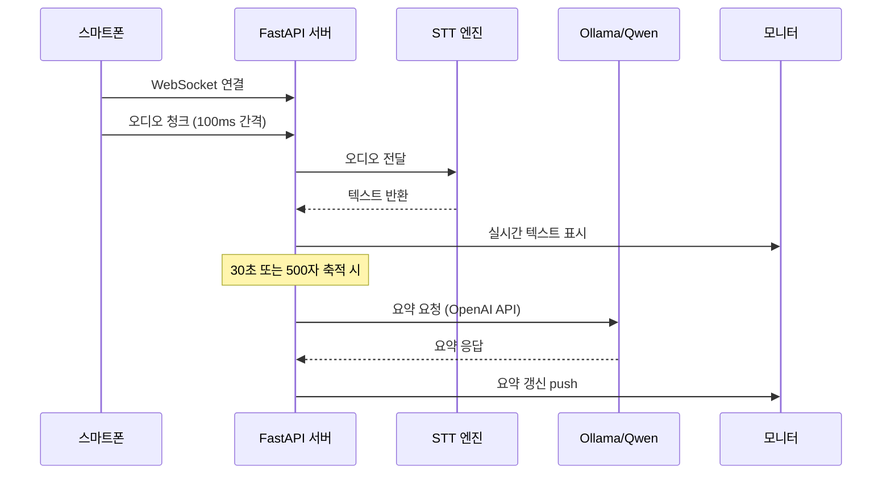

# 실시간 회의 관리 시스템 (Auto Meeting) PRD

> **Version**: v1.0 | **Date**: 2026-03-18 | **Status**: Draft
> **Appetite**: Big 6주

## Market Context

### 페인포인트

- 회의 중 수기 기록 → 핵심 내용 누락, 참석자 집중력 분산
- 회의록 작성에 30분+ 추가 소요 → 비생산적 반복 작업
- 아젠다 시간 관리 부재 → 회의 시간 초과, 후순위 안건 논의 불가
- 클라우드 AI 회의 솔루션 (Otter.ai, Fireflies 등) → 월 구독료 + 데이터 외부 유출 우려

### 기존 솔루션 비교

| 솔루션 | 실시간 STT | AI 요약 | 아젠다 추적 | 데이터 위치 | 비용 |
|--------|:----------:|:-------:|:-----------:|:-----------:|:----:|
| Otter.ai | O | O | X | 클라우드 | $16.99/월 |
| Fireflies.ai | O | O | X | 클라우드 | $18/월 |
| Notion AI | X | O | X | 클라우드 | $10/월 |
| **Auto Meeting** | **O** | **O** | **O** | **로컬** | **무료** |

### 차별점

1. **완전 로컬 처리** — 음성 데이터, 텍스트, 요약 모두 사내 서버에서 처리 (데이터 유출 제로)
2. **아젠다 시간 추적** — 기존 솔루션에 없는 실시간 아젠다별 타이머/프로그레스 바
3. **초기 비용 이후 무료** — 클라우드 구독 없이 기존 GPU 서버 활용

## 1. 개요

- **목적**: 회의실에서 스마트폰으로 음성을 캡처하고, 로컬 AI가 실시간으로 STT + 요약 + 아젠다 추적을 수행하여 대형 모니터에 표시하는 시스템
- **배경**: `C:\claude\auto_meeting\docs\firstlook.md` 기반. 사용자가 Google Workspace 기반을 검토했으나 실시간 WebSocket/오디오 스트리밍에 구조적 한계 확인 → 별도 웹앱 개발로 결정
- **범위**:
  - **In Scope**: 스마트폰 음성 캡처, 실시간 STT, AI 요약, 아젠다 CRUD/시간추적, 모니터 디스플레이
  - **Out of Scope**: 화자 분리(Speaker Diarization), 다국어 동시통역, 모바일 네이티브 앱, 클라우드 배포

## 2. 사용자 페르소나

| 페르소나 | 역할 | 주요 행동 | 니즈 |
|---------|------|----------|------|
| **진행자** | 회의 주재, 아젠다 관리 | 스마트폰으로 회의 시작/종료, 아젠다 전환 | 시간 내 아젠다 소화, 실시간 요약 확인 |
| **참석자** | 회의 참여, 발언 | 모니터로 요약/아젠다 확인 | 기록 부담 없이 논의에 집중 |
| **관리자** | 사전 아젠다 등록, 회의록 관리 | 웹에서 아젠다 CRUD, 회의 후 요약 확인 | 회의 전 준비, 회의 후 기록 아카이빙 |

## 3. 사용자 여정

### Happy Path

```
[회의 전]
관리자 → 웹에서 아젠다 등록 (제목, 목표시간) → 저장

[회의 시작]
진행자 → 스마트폰 브라우저 접속 → "회의 시작" 탭
       → 녹음 시작 → 음성이 WebSocket으로 서버 전송

[회의 중]
서버 → STT 실시간 변환 → 텍스트 버퍼 축적
     → 30초 주기로 LLM 요약 갱신 → WebSocket으로 모니터 푸시

모니터 → 실시간 요약 표시 + 현재 아젠다 강조 + 타이머

진행자 → 스마트폰에서 "다음 아젠다" 탭 → 아젠다 전환
       → "회의 종료" 탭 → 최종 회의록 생성

[회의 후]
관리자 → 웹에서 최종 회의록 확인/편집/다운로드
```

### Edge Case

| 상황 | 처리 |
|------|------|
| 네트워크 끊김 | 스마트폰 로컬 버퍼링 → 재연결 시 일괄 전송 |
| STT 오인식 | 회의 후 텍스트 수동 편집 기능 |
| 아젠다 시간 초과 | 모니터에 경고 표시 (빨간 프로그레스 바) |
| 동시 발언 | 단일 오디오 스트림 처리 (화자 분리 Out of Scope) |
| LLM 서버 다운 | STT는 계속 동작, 요약만 "서버 응답 없음" 표시 |

## 4. 기능 요구사항

### P0 — MVP (필수)

| ID | 기능 | 설명 | 기술 |
|----|------|------|------|
| FR-001 | 스마트폰 음성 캡처 | 브라우저에서 마이크 접근, 실시간 오디오 스트리밍 | MediaRecorder API + WebSocket |
| FR-002 | 실시간 STT | 오디오 → 텍스트 실시간 변환 (한국어) | 오픈소스 STT (섹션 6 참조) |
| FR-003 | 실시간 AI 요약 | 축적된 텍스트를 주기적으로 요약 | 로컬 Ollama/Qwen 3.5 (port 9000) |
| FR-004 | 아젠다 사전 등록 | 회의 전 아젠다 CRUD (제목, 목표시간, 순서) | REST API + DB |
| FR-005 | 아젠다 시간 추적 | 아젠다별 경과시간 타이머, 목표 대비 프로그레스 바 | 프론트엔드 타이머 + 서버 동기화 |
| FR-006 | 모니터 디스플레이 | 실시간 요약 + 아젠다 + 타이머를 대형 모니터에 표시 | WebSocket push + React UI |
| FR-007 | 회의 시작/종료 제어 | 진행자 스마트폰에서 녹음 시작/정지/종료 | 프론트엔드 컨트롤 패널 |

### P1 — 확장 (다음 스프린트)

| ID | 기능 | 설명 |
|----|------|------|
| FR-008 | 회의록 아카이빙 | 회의 종료 후 최종 요약 + 전체 텍스트 저장/검색 |
| FR-009 | 아젠다 자동 감지 | STT 텍스트에서 현재 논의 아젠다 자동 판별 |
| FR-010 | 회의록 편집 | 회의 후 텍스트/요약 수동 수정 UI |
| FR-011 | 키워드 하이라이트 | 요약에서 핵심 키워드/결정사항/Action Item 강조 |

### P2 — 미래 (백로그)

| ID | 기능 | 설명 |
|----|------|------|
| FR-012 | 화자 분리 | 발언자별 텍스트 분리 (Speaker Diarization) |
| FR-013 | 다국어 지원 | 영어/일본어 등 추가 언어 STT |
| FR-014 | Slack/Teams 연동 | 회의록 자동 공유 |

## 5. 비기능 요구사항

| ID | 항목 | 요구사항 | 비고 |
|----|------|---------|------|
| NFR-001 | STT 지연 | 음성 입력 후 텍스트 표시까지 ≤ 3초 | 체감 실시간성 |
| NFR-002 | 요약 갱신 주기 | 30초 간격 또는 500자 축적 시 (먼저 도달하는 조건) | LLM 호출 빈도 제어 |
| NFR-003 | 동시 접속 | 모니터 1대 + 스마트폰 5대 이상 동시 지원 | WebSocket 연결 관리 |
| NFR-004 | 가용성 | 1시간 연속 회의 중 시스템 중단 없음 | 메모리 누수 방지 |
| NFR-005 | 데이터 보안 | 모든 데이터 로컬 처리, 외부 API 호출 제로 | 핵심 차별점 |
| NFR-006 | 브라우저 호환 | Chrome/Safari 모바일 + Chrome 데스크톱 | MediaRecorder API 지원 브라우저 |
| NFR-007 | VRAM 예산 | STT ≤ 0GB (CPU), LLM ≤ 10GB → 총 ≤ 10GB / 16GB | GPU 경합 방지 |
| NFR-008 | 한국어 STT 정확도 | WER ≤ 15% (일상 회의 환경) | 조용한 회의실 기준 |

## 6. 기술 스택 결정

### 레이어별 선택

| 레이어 | 선택 | 근거 |
|--------|------|------|
| **STT** | 오픈소스 (아래 후보 비교) | 클라우드 API 비용 제거, 데이터 로컬 보존 |
| **AI 요약** | Ollama + Qwen 3.5 9B (port 9000) | 기존 `C:\claude\vllm` 인프라 재사용, OpenAI 호환 API |
| **VRAM 전략** | STT = CPU, LLM = GPU | GPU 경합 제로 (128GB RAM으로 CPU STT 충분) |
| **프론트엔드** | React + Next.js | SPA + WebSocket 실시간 UI |
| **백엔드** | FastAPI (Python) | STT/LLM Python 생태계 통합 용이 |
| **실시간 통신** | WebSocket (Socket.IO) | 양방향 오디오/텍스트/요약 스트리밍 |
| **DB** | SQLite | 경량, 단일 서버, 동시성 낮음 |

### STT 후보 비교

#### Option 1: WhisperLiveKit (1순위)

- **모델**: Whisper Large-v3 + SimulStreaming
- **한국어**: Good (Whisper 기반)
- **실시간**: YES — WebSocket 3종 API 내장 (Deepgram/OpenAI/Custom 호환)
- **VRAM**: ~3GB (INT8) 또는 CPU 모드 가능
- **장점**: WebSocket 서버 내장 → 클라이언트 통합 최소 노력
- **단점**: CPU 모드 시 지연 증가 (~5초)

#### Option 2: SenseVoice (2순위 — 권장 조합)

- **모델**: Alibaba FunAudioLLM SenseVoice-Small
- **한국어**: Excellent (CJK 특화 학습)
- **실시간**: Partial — 배치 추론 기본, 스트리밍 래퍼 필요
- **VRAM**: CPU 모드 충분 (모델 ~450MB)
- **장점**: Whisper 대비 15x 빠른 추론, CPU에서도 실시간급
- **단점**: WebSocket 미지원 → FastAPI 래퍼 직접 구현 필요

#### Option 3: Vosk (경량 옵션)

- **모델**: vosk-model-ko (50MB)
- **한국어**: Fair (WER 10-15%)
- **실시간**: YES — WebSocket 내장
- **VRAM**: CPU only (50MB 모델)
- **장점**: 초경량, 설치 1분
- **단점**: 정확도 낮음, 개발 중단 우려

### 권장 조합

```
SenseVoice (CPU, 한국어 최적) + Ollama/Qwen 3.5 (GPU, AI 요약)
→ GPU 경합 제로, 한국어 정확도 최상
→ WebSocket 래퍼만 직접 구현 필요 (FastAPI 1개 엔드포인트)
```

**대안**: WhisperLiveKit (WebSocket 내장으로 빠른 프로토타이핑) → 한국어 정확도 검증 후 SenseVoice 전환

### 로컬 인프라 현황 (`C:\claude\vllm`)

| 항목 | 값 |
|------|-----|
| GPU | RTX 5080 16GB GDDR7 |
| RAM | 128 GB DDR5-5600 |
| CPU | Intel Core Ultra 9 285K (24C/24T) |
| LLM 엔진 | Ollama (Docker Compose) |
| 모델 | Qwen 3.5 9B Q8_0 (~6.6GB VRAM) |
| API | OpenAI 호환 (`localhost:9000`) |
| Web UI | Open WebUI (`localhost:9001`) |

## 7. 시스템 아키텍처

### Overview



### Detail: 백엔드 내부 구조



### 데이터 흐름 시퀀스



## 8. 리스크 평가

| ID | 리스크 | 영향 | 확률 | 완화 방안 |
|----|--------|------|------|----------|
| R-001 | STT 한국어 정확도 부족 | 요약 품질 저하 | 중 | SenseVoice (CJK 특화) 1순위, Whisper 대안 |
| R-002 | VRAM 경합 (STT + LLM 동시) | 추론 지연/OOM | 하 | STT=CPU 전략으로 GPU 경합 제로 |
| R-003 | 회의실 소음/반향 | STT 오인식 증가 | 중 | 지향성 마이크 권장, 노이즈 필터 전처리 |
| R-004 | LLM 요약 지연 (>5초) | 실시간 체감 저하 | 중 | 요약 주기 조절 (30초→60초), 스트리밍 응답 |
| R-005 | 장시간 회의 메모리 누수 | 시스템 크래시 | 중 | 텍스트 버퍼 슬라이딩 윈도우 (최근 10분만 요약 입력) |
| R-006 | 스마트폰↔서버 네트워크 끊김 | 음성 데이터 손실 | 하 | 클라이언트 로컬 버퍼링 + 재연결 자동 전송 |
| R-007 | Ollama Docker 불안정 | LLM API 응답 없음 | 하 | healthcheck + 자동 재시작 (docker-compose) |

## 9. 구현 상태

| 항목 | 상태 | 비고 |
|------|------|------|
| PRD 작성 | 완료 | v1.0 |
| 기술 스택 결정 | 완료 | SenseVoice + Ollama/Qwen 3.5 |
| Ollama 인프라 | 완료 | `C:\claude\vllm` (port 9000 가동 중) |
| STT 엔진 설치 | 예정 | SenseVoice 또는 WhisperLiveKit |
| 백엔드 (FastAPI) | 예정 | WebSocket + STT + LLM 통합 |
| 프론트엔드 (React) | 예정 | 모니터 UI + 스마트폰 컨트롤 |
| 통합 테스트 | 예정 | 실제 회의실 환경 검증 |

## Changelog

| 날짜 | 버전 | 변경 내용 | 변경 유형 | 결정 근거 |
|------|------|-----------|----------|----------|
| 2026-03-18 | v1.0 | 최초 작성 | - | - |
