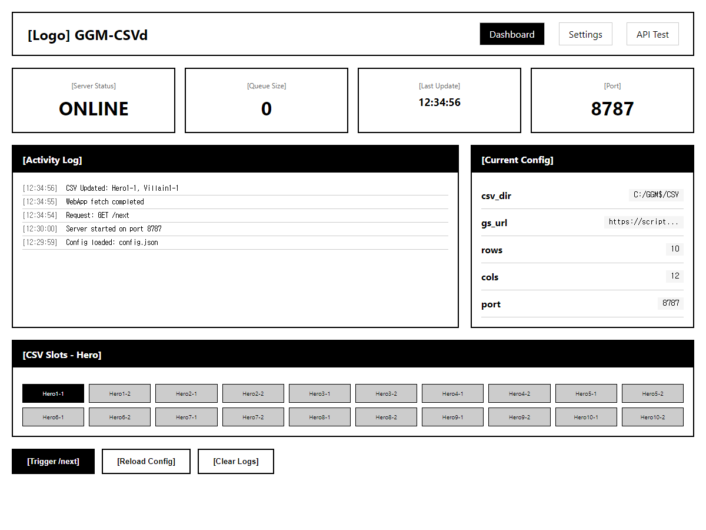
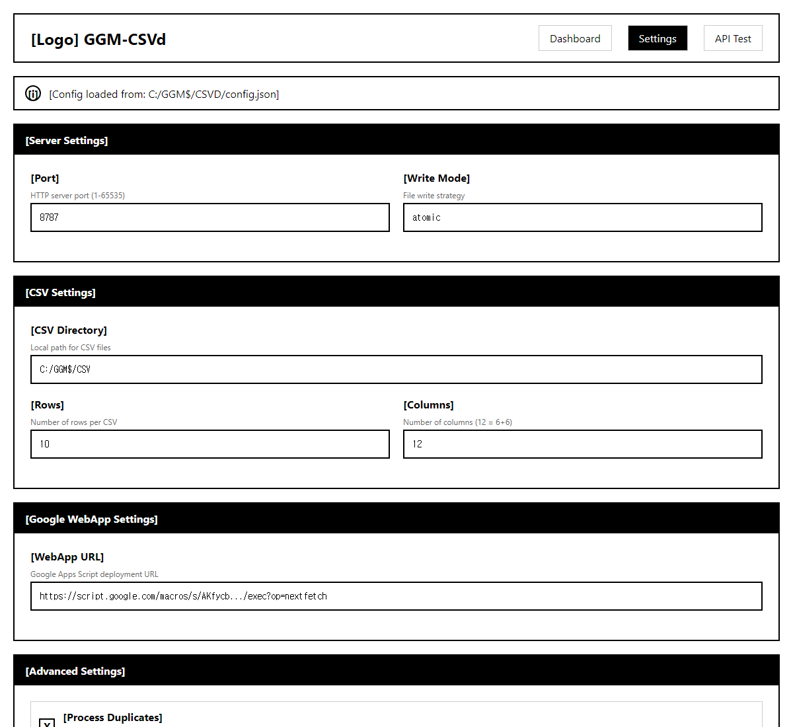
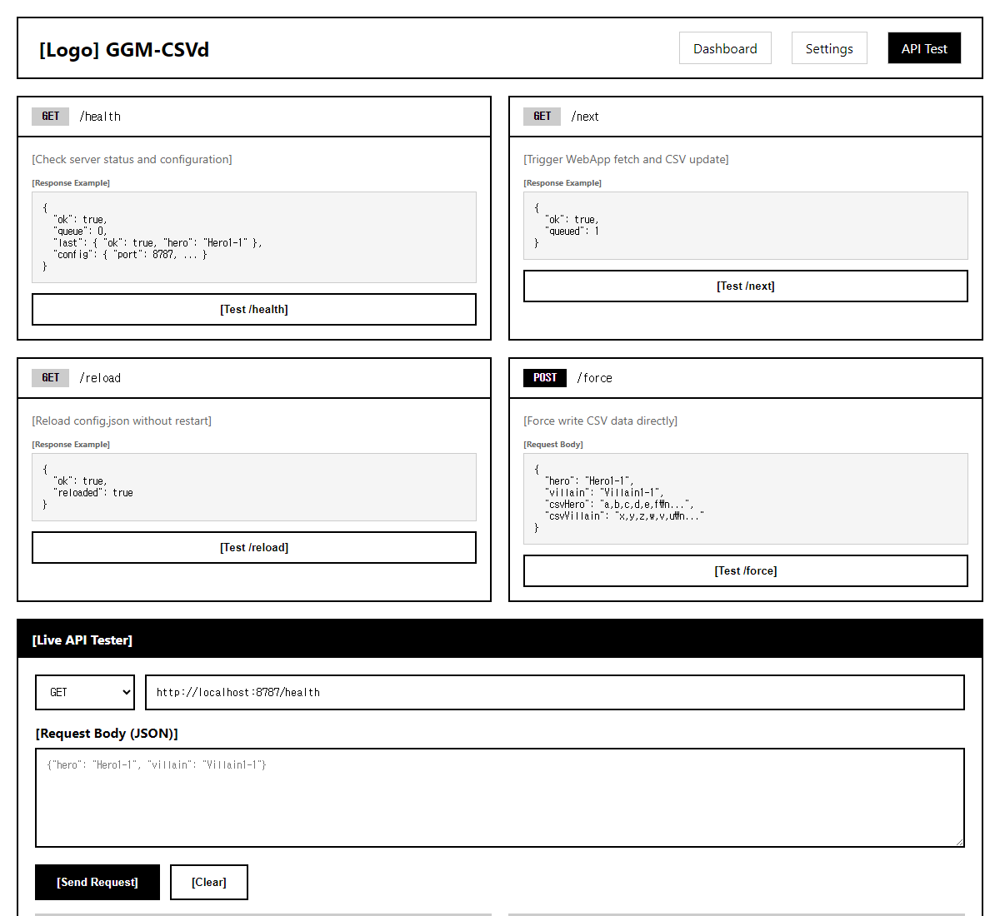

# PRD-0001: GGM-CSVd GUI Dashboard

**Version**: 1.0.0
**Date**: 2026-01-22
**Status**: Draft
**Author**: Claude Code

---

## 1. Overview

### 1.1 Problem Statement

현재 GGM-CSVd는 CLI 기반으로만 운영되어 다음과 같은 문제가 있습니다:
- 서버 상태 확인을 위해 curl 명령어 사용 필요
- config.json 수동 편집 필요
- API 테스트를 위한 별도 도구 필요
- CSV 슬롯 상태 시각화 불가

### 1.2 Solution

웹 기반 GUI 대시보드를 제공하여:
- 실시간 서버 상태 모니터링
- 직관적인 설정 편집
- 내장 API 테스트 도구
- CSV 슬롯 시각화

### 1.3 Target Users

- 포커 그래픽 운영자
- 방송 기술 담당자
- 시스템 관리자

---

## 2. User Interface Design

### 2.1 Dashboard (메인 화면)



**주요 기능:**
- 서버 상태 표시 (ONLINE/OFFLINE)
- 큐 사이즈 모니터링
- 마지막 업데이트 시간
- 활동 로그 (실시간)
- 현재 설정 요약
- CSV 슬롯 그리드 (Hero/Villain)

**액션 버튼:**
- [Trigger /next] - 수동 CSV 갱신
- [Reload Config] - 설정 리로드
- [Clear Logs] - 로그 초기화

---

### 2.2 Settings (설정 화면)



**섹션 구성:**

| 섹션 | 설정 항목 |
|------|----------|
| Server Settings | port, write_mode |
| CSV Settings | csv_dir, rows, cols |
| WebApp Settings | gs_url |
| Advanced Settings | process_duplicates, dedup_window_ms, whitelist |

**기능:**
- 폼 기반 설정 편집
- 실시간 유효성 검사
- Whitelist 태그 입력
- 기본값 복원

---

### 2.3 API Test (API 테스트 화면)



**엔드포인트 카드:**

| Endpoint | Method | Description |
|----------|--------|-------------|
| `/health` | GET | 서버 상태 및 설정 확인 |
| `/next` | GET/POST | WebApp fetch 트리거 |
| `/reload` | GET | config.json 리로드 |
| `/force` | POST | CSV 강제 쓰기 |

**Live Tester:**
- HTTP 메서드 선택 (GET/POST)
- URL 입력
- Request Body 편집기 (JSON)
- Response Headers/Body 표시
- 요청 히스토리 테이블

---

## 3. Technical Requirements

### 3.1 Architecture

```
┌─────────────────────────────────────────────────┐
│                 Browser (GUI)                    │
├─────────────────────────────────────────────────┤
│  Dashboard  │  Settings  │  API Test            │
└──────────────────┬──────────────────────────────┘
                   │ HTTP
                   ▼
┌─────────────────────────────────────────────────┐
│              GGM-CSVd Server                     │
│  ┌───────────────────────────────────────────┐  │
│  │  New Endpoints (GUI 전용)                 │  │
│  │  - GET /                  → Dashboard HTML│  │
│  │  - GET /settings          → Settings HTML │  │
│  │  - GET /api-test          → API Test HTML │  │
│  │  - GET /api/config        → JSON config   │  │
│  │  - POST /api/config       → Save config   │  │
│  │  - GET /api/logs          → Activity logs │  │
│  └───────────────────────────────────────────┘  │
│  ┌───────────────────────────────────────────┐  │
│  │  Existing Endpoints                       │  │
│  │  - /health, /next, /reload, /force        │  │
│  └───────────────────────────────────────────┘  │
└─────────────────────────────────────────────────┘
```

### 3.2 New API Endpoints

| Endpoint | Method | Request | Response |
|----------|--------|---------|----------|
| `/` | GET | - | Dashboard HTML |
| `/api/config` | GET | - | `{ config: {...} }` |
| `/api/config` | POST | `{ key: value }` | `{ ok: true }` |
| `/api/logs` | GET | `?limit=50` | `{ logs: [...] }` |
| `/api/slots` | GET | - | `{ hero: [...], villain: [...] }` |

### 3.3 Technology Stack

| Layer | Technology |
|-------|------------|
| Frontend | Vanilla HTML/CSS/JS (빌드 불필요) |
| Backend | Python http.server (기존 확장) |
| Styling | CSS Grid, Flexbox (프레임워크 없음) |

### 3.4 Security Considerations

**필수 구현:**
1. **Slot Name Validation**: `^[A-Za-z0-9_-]+$` 정규식 검증
2. **Request Size Limit**: 10MB 제한
3. **Local Only**: 127.0.0.1 바인딩 유지

**권장 구현:**
1. `/force` 토큰 인증 (config.json에 `api_token` 추가)
2. Rate Limiting (분당 60 요청)

---

## 4. Success Metrics

| Metric | Target | Measurement |
|--------|--------|-------------|
| 설정 변경 시간 | <30초 | 사용자 테스트 |
| API 테스트 응답 시간 | <2초 | 자동 측정 |
| 에러율 | <1% | 로그 분석 |

---

## 5. Implementation Phases

### Phase 1: MVP (Week 1)
- [ ] Dashboard 화면 구현
- [ ] `/api/config` GET 엔드포인트
- [ ] 기본 스타일링

### Phase 2: Settings (Week 2)
- [ ] Settings 화면 구현
- [ ] `/api/config` POST 엔드포인트
- [ ] 설정 유효성 검사

### Phase 3: API Test (Week 3)
- [ ] API Test 화면 구현
- [ ] Live Tester 기능
- [ ] 요청 히스토리

### Phase 4: Polish (Week 4)
- [ ] 보안 패치 적용
- [ ] 에러 핸들링 개선
- [ ] 문서화

---

## 6. Wireframes

### HTML 목업 파일

| 화면 | HTML | PNG |
|------|------|-----|
| Dashboard | [ggm-csvd-dashboard.html](mockups/ggm-csvd-dashboard.html) | [PNG](images/ggm-csvd-dashboard.png) |
| Settings | [ggm-csvd-settings.html](mockups/ggm-csvd-settings.html) | [PNG](images/ggm-csvd-settings.png) |
| API Test | [ggm-csvd-api-test.html](mockups/ggm-csvd-api-test.html) | [PNG](images/ggm-csvd-api-test.png) |

---

## 7. Open Questions

1. **인증 방식**: 토큰 vs IP 화이트리스트?
2. **실시간 업데이트**: WebSocket vs Polling?
3. **모바일 지원**: 필요한가?

---

## Appendix: Code Analysis Summary

[코드 분석 보고서](../CLAUDE.md) 참조

**보안 취약점 (PRD 구현 시 해결 필요):**
- HIGH: 경로 traversal - slot명 검증 필요
- HIGH: /force 인증 부재
- MEDIUM: Content-Length 무제한
