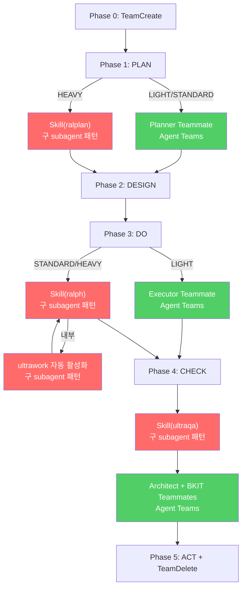
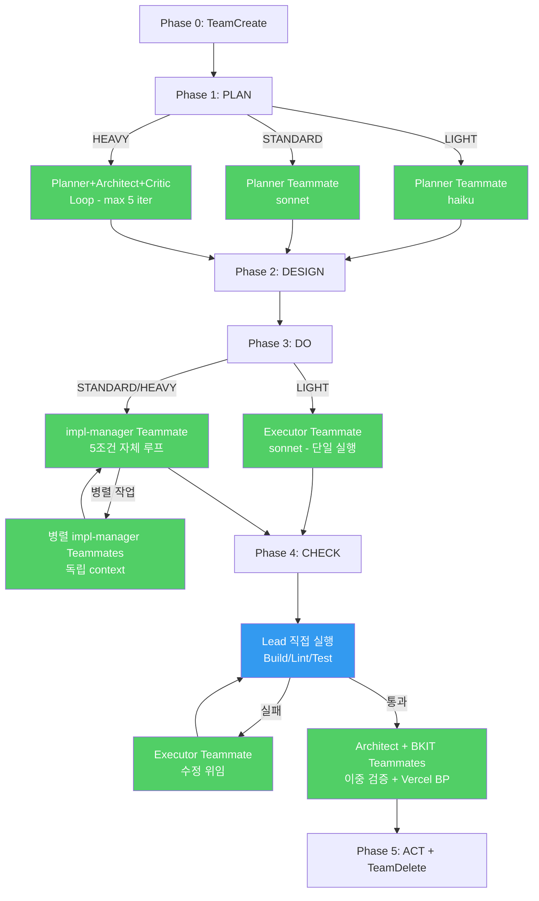

# /auto v21.0 통합 재설계 — OMC Skill() 제거, Agent Teams 단일 패턴

**Version**: 1.0.0 | **Date**: 2026-02-17 | **Status**: DRAFT
**Complexity**: 5/5 (HEAVY)
**Branch**: TBD (feat/auto-v21-unified-redesign)

---

## 1. 배경

### 1.1 문제 정의: 이중 패턴 불일치

v20.1에서 Agent Teams 마이그레이션을 완료했으나, `/auto`가 호출하는 OMC 스킬 내부에는 여전히 구 `Task(run_in_background=true)` 패턴이 남아 있다. 이로 인해 `/auto` PDCA 사이클 내부에 **두 가지 에이전트 실행 패턴이 공존**하는 상태가 되었다.

| 계층 | 패턴 | 상태 |
|------|------|------|
| `/auto` 직접 teammate (explore, planner, executor, verifier, reporter) | Agent Teams (`TeamCreate → Task(name, team_name) → SendMessage → shutdown_request → TeamDelete`) | v20.0 마이그레이션 완료 |
| OMC Skill 호출 (ralph, ultrawork, ralplan, ultraqa) | 구 `Task(run_in_background=true)` subagent 패턴 | **미마이그레이션** |

### 1.2 구체적 문제점

**Phase 1 HEAVY**: `Skill("ralplan")` 호출 → ralplan 내부에서 Planner, Architect, Critic 3개 agent를 구 패턴으로 spawn

**Phase 3 STANDARD/HEAVY**: `Skill("ralph")` 호출 → ralph 내부에서:
- ultrawork 자동 활성화 → 병렬 `Task(run_in_background=true)` spawn
- Architect 검증 → 구 패턴 subagent
- 5조건 루프 반복 → 매 iteration마다 구 패턴 agent 누적

**Phase 4**: `Skill("ultraqa")` 호출 → Build/Lint/Test/Fix 사이클을 구 패턴으로 실행

### 1.3 이중 패턴이 만드는 실질적 위험

| 위험 | 설명 | 심각도 |
|------|------|:------:|
| **Context overflow** | 구 패턴 agent 결과가 Lead context에 직접 합류. Ralph 5조건 루프에서 iteration마다 결과 누적 → compact 실패 위험 | **CRITICAL** |
| **State 이중 관리** | Agent Teams는 Mailbox, 구 패턴은 직접 context. 같은 PDCA 사이클 내에서 두 통신 방식 혼재 | HIGH |
| **Lifecycle 불일치** | Agent Teams는 `TeamCreate/TeamDelete`로 명시적 관리. 구 패턴 subagent는 자동 GC 의존 → 세션 종료 시 orphan agent 가능 | HIGH |
| **디버깅 복잡도** | 문제 발생 시 Agent Teams 계층인지 Skill 내부 구 패턴인지 판별해야 함 | MEDIUM |
| **Stop Hook 간섭** | ralph/ultrawork의 state 파일(`ultrawork-state.json`, `ralph-state.json`)이 Stop Hook과 충돌하는 문제가 반복 발생 (2026-02-13 3차 수정까지 진행) | HIGH |

### 1.4 현재 OMC 스킬 내부 동작 분석

#### ralph
- 자체 루프: max iterations (기본 10회)
- 5조건 검증: TODO==0, 기능동작, 테스트통과, 에러==0, Architect승인
- ultrawork 자동 활성화: 병렬 작업 감지 시 자동 spawn
- State 파일: `.omc/ralph-state.json`, `.omc/ralph-verification.json`
- 문제: Agent Teams 미사용, state 파일이 Stop Hook과 충돌

#### ultrawork
- 병렬 `Task()` spawn, delegation enforcement, model routing
- State 파일: `.omc/ultrawork-state.json`, `~/.claude/ultrawork-state.json`
- 문제: Agent Teams 미사용, 이중 state 파일 관리

#### ralplan
- 3-agent 루프: Planner → Architect → Critic
- Max 5 iterations, Critic 필수 승인
- 문제: Agent Teams 미사용

#### ultraqa
- Build → Lint → Test → Fix 사이클
- 문제: Agent Teams 미사용

---

## 2. 목표

### 2.1 핵심 목표

**`/auto` PDCA 사이클 전체를 Agent Teams 단일 패턴으로 통합한다.**

| 지표 | v20.1 현재 | v21.0 목표 |
|------|:----------:|:----------:|
| `Skill()` 호출 수 | 4개 (ralph, ultrawork, ralplan, ultraqa) | **0개** |
| 에이전트 실행 패턴 | 2가지 (Agent Teams + 구 subagent) | **1가지** (Agent Teams only) |
| State 파일 의존 | 4개 (ralph-state, ralph-verification, ultrawork-state x2) | **0개** |
| Stop Hook 충돌 위험 | 있음 (3차 수정 이력) | **없음** |
| Context overflow 위험 | 높음 (Ralph 루프 결과 누적) | **없음** (Mailbox 분리) |

### 2.2 제약 조건

1. **PDCA 5-Phase 구조 유지**: Phase 0-5 순서와 Gate 조건은 변경하지 않음
2. **기능 동등성**: v20.1에서 제공하는 모든 기능을 v21.0에서도 동일하게 제공
3. **BKIT 에이전트 현행 유지**: 이미 Agent Teams 패턴 사용 중이므로 변경 불필요
4. **Phase 0, 2, 5 현행 유지**: 이미 Agent Teams 패턴 100% 사용 중
5. **하위 호환성**: 모든 옵션(`--worktree`, `--interactive`, `--eco` 등) 동작 유지

---

## 3. 구현 범위

### 3.1 Phase 1 변경: ralplan 대체 (3-Agent Planning Loop)

**현재 (v20.1)**: HEAVY 모드에서 `Skill(skill="ralplan")` 호출

**신규 (v21.0)**: Agent Teams 기반 Planner + Architect + Critic 루프를 `/auto` Phase 1에 직접 구현

| 항목 | v20.1 | v21.0 |
|------|-------|-------|
| HEAVY 계획 수립 | `Skill(ralplan)` → 내부 3-agent 구 패턴 | Planner+Architect+Critic teammate 루프 (max 5 iterations) |
| Critic 승인 | ralplan 내부에서 처리 | Lead가 Critic 결과를 받아 승인/반려 판단 |
| 계획 산출물 | ralplan이 직접 생성 | Planner teammate가 생성, Critic teammate가 검증 |
| LIGHT/STANDARD | 변경 없음 | 변경 없음 |

**Planner-Critic 루프 흐름 (HEAVY)**:
1. Planner teammate (sonnet) spawn → 계획 초안 생성
2. Architect teammate (sonnet) spawn → 기술적 타당성 검증
3. Critic teammate (sonnet) spawn → 계획 완전성/위험 검토 → APPROVE/REVISE
4. REVISE → Planner teammate 재spawn (Critic 피드백 포함) → 2번으로
5. APPROVE → Phase 1 완료, Phase 2 진입

### 3.2 Phase 3 변경: ralph + ultrawork 대체 (구현 루프 + 병렬 실행)

**현재 (v20.1)**: STANDARD/HEAVY 모드에서 `Skill(skill="ralph")` 호출, ralph 내부에서 ultrawork 자동 활성화

**신규 (v21.0)**: Agent Teams 기반 5조건 구현 루프를 "Ralph teammate" 패턴으로 구현 — 단일 executor teammate가 내부에서 5조건 루프를 자체 제어, Lead는 최종 결과만 수신

| 항목 | v20.1 | v21.0 |
|------|-------|-------|
| STANDARD/HEAVY 구현 | `Skill(ralph)` → 자체 루프 + ultrawork 자동 활성화 | impl-manager teammate가 5조건 자체 루프 (Lead는 결과만 수신) |
| 병렬 실행 | ultrawork 내부에서 구 패턴 spawn | 독립 작업을 병렬 impl-manager teammates로 spawn (Lead 판단) |
| 5조건 검증 | ralph 내부에서 자체 관리 | impl-manager가 내부에서 자체 관리 (Lead 미관여) |
| State 파일 | ralph-state.json, ultrawork-state.json | **불필요** (Agent Teams lifecycle으로 대체) |
| Max iterations | ralph 기본 10회 | 동일 (10회), impl-manager 자체 카운트 |
| LIGHT | 변경 없음 (executor teammate 단일 실행) | 변경 없음 |

**5조건 구현 루프 흐름 (STANDARD/HEAVY)**:
1. Lead가 impl-manager teammate spawn (5조건 자체 루프 지시)
2. impl-manager 내부에서 max 10회 iteration 자체 관리:
   - TODO == 0 (모든 할일 완료)
   - 빌드 성공 (build command 실행)
   - 테스트 통과 (pytest/jest 실행)
   - 에러 == 0 (lint/type check)
   - 코드 리뷰 자체 검증 (아키텍처 일관성)
3. ALL 충족 시 → `IMPLEMENTATION_COMPLETED: {summary}` 메시지 전송
4. 10회 초과 시 → `IMPLEMENTATION_FAILED: {remaining_issues}` 메시지 전송
5. Lead는 최종 COMPLETED/FAILED 메시지만 수신 (중간 iteration 미수신)

**핵심 변경점**:
- Lead가 루프를 직접 제어하지 않음 → context 누적 방지
- 5조건 중 "Architect 승인"을 "코드 리뷰 자체 검증"으로 변경 (teammate 내부에서 별도 Architect subagent 호출이 Agent Teams와 충돌하므로)
- Phase 4에서 별도 Architect 검증이 이어지므로 Phase 3에서의 Architect 검증은 자체 검증으로 충분

**병렬 실행 (ultrawork 대체)**:
- HEAVY 모드에서 독립 작업이 2개 이상일 때
- Lead가 작업 분할 판단 → 병렬 impl-manager teammates spawn
- 각 teammate는 독립 context에서 실행 (Mailbox 통신)
- `--worktree` 옵션 시 teammate별 별도 worktree 할당 (REFERENCE.md 현행 패턴 유지)

### 3.2.1 자동 재시도/승격/실패 로직

| 조건 | 처리 |
|------|------|
| impl-manager 5조건 루프 내 빌드 실패 | impl-manager 자체 재시도 (10회 한도 내) |
| impl-manager 10회 초과 (FAILED 반환) | Lead가 사용자에게 알림 + 수동 개입 요청 |
| LIGHT에서 빌드 실패 2회 | STANDARD 자동 승격 (executor 재spawn) |
| UltraQA 3사이클 초과 | STANDARD → HEAVY 자동 승격 |
| 영향 파일 5개 이상 감지 | LIGHT/STANDARD → HEAVY 자동 승격 |
| 진행 상태 추적 | `pdca-status.json`의 `ralphIteration` 필드 (state 파일 불필요) |
| 세션 중단 후 resume | `pdca-status.json` 기반 Phase/iteration 복원 |

**Resume 동작 (세션 중단 후 재개)**:
- `pdca-status.json`에 `implManagerIteration` 필드 추가 (impl-manager가 중단된 iteration 번호)
- Resume 시: iteration 5회 미만이면 해당 지점부터 재개, 5회 이상 소진이면 처음부터 재시작
- impl-manager teammate를 새로 spawn하면서 "이전 시도에서 {N}회까지 진행됨, 남은 이슈: {issues}" prompt 제공

### 3.3 Phase 4 변경: ultraqa 대체 (QA 사이클)

**현재 (v20.1)**: `Skill(skill="ultraqa")` 호출

**신규 (v21.0)**: Agent Teams 기반 Build/Lint/Test/Fix 사이클을 `/auto` Phase 4에 직접 구현

| 항목 | v20.1 | v21.0 |
|------|-------|-------|
| QA 사이클 | `Skill(ultraqa)` → 내부 구 패턴 | QA teammate(s) + Lead 제어 사이클 |
| Build/Lint/Test | ultraqa 내부에서 자동 실행 | Lead가 Bash로 직접 실행 (단순 명령) |
| Fix | ultraqa 내부에서 자동 수정 | Executor teammate spawn (수정 작업 위임) |
| 사이클 횟수 | LIGHT 1회, STANDARD 3회, HEAVY 5회 | 동일 |

**QA 사이클 흐름**:
1. Lead가 직접 실행: `ruff check`, `pytest`, `npm run build` 등 (10줄 이하 직접 실행 규칙 적용)
2. 실패 발견 시 → Executor teammate spawn → 수정 위임
3. 수정 완료 → 재검증 (1번으로)
4. 모든 검사 통과 → Step 4.2 (이중 검증) 진입

### 3.4 Phase 4 확장: Vercel BP 검증 통합

**현재**: 별도 Vercel BP 규칙이 존재하나 `/auto`에 통합되지 않음

**신규 (v21.0)**: Phase 4 CHECK의 이중 검증 단계에서 Vercel BP 규칙도 함께 검증

**통합 방식 비교**:

| 방식 | 장점 | 단점 |
|------|------|------|
| Architect prompt에 통합 | Skill() 추가 불필요, teammate 수 유지 | Architect prompt 증가 (~500t), 검증 범위 과다 |
| code-analyzer prompt에 통합 | 코드 품질 분석과 자연스러운 조합 | BKIT agent 프롬프트 수정 필요 |
| 별도 teammate 추가 | 검증 책임 분리 | teammate 수 증가, 비용 증가 |

**선택**: **code-analyzer teammate prompt에 통합** (권장)
- 이유: code-analyzer는 이미 코드 품질/보안/성능을 분석하므로 Vercel BP 규칙과 자연스럽게 결합
- Architect teammate는 기능 완성도에 집중, Vercel BP는 code-analyzer에게 위임
- BKIT code-analyzer에 Vercel BP 핵심 규칙(React 성능, Next.js 패턴 등)을 prompt에 추가

| 검증 항목 | 담당 | 모드 |
|-----------|------|------|
| 기능 완성도 | Architect teammate | ALL |
| 설계-구현 일치도 | gap-detector teammate | STANDARD/HEAVY |
| 코드 품질/보안 + **Vercel BP** | code-analyzer teammate | STANDARD/HEAVY |

**Vercel BP 통합 구현 방법**:
1. Phase 4 Step 4.2에서 code-analyzer teammate spawn 시 prompt에 Vercel BP 핵심 규칙을 동적 주입
2. BKIT plugin 코드 직접 수정 금지 (업데이트 시 덮어쓰임)
3. `/auto` REFERENCE.md에 Vercel BP 규칙 목록 관리 (~500t):
   - React 성능 (useMemo, useCallback 적절성)
   - Next.js 패턴 (App Router, Server Component 우선)
   - 접근성 (aria-label, semantic HTML)
4. code-analyzer prompt 예시: "코드 품질/보안 분석 + 다음 Vercel BP 규칙 준수 여부 확인: {vercel_bp_rules}"

### 3.5 BKIT 통합: 현행 유지 확인

BKIT 에이전트 4개는 이미 Agent Teams 패턴을 사용하고 있으므로 변경하지 않는다.

| BKIT 에이전트 | Phase | 역할 | 변경 |
|--------------|:-----:|------|:----:|
| gap-detector | 4 | 설계-구현 갭 분석 | 없음 |
| code-analyzer | 4 | 코드 품질 분석 | 없음 |
| pdca-iterator | 5 | 갭 자동 개선 | 없음 |
| report-generator | 5 | 완료 보고서 생성 | 없음 |

---

## 4. 비변경 항목

| Phase | 현재 상태 | 변경 여부 |
|:-----:|----------|:---------:|
| **Phase 0** (옵션 파싱 + TeamCreate) | Agent Teams 패턴 | 변경 없음 |
| **Phase 2** (설계 문서 생성) | executor/executor-high teammate | 변경 없음 |
| **Phase 5** (결과 기반 자동 실행 + TeamDelete) | BKIT teammate + TeamDelete | 변경 없음 |
| **자율 발견 모드** (`/auto` 단독) | 5-Tier 발견 체계 | 변경 없음 |
| **세션 관리** (status/stop/resume) | pdca-status.json 기반 | 변경 없음 |
| **옵션 시스템** (--worktree, --interactive 등) | 현행 동작 | 변경 없음 |
| **복잡도 분기** (LIGHT/STANDARD/HEAVY) | 5점 만점 기준 | 변경 없음 |
| **자동 승격 규칙** | 빌드 실패 2회 등 | 변경 없음 |
| **Gate 조건** (Phase 1→2, 2→3, 3→4) | 필수 섹션 확인 | 변경 없음 |

---

## 5. 전체 플로우 비교

### 5.1 v20.1 현재 플로우



### 5.2 v21.0 신규 플로우



**범례**: 녹색 = Agent Teams 패턴, 파란색 = Lead 직접 실행, 빨간색 = 구 subagent 패턴 (제거 대상)

---

## 6. 예상 영향 파일

| 파일 | 변경 유형 | 설명 |
|------|----------|------|
| `.claude/skills/auto/SKILL.md` | **핵심 수정** | Phase 1/3/4 코드 블록 전면 교체 (Skill() → Agent Teams) |
| `.claude/skills/auto/REFERENCE.md` | **핵심 수정** | 상세 워크플로우, 코드 블록 전면 교체 |
| `~/.claude/CLAUDE.md` | 수정 | OMC 스킬 라우팅 테이블 정리 (ralph, ultrawork, ralplan, ultraqa 호출 제거) |
| `.claude/rules/08-skill-routing.md` | 수정 | 스킬 매핑 테이블 업데이트 |
| `docs/.pdca-status.json` | 수정 | v21.0 feature 추가 |
| `docs/AGENTS_REFERENCE.md` | 수정 | /auto 내부 동작 설명 업데이트 |

### 제거 가능 파일/설정

| 대상 | 사유 |
|------|------|
| ralph state 파일 관리 로직 | Agent Teams lifecycle으로 대체 |
| ultrawork state 파일 관리 로직 | Agent Teams lifecycle으로 대체 |
| `session_cleanup.py`의 ralph/ultrawork state 정리 코드 | State 파일 자체가 불필요해짐 |
| Stop Hook의 ralph/ultrawork 차단 경로 | State 파일 제거로 해당 경로 불필요 |

---

## 7. Agent Teams 패턴 상세

### 7.1 Phase 1 HEAVY: Planner-Critic Loop

```
TeamCreate("pdca-{feature}") ← Phase 0에서 이미 생성됨

critic_feedback = ""  # Lead 메모리에서 관리

Loop (max 5 iterations, i=1..5):
  ├── Task(subagent_type="planner", name="planner-{i}",
  │        team_name="pdca-{feature}", model="sonnet",
  │        prompt="계획 수립. 이전 Critic 피드백: {critic_feedback}")
  ├── SendMessage → planner-{i} 결과 수신 → shutdown_request
  │
  ├── Task(subagent_type="architect", name="arch-{i}",
  │        team_name="pdca-{feature}", model="sonnet",
  │        prompt="계획의 기술적 타당성 검증. Plan 파일: docs/01-plan/{feature}.plan.md")
  ├── SendMessage → arch-{i} 결과 수신 → shutdown_request
  │
  ├── Task(subagent_type="critic", name="critic-{i}",
  │        team_name="pdca-{feature}", model="sonnet",
  │        prompt="계획 완전성 검토. APPROVE 또는 REVISE + 구체적 피드백.
  │               Plan 파일: docs/01-plan/{feature}.plan.md
  │               Architect 소견 포함.")
  ├── SendMessage → critic-{i} 결과 수신 → shutdown_request
  │
  └── critic 결과 파싱:
      ├── APPROVE → Loop 종료, Phase 2 진입
      └── REVISE → critic_feedback = critic 메시지 내용 → 다음 iteration
          (5회 초과 시 경고 포함 강제 승인)
```

**Critic 피드백 처리 메커니즘**:

| 항목 | 방법 |
|------|------|
| 판정 추출 | Critic prompt에 "반드시 첫 줄에 `VERDICT: APPROVE` 또는 `VERDICT: REVISE`를 출력하세요" 지시. Lead는 메시지 첫 줄에서 키워드 확인 |
| 피드백 범위 | REVISE 시 `VERDICT:` 줄 이후 전체 내용을 critic_feedback에 저장 |
| 토큰 제한 | 누적 피드백이 1,500t 초과 시 최신 2회분만 유지 (이전 피드백은 "Iteration {N}: {핵심 요약 1줄}" 형태로 압축) |
| 5회 초과 처리 | 경고 메시지 포함하여 강제 APPROVE. Plan에 "⚠️ Critic 5회 반복으로 강제 승인" 주석 추가 |

### 7.2 Phase 3 STANDARD/HEAVY: impl-manager Teammate (5조건 자체 루프)

```
# STANDARD/HEAVY: Implementation Manager teammate (5조건 자체 루프)
Task(subagent_type="executor[-high]", name="impl-manager",
     team_name="pdca-{feature}", model="sonnet|opus",
     prompt="docs/02-design/{feature}.design.md 기반 구현.

             [자체 iteration 루프] (max 10회):
             5조건 미충족 시 자동 수정 후 재검증. 조건 미충족 상태에서 완료 주장 절대 금지.
             1) TODO == 0 (모든 할일 완료)
             2) 빌드 성공 (build command 실행)
             3) 테스트 통과 (pytest/jest 실행)
             4) 에러 == 0 (lint/type check)
             5) 자체 코드 리뷰 (아키텍처 일관성)

             [Iron Law Evidence Chain]:
             IMPLEMENTATION_COMPLETED 전송 전 5단계 증거 필수 확보:
             테스트 결과 + 빌드 결과 + Lint 결과 + 자체 리뷰 + 위 4개를 메시지에 포함.

             [Zero Tolerance]:
             범위 축소, 부분 완료, 테스트 삭제, 조기 중단 절대 금지.
             불확실 언어 (should, probably, seems to) 사용 시 구체적 검증 추가.

             ALL 충족 시 'IMPLEMENTATION_COMPLETED: {evidence_summary}' 전송.
             10회 초과 시 'IMPLEMENTATION_FAILED: {remaining_issues}' 전송.")
SendMessage(type="message", recipient="impl-manager", content="5조건 구현 루프 시작.")
# Lead는 최종 COMPLETED/FAILED 메시지만 수신 (중간 iteration 미수신)

# 병렬 실행은 Lead가 판단하여 독립 작업 시 병렬 impl-manager 다수 spawn
```

### 7.3 Phase 4: QA 사이클 + 이중 검증

```
[Step 4.1: QA 사이클 - Lead 직접 + Executor 위임]
failure_history = []  # 실패 기록 배열

Loop (max LIGHT:1 / STANDARD:3 / HEAVY:5):
  ├── Lead 직접 실행: ruff check, pytest, npm run build
  ├── 실패 시 →
  │   ├── failure_history에 실패 내용 추가
  │   ├── 동일 실패 3회 연속 감지 시 →
  │   │   └── QA 사이클 조기 종료 + "동일 실패 3회: {root_cause}" 출력 + 사용자 알림
  │   ├── Task(subagent_type="executor", name="fixer-{i}",
  │   │        team_name="pdca-{feature}", model="sonnet",
  │   │        prompt="QA 실패 수정: {failure_details}")
  │   └── SendMessage → 완료 대기 → shutdown_request
  └── 모든 검사 통과 → Step 4.2

[Step 4.2: 이중 검증 - 순차 Teammates]
(현행 v20.1과 동일 — 이미 Agent Teams 패턴)
Architect → gap-detector → code-analyzer (순차)
+ Vercel BP 검증을 code-analyzer prompt에 통합
```

---

## 8. 복잡도 분기 비교 (v20.1 vs v21.0)

### 전체 비교 테이블

| Phase | 모드 | v20.1 | v21.0 | 변경 |
|:-----:|:----:|-------|-------|:----:|
| **1** | LIGHT | Planner teammate (haiku) | 동일 | 없음 |
| **1** | STANDARD | Planner teammate (sonnet) | 동일 | 없음 |
| **1** | HEAVY | `Skill(ralplan)` | Planner+Architect+Critic teammate 루프 | **변경** |
| **2** | ALL | executor/executor-high teammate | 동일 | 없음 |
| **3** | LIGHT | Executor teammate (sonnet) | 동일 | 없음 |
| **3** | STANDARD | `Skill(ralph)` | 5조건 구현 루프 (Agent Teams) | **변경** |
| **3** | HEAVY | `Skill(ralph)` + ultrawork | 5조건 루프 + 병렬 teammates | **변경** |
| **4** | ALL | `Skill(ultraqa)` + teammates | Lead QA + Executor teammate + 이중 검증 | **변경** |
| **5** | ALL | BKIT teammates + TeamDelete | 동일 | 없음 |

### Skill() 호출 제거 매핑

| 제거 대상 | 대체 방식 | Phase |
|----------|----------|:-----:|
| `Skill(skill="ralplan")` | Planner+Architect+Critic teammate 루프 | 1 |
| `Skill(skill="ralph")` | 5조건 구현 루프 (impl-manager 자체 제어, Lead는 최종 결과만 수신) | 3 |
| ultrawork 자동 활성화 | 병렬 impl-manager teammate spawn (Lead가 독립 작업 판단 시) | 3 |
| `Skill(skill="ultraqa")` | Lead QA 직접 실행 + Executor 수정 위임 | 4 |

---

## 9. 마이그레이션 전략

### 9.1 전환 계획 (v20.1 → v21.0)

| 단계 | 작업 | 위험도 |
|:----:|------|:------:|
| 1 | SKILL.md Phase 1 HEAVY 수정 (ralplan → teammate 루프) | LOW |
| 2 | SKILL.md Phase 4 Step 4.1 수정 (ultraqa → Lead QA + executor) | LOW |
| 3 | SKILL.md Phase 3 STANDARD/HEAVY 수정 (ralph → 5조건 루프) | **HIGH** |
| 4 | REFERENCE.md 전면 업데이트 (상세 코드 블록) | MEDIUM |
| 5 | OMC CLAUDE.md 스킬 라우팅 정리 | LOW |
| 6 | skill-routing.md 업데이트 | LOW |
| 7 | session_cleanup.py에서 ralph/ultrawork state 정리 코드 제거 | LOW |
| 8 | 통합 테스트 (LIGHT/STANDARD/HEAVY 각 1건) | MEDIUM |

### 9.2 단계별 검증

| 단계 | 검증 방법 |
|:----:|----------|
| 1 | `/auto "간단한 HEAVY 작업" --dry-run`으로 Planner-Critic 루프 동작 확인 |
| 2 | `/auto "간단한 작업" --eco`로 LIGHT QA 사이클 확인 |
| 3 | `/auto "중간 작업"`으로 5조건 루프 확인 + Lead context에 impl-manager로부터 IMPLEMENTATION_COMPLETED 또는 IMPLEMENTATION_FAILED 메시지 1개만 수신되었는지 검증 |
| 4 | REFERENCE.md 코드 블록이 SKILL.md와 동기화되었는지 수동 확인 |
| 8 | 3가지 모드 각각 실제 작업 1건 실행하여 Phase 0→5 완주 확인 |

### 9.3 롤백 전략

- SKILL.md와 REFERENCE.md를 git에서 v20.1 태그로 복원
- OMC Skill()은 그대로 존재하므로 코드 롤백만으로 v20.1 복귀 가능
- State 파일 정리 코드는 제거하지 않고 주석 처리 → 롤백 시 주석 해제

---

## 10. 위험 요소

| # | 위험 | 영향 | 완화 전략 |
|:-:|------|------|----------|
| 1 | **Ralph 5조건 로직 재구현 정확도** | 기존 ralph의 미묘한 edge case(자동 재시도 조건, 승격 트리거 등)를 놓칠 수 있음 | ralph 소스를 정밀 분석하여 모든 조건 분기를 문서화한 후 구현 |
| 2 | **OMC 에코시스템 이탈** | ralph/ultrawork/ralplan/ultraqa의 OMC 업데이트를 더 이상 자동으로 받지 못함 | OMC 업데이트 릴리즈 노트 모니터링, 유의미한 개선 시 수동 반영 |
| 3 | **SKILL.md 200줄 제한 초과** | 4개 Skill() 호출을 Agent Teams 코드 블록으로 교체하면 줄 수 증가 | REFERENCE.md에 상세 코드 블록 배치, SKILL.md는 요약만 유지 |
| 4 | **Lead context 부하 증가** | 구 패턴은 Skill()이 알아서 처리했지만, v21.0에서는 Lead가 루프 제어 → Lead context 소비 증가 | 루프 내 intermediate 결과는 Mailbox로만 수신, Lead에는 최종 판정만 유지 |
| 5 | **Critic/Architect 누적 spawn** | Planner-Critic 5회 + 5조건 10회 → 최대 ~45회 teammate spawn | Max iteration을 보수적으로 설정, 자동 승격으로 조기 탈출 |
| 6 | **하위 호환성 불완전** | `/auto` 키워드 트리거에서 "ralph", "ultrawork" 사용 시 기대 동작 불일치 | 키워드 트리거는 유지하되 내부 실행만 Agent Teams로 변경. 사용자 관점 동작 동일 |
| 7 | **impl-manager 자체 검증 bias** | impl-manager가 자신이 작성한 코드를 자체 검증하면 bias 위험. Phase 4 Architect REJECT 시 Phase 3 전체 재작업 필요 | impl-manager prompt에 "의심스러운 설계는 즉시 Lead에게 질문" 지시 포함. Phase 4 REJECT 2회 시 자동 HEAVY 승격 |
| 8 | **Agent Teams lifecycle 불완전 종료** | TeamDelete() 실패 시 orphan teammate 발생 → 다음 세션 Stop Hook 차단 가능 | TeamDelete() 전에 모든 teammate shutdown_request 완료 확인. session_cleanup.py에 orphan teammate 정리 로직 추가 |
| 9 | **OMC 기능 이관 누락** | v21.0에서 OMC 스킬의 세부 기능(Iron Law, Red Flags, Same Failure 3x 등)이 누락되면 품질 저하 | 섹션 13 기능 이관 매트릭스의 HIGH 위험 항목(#1,#3,#11,#14,#16,#21) 우선 구현. Design 단계에서 각 항목의 prompt 수준 설계 필수 |

---

## 11. 성공 기준

v21.0이 완료되었다고 선언하려면 다음 **모든 조건**을 충족해야 한다:

| # | 기준 | 검증 방법 |
|:-:|------|----------|
| 1 | SKILL.md + REFERENCE.md에서 `Skill(` 호출이 **0개** | `grep "Skill(" SKILL.md REFERENCE.md` 결과 없음 |
| 2 | 모든 Phase가 Agent Teams 단일 패턴 사용 | `grep "Skill(" SKILL.md` 결과 0건 + `grep "run_in_background" SKILL.md` 결과 0건 |
| 3 | ralph/ultrawork state 파일 의존 **0개** | `grep "ralph-state\|ultrawork-state" SKILL.md REFERENCE.md` 결과 없음 |
| 4 | LIGHT 모드 작업 Phase 0→5 완주 | 실제 작업 1건 실행 성공 |
| 5 | STANDARD 모드 작업 Phase 0→5 완주 | 실제 작업 1건 실행 성공 (5조건 루프 동작 확인) |
| 6 | HEAVY 모드 작업 Phase 0→5 완주 | 실제 작업 1건 실행 성공 (Planner-Critic 루프 동작 + TaskList에서 2개 이상 impl-manager teammate 동시 실행 확인) |
| 7 | Stop Hook 충돌 **0건** | 세션 시작/종료 5회 반복 시 "Stop hook prevented" 없음 |
| 8 | SKILL.md **250줄 이내** | `wc -l SKILL.md` ≤ 250 |
| 9 | 기존 옵션 모두 동작 | `--worktree`, `--interactive`, `--eco`, `--dry-run` 각 1회 테스트 |
| 10 | OMC 기능 이관율 100% | 섹션 13 매트릭스 26개 기능 모두 v21.0에서 동작 확인 (이관 방법 열의 구현 완료) |

---

## 12. 토큰 영향 분석

### 12.1 초기화 비용 비교

| 항목 | v20.1 | v21.0 예상 | 변화 |
|------|:-----:|:----------:|:----:|
| SKILL.md 토큰 | ~600t | ~600t | 동일 |
| REFERENCE.md 토큰 | ~2,400t | ~2,800t | +400t |
| OMC Skill 로딩 (ralph/ultrawork/ralplan/ultraqa) | ~1,200t | **0t** | **-1,200t** |
| State 파일 관리 | ~200t | **0t** | **-200t** |
| Agent Teams overhead | 기존 teammate만 | 추가 teammate | +300t |
| **초기화 합계** | **~4,400t** | **~3,700t** | **-700t (-16%)** |

### 12.2 런타임 context 비교 (STANDARD 기준, 1회 PDCA 사이클)

| Phase | v20.1 Lead context | v21.0 Lead context | 비고 |
|:-----:|:------------------:|:------------------:|------|
| Phase 1 HEAVY | ~500t (Skill 결과만) | ~3,000t (Planner-Critic 5회 × 3 teammates × 200t) | +2,500t |
| Phase 3 STD/HEAVY | ~500t (Skill 결과만) | ~500t (impl-manager 최종 결과만) | **동일** (impl-manager는 IMPLEMENTATION_COMPLETED/FAILED 최종 메시지 1개만 Lead에 전송, 중간 iteration 상태는 미전송) |
| Phase 4 QA | ~500t (Skill 결과만) | ~800t (Lead QA 직접 + Executor 수정) | +300t |
| Phase 4 이중 검증 | ~1,000t | ~1,000t | 동일 |
| **런타임 합계** | **~2,500t** | **~5,300t** | **+2,800t** |

### 12.3 총합 비교

| 구분 | v20.1 | v21.0 | 변화 |
|------|:-----:|:-----:|:----:|
| 초기화 비용 | ~4,400t | ~3,700t | -700t |
| 런타임 (STANDARD 1사이클) | ~2,500t | ~5,300t | +2,800t |
| **총합** | **~6,900t** | **~9,000t** | **+2,100t (+30%)** |

> **참고**: LIGHT 모드는 Phase 1/3에서 루프가 없으므로 v20.1과 런타임 동일. HEAVY 모드는 Planner-Critic 루프 비용 증가하나 OMC Skill 초기화 절감으로 상쇄.
>
> **핵심 트레이드오프**: 토큰 소비가 ~30% 증가하나, Context overflow 위험 제거 + State 파일 충돌 해소 + 단일 패턴 일관성이 더 큰 가치를 제공한다.

---

## 13. OMC 기능 이관 매트릭스

### 13.1 개요

v20.1에서 `Skill()` 호출로 위임하던 OMC 스킬 4개(ralph, ultrawork, ralplan, ultraqa)의 **모든 기능을 v21.0 Agent Teams 패턴으로 100% 이관**해야 한다. 단순한 패턴 교체가 아닌, 각 스킬의 고유 장점을 보존하는 것이 핵심 목표이다.

### 13.2 기능 이관 매트릭스

| # | OMC 기능 | 출처 | v21.0 이관 방법 | 난이도 | 누락 위험 |
|:-:|---------|:----:|---------------|:------:|:--------:|
| 1 | Self-referential loop (promise 패턴) | ralph | impl-manager prompt에 "5조건 미충족 시 자동 재시도" 명시. Hook 기반 continuation 대신 **teammate 자체 iteration 로직** | HIGH | HIGH |
| 2 | PRD Mode (`--prd`) | ralph | Phase 1 plan 생성 시 `--prd` 옵션으로 user story 분해 추가 | LOW | LOW |
| 3 | Iron Law 5단계 Evidence Chain | ralph | impl-manager completion 조건에 명시: test pass → build success → lint clean → 자체 코드 리뷰 → IMPLEMENTATION_COMPLETED 메시지 | MEDIUM | HIGH |
| 4 | Red Flags 감지 | ralph | impl-manager prompt에 "should, probably, seems to 등 불확실 언어 사용 시 자체 경고 + 구체적 검증 추가" | LOW | MEDIUM |
| 5 | Architect Mandatory Verification | ralph | Phase 4 Step 4.2 Architect teammate (현행 유지) | LOW | LOW |
| 6 | Zero Tolerance (범위 축소/조기 중단 금지) | ralph | impl-manager prompt에 "범위 축소, 부분 완료, 테스트 삭제 절대 금지" 명시 | LOW | MEDIUM |
| 7 | State Cleanup (rm -f) | ralph, ulw | Phase 5에서 TeamDelete() 시 자동 정리. 별도 state 파일 없으므로 orphan cleanup만 필요 | LOW | LOW |
| 8 | Parallel Execution 강제 | ulw | Lead가 독립 작업 판단 → 병렬 impl-manager spawn | LOW | LOW |
| 9 | Delegation Enforcement | ulw | OMC CLAUDE.md Rule 3 (현행 유지) + impl-manager prompt에 "직접 코드 수정, 에이전트에게 위임" | LOW | LOW |
| 10 | Background Operations | ulw | impl-manager prompt에 "install, build, test 등 장시간 명령은 background 실행" | LOW | MEDIUM |
| 11 | Persistence Enforcement (stop hook) | ulw, ralph | **제거** — Agent Teams teammate는 stop hook 대상 아님. impl-manager 자체 iteration으로 대체 | HIGH | HIGH |
| 12 | Smart Model Routing (3-tier) | ralph, ulw | Agent Teams `model` 파라미터로 직접 제어 (현행 v20.1 유지) | LOW | LOW |
| 13 | 3-Agent Consensus Loop | ralplan | Phase 1 HEAVY Planner-Critic Loop (섹션 7.1, 현행 반영) | HIGH | HIGH |
| 14 | Plan Mode Phase 3.5 bypass | ralplan | Planner prompt에 "사용자 확인 단계 skip, Critic이 reviewer 역할" 명시 | MEDIUM | HIGH |
| 15 | Critic Mandatory Rule | ralplan | Phase 1 HEAVY completion 조건에 "Critic APPROVE 필수" (현행 반영) | MEDIUM | MEDIUM |
| 16 | Critic 높은 기준치 | ralplan | Critic prompt에 "first-draft 수준의 엄격한 리뷰, 평균 3회 이상 REVISE 예상" 명시 | LOW | HIGH |
| 17 | Quality Gates 4개 | ralplan | Planner 완료 조건에 4개 gate (파일 참조 유효, criteria 구체, 범위 명확, 모호성 배제) | LOW | MEDIUM |
| 18 | Force approval with warning | ralplan | Phase 1 HEAVY 5회 초과 시 강제 APPROVE + Plan 주석 (현행 반영) | LOW | LOW |
| 19 | Autonomous QA Cycling | ultraqa | Phase 4 Step 4.1 Lead QA + Executor 수정 위임 (현행 반영) | MEDIUM | MEDIUM |
| 20 | Goal Type Parsing (6종) | ultraqa | Phase 4 Lead가 프로젝트 유형에 맞는 QA 명령 자동 선택 | LOW | LOW |
| 21 | Same Failure 3x Early Exit | ultraqa | Phase 4 QA 사이클에 "동일 실패 3회 감지 → 조기 종료 + root cause 출력" 로직 추가 | MEDIUM | HIGH |
| 22 | Custom Pattern Matching | ultraqa | Phase 4 `--custom` 옵션으로 임의 성공 패턴 정의 지원 | LOW | LOW |
| 23 | Interactive Testing (qa-tester) | ultraqa | Phase 4에서 `--interactive` 옵션 시 qa-tester teammate 활용 | LOW | LOW |
| 24 | Observability 포맷 | ultraqa | 모든 teammate prompt에 "[Phase N Step M] ..." 진행 상황 출력 형식 규약 | LOW | MEDIUM |
| 25 | failures[] 추적 | ultraqa | Phase 4 Lead가 failure 배열 관리, 패턴 분석용 | LOW | MEDIUM |
| 26 | Notepad Memory (`<remember>`) | hook | Agent Teams 내부에서 `.omc/notepad.md` 직접 관리 가능 (현행 hook 유지) | LOW | LOW |

### 13.3 HIGH 누락 위험 항목 상세 대응

#### 13.3.1 Self-referential Loop 대체 (기능 #1, #11)

**현재 (OMC)**: Ralph의 `<promise>` 토큰 부재 → `persistent-mode.mjs` hook이 감지 → continuation 강제 (stop event intercept)

**문제**: Agent Teams teammate는 stop hook 대상이 아님 → hook 기반 continuation 불가

**v21.0 대체 전략**:
- impl-manager prompt에 **자체 iteration 로직** 내장:
  ```
  "5조건 (TODO==0, 빌드성공, 테스트통과, 에러==0, 자체코드리뷰) 중 하나라도 미충족이면
   반드시 수정 후 재검증하세요. 최대 10회까지 자동 반복합니다.
   모든 조건 충족 시에만 'IMPLEMENTATION_COMPLETED: {요약}' 메시지를 전송하세요.
   조건 미충족 상태에서 COMPLETED를 보내는 것은 절대 금지입니다."
  ```
- **stop hook 불필요**: teammate는 Lead의 shutdown_request 없이는 종료되지 않음
- **핵심 차이**: hook 기반 강제 → prompt 기반 자발적 iteration

#### 13.3.2 Iron Law 5단계 Evidence Chain (기능 #3)

**v21.0 대체 전략**:
impl-manager prompt에 completion evidence 체인 명시:
```
"IMPLEMENTATION_COMPLETED 전송 전 반드시 다음 5단계 증거를 확보하세요:
 1. 모든 테스트 통과 (pytest/jest 실행 결과)
 2. 빌드 성공 (build command 실행 결과)
 3. Lint/Type 에러 0개 (ruff/tsc 실행 결과)
 4. 자체 코드 리뷰 (작성 코드의 아키텍처 일관성 확인)
 5. 위 4개 결과를 IMPLEMENTATION_COMPLETED 메시지에 포함
 증거 없는 완료 주장은 절대 금지합니다."
```

#### 13.3.3 Critic 높은 기준치 보존 (기능 #16)

**v21.0 대체 전략**:
Phase 1 HEAVY Critic teammate prompt에 다음 포함:
```
"당신은 까다로운 코드 리뷰어입니다. 일반적으로 계획은 3회 이상 수정이 필요합니다.
 다음을 반드시 검증하세요:
 - 모든 파일 참조가 실제 존재하는 경로인지
 - acceptance criteria가 구체적이고 측정 가능한지
 - 모호한 표현 ('적절히', '필요 시', '가능하면' 등) 사용 여부
 - 누락된 edge case가 없는지
 VERDICT: APPROVE는 위 모든 조건을 충족할 때만 출력하세요."
```

#### 13.3.4 Same Failure 3x Early Exit (기능 #21)

**v21.0 대체 전략**:
Phase 4 Step 4.1 QA 사이클에 다음 로직 추가:
```
Lead가 QA 사이클 실행 시:
- 각 사이클의 실패 내용을 기록 (failure_history[])
- 동일한 실패가 3회 연속 발생 시:
  → QA 사이클 조기 종료
  → "동일 실패 3회 감지: {root_cause}" 출력
  → 사용자에게 수동 개입 요청
```

#### 13.3.5 Plan Mode Phase 3.5 Bypass (기능 #14)

**v21.0 대체 전략**:
Phase 1 HEAVY Planner teammate prompt에 다음 포함:
```
"계획 문서 작성 후 사용자 확인 단계를 건너뛰세요.
 Critic teammate가 reviewer 역할을 대신합니다.
 계획 완료 시 바로 '계획 작성 완료' 메시지를 전송하세요."
```

---

## 14. 부록 A: 용어 정의

| 용어 | 정의 |
|------|------|
| Agent Teams | Claude Code의 in-process 멀티에이전트 패턴. TeamCreate/Task/SendMessage/shutdown_request/TeamDelete lifecycle |
| 구 subagent 패턴 | `Task(run_in_background=true)`로 background agent를 spawn하는 레거시 패턴. 결과가 Lead context에 직접 합류 |
| Mailbox | Agent Teams의 메시지 전달 메커니즘. SendMessage로 teammate 간 통신 |
| Lead | PDCA orchestrator 역할을 하는 메인 agent (/auto 자체) |
| 5조건 | ralph의 완료 판정 기준: TODO==0, 기능동작, 테스트통과, 에러==0, Architect승인 |
| Planner-Critic Loop | ralplan을 대체하는 Agent Teams 기반 계획 검증 루프 |

## 15. 부록 B: 관련 문서

| 문서 | 용도 |
|------|------|
| `.claude/skills/auto/SKILL.md` | 핵심 변경 대상 |
| `.claude/skills/auto/REFERENCE.md` | 상세 코드 블록 변경 대상 |
| `docs/01-plan/auto-work-unification.plan.md` | v19.0 통합 PRD (참조) |
| `.claude/references/skill-causality-graph.md` | 인과관계 보존 확인 |
| `~/.claude/CLAUDE.md` | OMC 규칙 정리 |
| `.claude/rules/08-skill-routing.md` | 스킬 라우팅 업데이트 |
