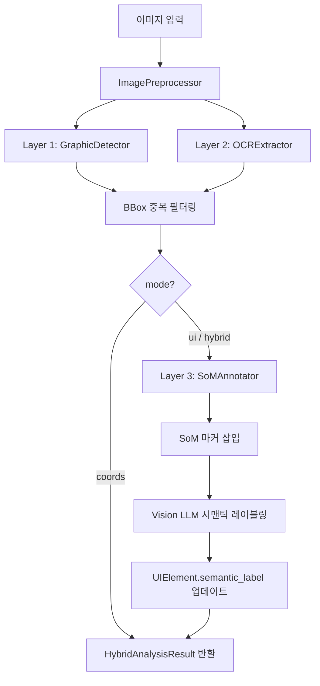
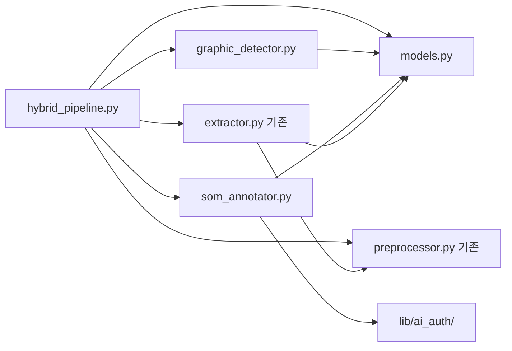
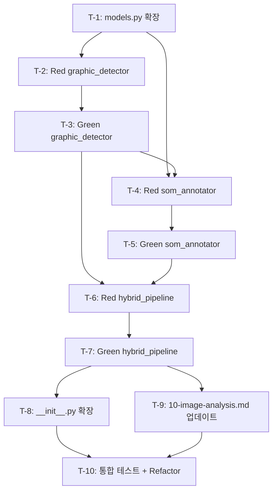

# OCR 3-Layer Hybrid Pipeline 구현 계획서

**작성일**: 2026-02-23
**버전**: 1.0.0
**복잡도**: STANDARD (3/5)
**담당**: planner
**PRD**: `C:\claude\docs\00-prd\ocr-hybrid-pipeline.prd.md`

---

## 1. 배경

### 1.1 문제 정의

단일 Vision API(Claude Vision)는 이미지 내 UI 요소의 **픽셀 좌표를 부정확하게 측정**한다. Vision LLM은 의미론적 이해에 강점이 있으나 정밀한 픽셀 좌표 추출에는 구조적 한계가 존재한다.

기존 `lib/ocr/` 모듈은 Tesseract OCR 기반 텍스트 BBox + 신뢰도 추출, OpenCV + Pillow 전처리 파이프라인까지 구현 완료 상태이나, 다음이 미구현이다:

- 비텍스트 요소(버튼, 아이콘, 이미지 블록 등) 감지
- Set-of-Mark(SoM) 프롬프팅을 통한 시맨틱 레이블링
- 3-Layer 통합 오케스트레이터

### 1.2 목적

기존 코드베이스 위에 완전한 3-Layer Hybrid Pipeline을 구축하여:

1. **정밀 좌표**: OpenCV `findContours()`로 비텍스트 UI 요소의 픽셀 BBox 추출
2. **텍스트 정밀도**: 기존 Tesseract OCR (`OCRExtractor.extract_text()`) 재사용
3. **시맨틱 레이블**: SoM 프롬프팅으로 Vision LLM이 좌표 추정 대신 번호 기반 의미 분류 수행

---

## 2. 구현 범위

### 2.1 포함 항목

| 항목 | 설명 |
|------|------|
| `graphic_detector.py` 신규 | `cv2.findContours()` 기반 비텍스트 요소 BBox 추출 |
| `som_annotator.py` 신규 | SoM 마커 삽입 + Vision LLM 시맨틱 레이블링 |
| `hybrid_pipeline.py` 신규 | 3-Layer 통합 오케스트레이터 |
| `models.py` 확장 | `UIElement`, `HybridAnalysisResult` dataclass 추가 |
| `__init__.py` 확장 | 신규 공개 API 노출 |
| `10-image-analysis.md` 업데이트 | `--coords` / `--ui` / `--mode hybrid` 옵션 문서화 |
| 중복 필터링 | Layer 1, 2 BBox 중복 제거 로직 |
| Fallback 처리 | Vision LLM 실패 시 Layer 1+2 결과만 반환 |
| TDD 테스트 3건 | graphic_detector, som_annotator, hybrid_pipeline 각각 |

### 2.2 제외 항목

| 항목 | 이유 |
|------|------|
| Vision LLM 좌표 추정 | SoM 핵심 원칙: LLM에 좌표 요청 금지 |
| 실시간 스트리밍 | 정적 이미지 파일 처리만 대상 |
| GPU 가속 (CUDA) | CPU 기반 OpenCV로 충분 |
| 배치 처리 | 단일 이미지 파이프라인만 구현 |
| 기존 코드 수정 | `extractor.py`, `preprocessor.py`, `models.py` 기존 클래스 변경 없음 |

---

## 3. 영향 파일

### 3.1 신규 생성

| 파일 | 역할 |
|------|------|
| `C:\claude\lib\ocr\graphic_detector.py` | `GraphicDetector` 클래스 — `cv2.findContours()` 기반 비텍스트 요소 감지 |
| `C:\claude\lib\ocr\som_annotator.py` | `SoMAnnotator` 클래스 — SoM 마커 삽입 + Vision LLM 레이블링 |
| `C:\claude\lib\ocr\hybrid_pipeline.py` | `HybridPipeline` 클래스 — 3-Layer 통합 오케스트레이터 |
| `C:\claude\tests\test_ocr_graphic_detector.py` | Layer 1 단위 테스트 |
| `C:\claude\tests\test_ocr_som_annotator.py` | Layer 3 단위 테스트 |
| `C:\claude\tests\test_ocr_hybrid_pipeline.py` | 통합 파이프라인 테스트 |

### 3.2 수정 대상

| 파일 | 변경 내용 | 기존 코드 영향 |
|------|----------|---------------|
| `C:\claude\lib\ocr\models.py` | `UIElement`, `HybridAnalysisResult` dataclass 추가 (파일 하단 append) | 기존 `BBox`, `OCRResult`, `AnalysisResult` 등 변경 없음 |
| `C:\claude\lib\ocr\__init__.py` | `HybridPipeline`, `UIElement`, `HybridAnalysisResult`, `GraphicDetector`, `SoMAnnotator` import 추가 | 기존 import 및 `__all__` 변경 없음 (항목 추가만) |
| `C:\claude\.claude\rules\10-image-analysis.md` | `--coords`, `--ui`, `--mode hybrid` 옵션 문서 추가 | 기존 섹션 변경 없음 (새 섹션 추가) |

---

## 4. 기술 설계

### 4.1 아키텍처 개요



**내부 의존성 그래프:**



### 4.2 Layer 1: GraphicDetector

**파일**: `C:\claude\lib\ocr\graphic_detector.py`

**클래스 설계:**

```python
class GraphicDetector:
    def __init__(self, min_area: int = 500, overlap_threshold: float = 0.5):
        self.min_area = min_area          # FR-3: 최소 면적 500px²
        self.overlap_threshold = overlap_threshold

    def detect_elements(self, image: Image.Image) -> List[UIElement]:
        """비텍스트 요소 감지 → UIElement 리스트 반환 (FR-1, FR-2, FR-5)"""
        # 1. PIL → OpenCV (BGR grayscale)
        # 2. cv2.threshold() (Otsu 이진화)
        # 3. cv2.findContours(RETR_EXTERNAL, CHAIN_APPROX_SIMPLE) (C-5)
        # 4. min_area 필터링 (FR-3)
        # 5. cv2.approxPolyDP → cv2.boundingRect → BBox (FR-4)
        # 6. UIElement(element_type="graphic", layer=1) 변환 (FR-5)

    def filter_overlapping(
        self, graphic_elements: List[UIElement], text_elements: List[UIElement]
    ) -> List[UIElement]:
        """텍스트 BBox와 중복되는 그래픽 컨투어 필터링 (FR-6)"""
        # IoU(Intersection over Union) 기반 중복 판정
        # overlap_threshold 초과 시 제거

    def _compute_iou(self, bbox1: BBox, bbox2: BBox) -> float:
        """두 BBox 간 IoU 계산"""
```

**핵심 구현 포인트:**
- `cv2.findContours()` 파라미터: `RETR_EXTERNAL` + `CHAIN_APPROX_SIMPLE` (C-5 제약사항)
- `cv2.approxPolyDP(contour, epsilon, True)`로 다각형 근사 후 `cv2.boundingRect()`로 BBox 정규화
- `min_area=500` 기본값으로 노이즈 소형 컨투어 제거
- `confidence`는 `contour_area / bbox_area` 비율로 산출 (직사각형에 가까울수록 높음)

### 4.3 Layer 2: Tesseract OCR 재사용

**기존 코드**: `C:\claude\lib\ocr\extractor.py` — `OCRExtractor` 클래스

**변경 없음**. `HybridPipeline`에서 다음 순서로 호출:

1. `OCRExtractor(image_path, lang)` 인스턴스 생성
2. `extract_text(preprocess=True)` 호출 → `OCRResult` 획득
3. `OCRResult.layout_info.blocks` 순회 → 각 `Word`의 `bbox` + `confidence` 추출
4. `UIElement(element_type="text", layer=2)` 변환 (FR-9)
5. `confidence_threshold` (기본 0.5) 미만 결과 제외 (FR-8)

**기존 데이터 흐름 활용:**
- `OCRExtractor.extract_text()` 내부의 `pytesseract.image_to_data()` 결과에서 `left`, `top`, `width`, `height`, `conf` 필드 직접 접근
- `_extract_layout_info()` 메서드가 이미 `BBox` 객체를 생성하므로 그대로 재사용

### 4.4 Layer 3: SoM + Vision LLM

**파일**: `C:\claude\lib\ocr\som_annotator.py`

**클래스 설계:**

```python
class SoMAnnotator:
    def __init__(self, tmp_dir: str = "C:\\claude\\lib\\ocr\\tmp", api_timeout: int = 20):
        self.tmp_dir = Path(tmp_dir)
        self.api_timeout = api_timeout   # NFR-P3: 20초 타임아웃

    def annotate(self, image: Image.Image, elements: List[UIElement]) -> Path:
        """요소마다 번호 마커 삽입 → 어노테이션 이미지 저장 (FR-10)"""
        # 1. 이미지 복사
        # 2. 각 UIElement의 bbox 좌상단에 빨간 원 + 흰색 번호 텍스트 삽입
        #    cv2.circle() + cv2.putText()
        # 3. 마커 ID → UIElement.marker_id 할당
        # 4. tmp_dir에 어노테이션 이미지 저장 (C-4)
        # 5. 저장 경로 반환

    def label_with_vision(
        self, annotated_image_path: Path, elements: List[UIElement]
    ) -> List[UIElement]:
        """Vision LLM에 SoM 프롬프트 전달 → 시맨틱 레이블 획득 (FR-11, FR-12)"""
        # 1. lib/ai_auth/ 통해 Claude Vision API 인증 (C-3)
        # 2. SoM 프롬프트 구성: "이미지에 번호가 표시된 UI 요소들이 있습니다.
        #    각 번호의 요소가 무엇인지 JSON으로 응답하세요. {번호: 레이블}"
        # 3. 좌표 추정 요청 절대 금지 (C-2)
        # 4. API 응답 파싱 → {marker_id: semantic_label} 매핑
        # 5. 각 UIElement.semantic_label 업데이트
        # 6. API 실패 시 semantic_label="unknown" 처리 (FR-13)

    def cleanup(self):
        """tmp_dir 내 어노테이션 이미지 정리 (C-4)"""
```

**SoM 프롬프트 템플릿:**
```
이 이미지에 빨간 번호 마커가 표시된 UI 요소들이 있습니다.
각 번호의 요소가 무엇인지 시맨틱 레이블을 부여하세요.
좌표는 제공하지 마세요. 의미만 분류하세요.

JSON 형식으로 응답: {"1": "submit_button", "2": "search_input", ...}
```

### 4.5 HybridPipeline 오케스트레이터

**파일**: `C:\claude\lib\ocr\hybrid_pipeline.py`

**클래스 설계:**

```python
class HybridPipeline:
    def __init__(
        self,
        lang: str = "kor+eng",
        min_area: int = 500,
        confidence_threshold: float = 0.5,
    ):
        self.lang = lang
        self.min_area = min_area
        self.confidence_threshold = confidence_threshold

    def run(self, image_path: str, mode: str = "hybrid") -> HybridAnalysisResult:
        """3-Layer 통합 실행 (FR-14, FR-15, FR-16)"""
        # 1. 이미지 로드 + 전처리
        # 2. Layer 1: GraphicDetector.detect_elements()
        # 3. Layer 2: OCRExtractor.extract_text() → UIElement 변환
        # 4. GraphicDetector.filter_overlapping() → 중복 제거
        # 5. if mode in ("ui", "hybrid"):
        #      Layer 3: SoMAnnotator.annotate() → label_with_vision()
        # 6. HybridAnalysisResult 구성 + 반환
        # 7. SoMAnnotator.cleanup() (finally 블록)
```

**mode별 실행 범위:**

| mode | Layer 1 | Layer 2 | Layer 3 | LLM 호출 |
|------|:-------:|:-------:|:-------:|:--------:|
| `"coords"` | O | O | X | X |
| `"ui"` | O | O | O | O |
| `"hybrid"` | O | O | O | O |

### 4.6 데이터 모델 확장

**파일**: `C:\claude\lib\ocr\models.py` (하단 append, 기존 클래스 변경 없음)

```python
@dataclass
class UIElement:
    element_type: str       # "text" | "graphic"
    bbox: BBox              # 기존 BBox 재사용
    semantic_label: str     # SoM 레이블 (기본값: "unknown")
    confidence: float       # 0.0~1.0
    layer: int              # 1 (graphic) 또는 2 (text)
    marker_id: int          # SoM 마커 번호 (0 = 미할당)

@dataclass
class HybridAnalysisResult:
    elements: List[UIElement]
    annotated_image_path: Optional[str]  # SoM 이미지 경로 (mode=coords면 None)
    processing_time: float               # 전체 처리 시간 (초)
    layer_stats: dict                    # {"layer1": N, "layer2": M, "total": N+M}
    mode: str                            # "coords" | "ui" | "hybrid"
```

**기존 모델과의 관계:**
- `UIElement.bbox`는 기존 `BBox` (line 12-30) 재사용
- `UIElement`는 기존 `TextRegion`과 별개의 모델 (TextRegion은 OCR 전용, UIElement은 Hybrid Pipeline 전용)
- `HybridAnalysisResult`는 기존 `AnalysisResult`와 별개 (AnalysisResult는 Vision+OCR 텍스트 분석용, HybridAnalysisResult는 좌표+레이블 분석용)

---

## 5. 위험 요소

| # | 위험 | 영향 | 완화 전략 |
|---|------|------|-----------|
| R-1 | **Vision LLM API 호출 비용** — `mode="ui"` 사용 시 매 이미지마다 Claude Vision API 호출 발생 | 비용 증가 | 기본 mode를 `"coords"`로 설정하여 LLM 호출 없이 좌표만 추출. `"ui"` 모드는 명시적 요청 시에만 활성화 |
| R-2 | **Tesseract 미설치 환경** — CI/CD 또는 새 개발 환경에서 Tesseract가 없을 수 있음 | Layer 2 실패 → 파이프라인 불완전 | 기존 `TesseractNotFoundError` 활용 + graceful fallback (Layer 1 결과만 반환) |
| R-3 | **대형 이미지 메모리 사용량** — 4K+ 이미지에서 `findContours()` + `image_to_data()` 동시 실행 시 메모리 부하 | OOM 가능성 | 이미지 최대 해상도 제한 (4096x4096), 초과 시 리사이즈 후 좌표 역산 |
| R-4 | **BBox 중복 필터링 오판** — IoU 임계값이 너무 낮으면 유효 요소 제거, 너무 높으면 중복 잔존 | 결과 정확도 저하 | `overlap_threshold=0.5` 기본값, 튜닝 가능하도록 파라미터 노출 |
| R-5 | **SoM 프롬프트 파싱 실패** — Vision LLM이 기대하지 않는 형식으로 응답할 수 있음 | Layer 3 부분 실패 | JSON 파싱 실패 시 `semantic_label="unknown"` 처리, 로그 경고 출력 |
| R-6 | **기존 `__init__.py` 확장 시 순환 import** — 신규 모듈이 기존 모듈을 참조하면서 발생 가능 | import 오류 | 의존성 방향 단방향 유지: `hybrid_pipeline → graphic_detector/som_annotator → models` |

### Edge Case

| # | 시나리오 | 기대 동작 |
|---|---------|-----------|
| E-1 | 텍스트만 있고 비텍스트 요소가 없는 이미지 | Layer 1 결과 = 빈 리스트, Layer 2 결과만 반환. `layer_stats.layer1 = 0` |
| E-2 | 비텍스트 요소만 있고 텍스트가 없는 이미지 (아이콘 모음 등) | Layer 2 결과 = 빈 리스트, Layer 1 결과만 반환. `layer_stats.layer2 = 0` |
| E-3 | 완전히 빈 이미지 (흰색/검정색 단색) | 두 Layer 모두 빈 리스트. `elements=[]`, `layer_stats` 모두 0 |
| E-4 | 이미지 파일이 아닌 경로 입력 | 기존 `ImageLoadError` 발생. 파이프라인 진입 전 실패 |
| E-5 | Vision LLM API 타임아웃 (20초 초과) | `semantic_label="unknown"` 처리 + 경고 로그. `mode="coords"` 결과 반환 |
| E-6 | Tesseract와 GraphicDetector가 동일 영역을 동시 감지 | `filter_overlapping()` IoU 기반 중복 제거. 텍스트 요소 우선 유지 |

---

## 6. TDD 전략

**원칙**: Red -> Green -> Refactor. 각 신규 파일마다 테스트 먼저 작성.

### 6.1 테스트 파일 매핑

| 테스트 파일 | 대상 파일 | 순서 |
|------------|-----------|:----:|
| `C:\claude\tests\test_ocr_graphic_detector.py` | `graphic_detector.py` | 1st |
| `C:\claude\tests\test_ocr_som_annotator.py` | `som_annotator.py` | 2nd |
| `C:\claude\tests\test_ocr_hybrid_pipeline.py` | `hybrid_pipeline.py` | 3rd |

### 6.2 테스트 케이스 개요

**test_ocr_graphic_detector.py:**
- `test_detect_elements_basic` — 도형이 포함된 합성 이미지에서 UIElement 리스트 반환 확인
- `test_min_area_filter` — 100px^2 미만 소형 컨투어가 필터링됨
- `test_empty_image` — 단색 이미지에서 빈 리스트 반환
- `test_filter_overlapping` — 텍스트 BBox와 겹치는 그래픽 요소가 제거됨
- `test_element_type_graphic` — 반환된 UIElement.element_type == "graphic"
- `test_layer_value` — 반환된 UIElement.layer == 1

**test_ocr_som_annotator.py:**
- `test_annotate_creates_image` — 마커 삽입 후 이미지 파일 생성 확인
- `test_marker_ids_assigned` — 각 UIElement에 고유 marker_id 할당
- `test_label_with_vision_success` — Vision LLM mock으로 시맨틱 레이블 할당 확인
- `test_label_with_vision_failure` — API 실패 시 semantic_label="unknown"
- `test_cleanup` — tmp 디렉토리 정리 확인

**test_ocr_hybrid_pipeline.py:**
- `test_run_coords_mode` — mode="coords"에서 Layer 1+2만 실행, LLM 호출 없음
- `test_run_ui_mode` — mode="ui"에서 Layer 1+2+3 전체 실행
- `test_result_has_layer_stats` — HybridAnalysisResult.layer_stats 키 존재 확인
- `test_result_processing_time` — processing_time > 0
- `test_empty_image_handling` — 빈 이미지에서 elements=[] 반환
- `test_confidence_threshold_filter` — 신뢰도 낮은 텍스트 결과 필터링 확인

### 6.3 Mock 전략

- **Tesseract**: 기존 `C:\claude\lib\ocr\tests\conftest.py`의 `mock_pytesseract` fixture 재사용
- **Vision LLM**: `unittest.mock.patch`로 `anthropic.Anthropic` mock — SoM JSON 응답 시뮬레이션
- **이미지 생성**: `PIL.ImageDraw`로 합성 테스트 이미지 생성 (도형 + 텍스트)

---

## 7. 태스크 목록

### T-1: models.py에 UIElement, HybridAnalysisResult dataclass 추가

**파일**: `C:\claude\lib\ocr\models.py`
**위치**: 파일 하단 (line 179 이후 append)
**방법**: 기존 `AnalysisResult` 아래에 `UIElement`, `HybridAnalysisResult` 두 dataclass 추가. `from typing import Optional` import 추가 필요.
**Acceptance Criteria**:
- `UIElement` dataclass가 `element_type`, `bbox`, `semantic_label`, `confidence`, `layer`, `marker_id` 필드를 가짐
- `HybridAnalysisResult` dataclass가 `elements`, `annotated_image_path`, `processing_time`, `layer_stats`, `mode` 필드를 가짐
- `BBox` 타입을 재사용
- 기존 클래스 (`BBox`, `Word`, `Line`, `Paragraph`, `TextBlock`, `LayoutInfo`, `TextRegion`, `TableDetection`, `OCRResult`, `AnalysisResult`) 변경 없음
- `pytest C:\claude\lib\ocr\tests\test_models.py -v` 기존 테스트 통과 유지

### T-2: TDD Red — test_ocr_graphic_detector.py 작성

**파일**: `C:\claude\tests\test_ocr_graphic_detector.py` (신규)
**방법**: PIL.ImageDraw로 합성 이미지(사각형, 원 등) 생성하는 fixture + 6개 테스트 케이스 작성 (6.2절 참조). `GraphicDetector` import 실패 허용 (Red 단계).
**Acceptance Criteria**:
- 6개 테스트 함수 존재
- `pytest C:\claude\tests\test_ocr_graphic_detector.py --collect-only` 성공
- 실행 시 `ImportError` 또는 `FAILED` (Red 상태)

### T-3: Green — graphic_detector.py 구현

**파일**: `C:\claude\lib\ocr\graphic_detector.py` (신규)
**방법**: `GraphicDetector` 클래스 구현 (4.2절 설계 기반). `detect_elements()`, `filter_overlapping()`, `_compute_iou()` 메서드.
**Acceptance Criteria**:
- `pytest C:\claude\tests\test_ocr_graphic_detector.py -v` 전체 통과
- `ruff check C:\claude\lib\ocr\graphic_detector.py` 린트 통과
- `cv2.findContours(_, cv2.RETR_EXTERNAL, cv2.CHAIN_APPROX_SIMPLE)` 사용 확인 (C-5)

### T-4: TDD Red — test_ocr_som_annotator.py 작성

**파일**: `C:\claude\tests\test_ocr_som_annotator.py` (신규)
**방법**: Vision LLM mock fixture + 5개 테스트 케이스 작성 (6.2절 참조).
**Acceptance Criteria**:
- 5개 테스트 함수 존재
- `pytest C:\claude\tests\test_ocr_som_annotator.py --collect-only` 성공
- 실행 시 `ImportError` 또는 `FAILED` (Red 상태)

### T-5: Green — som_annotator.py 구현

**파일**: `C:\claude\lib\ocr\som_annotator.py` (신규)
**방법**: `SoMAnnotator` 클래스 구현 (4.4절 설계 기반). `annotate()`, `label_with_vision()`, `cleanup()` 메서드.
**Acceptance Criteria**:
- `pytest C:\claude\tests\test_ocr_som_annotator.py -v` 전체 통과
- API 실패 시 `semantic_label="unknown"` 처리 확인
- `C:\claude\lib\ocr\tmp\` 디렉토리에 임시 이미지 저장 + cleanup 동작
- 좌표 추정 프롬프트 없음 확인 (C-2)
- `lib/ai_auth/` 인증 흐름 사용 (C-3)

### T-6: TDD Red — test_ocr_hybrid_pipeline.py 작성

**파일**: `C:\claude\tests\test_ocr_hybrid_pipeline.py` (신규)
**방법**: GraphicDetector + OCRExtractor + SoMAnnotator mock + 6개 테스트 케이스 작성 (6.2절 참조).
**Acceptance Criteria**:
- 6개 테스트 함수 존재
- `pytest C:\claude\tests\test_ocr_hybrid_pipeline.py --collect-only` 성공
- 실행 시 `ImportError` 또는 `FAILED` (Red 상태)

### T-7: Green — hybrid_pipeline.py 구현

**파일**: `C:\claude\lib\ocr\hybrid_pipeline.py` (신규)
**방법**: `HybridPipeline` 클래스 구현 (4.5절 설계 기반). `run(image_path, mode)` 메서드.
**Acceptance Criteria**:
- `pytest C:\claude\tests\test_ocr_hybrid_pipeline.py -v` 전체 통과
- `mode="coords"` 시 Vision LLM 호출 없음 확인
- `mode="ui"` 시 SoMAnnotator 호출 확인
- `HybridAnalysisResult` 반환 + layer_stats 정확성
- finally 블록에서 `SoMAnnotator.cleanup()` 호출

### T-8: __init__.py 공개 API 확장

**파일**: `C:\claude\lib\ocr\__init__.py`
**위치**: 기존 import 블록 하단 + `__all__` 리스트 확장
**방법**: `GraphicDetector`, `SoMAnnotator`, `HybridPipeline`, `UIElement`, `HybridAnalysisResult` 추가.
**Acceptance Criteria**:
- `from lib.ocr import HybridPipeline, UIElement, HybridAnalysisResult` 성공
- `from lib.ocr import GraphicDetector, SoMAnnotator` 성공
- 기존 `from lib.ocr import OCRExtractor, ImagePreprocessor` 동작 유지
- `__all__` 리스트에 5개 신규 항목 포함

### T-9: 10-image-analysis.md 옵션 문서 업데이트

**파일**: `C:\claude\.claude\rules\10-image-analysis.md`
**위치**: 기존 "옵션 처리" 테이블 하단에 새 섹션 추가
**방법**: `--coords`, `--ui`, `--mode hybrid` 옵션 설명 + CLI 예제 추가.
**Acceptance Criteria**:
- `--coords` 옵션 설명 존재 (Layer 1+2만, LLM 호출 없음)
- `--ui` 옵션 설명 존재 (Layer 1+2+3, 시맨틱 레이블 포함)
- `--mode hybrid` 옵션 설명 존재 (`--ui`와 동일)
- 기존 옵션 (`--table`, `--preset`) 설명 변경 없음

### T-10: 전체 통합 테스트 + Refactor

**방법**: 3개 테스트 파일 전체 실행 + 기존 OCR 테스트 회귀 확인.
**Acceptance Criteria**:
- `pytest C:\claude\tests\test_ocr_graphic_detector.py C:\claude\tests\test_ocr_som_annotator.py C:\claude\tests\test_ocr_hybrid_pipeline.py -v` 전체 통과
- `pytest C:\claude\lib\ocr\tests\ -v` 기존 테스트 전체 통과 (회귀 없음)
- `ruff check C:\claude\lib\ocr\ --fix` 린트 클린

### 태스크 의존성



---

## 8. 커밋 전략

| 순서 | 커밋 메시지 | 포함 태스크 |
|:----:|------------|:-----------:|
| 1 | `feat(ocr): UIElement, HybridAnalysisResult 데이터 모델 추가` | T-1 |
| 2 | `test(ocr): GraphicDetector TDD Red 테스트 추가` | T-2 |
| 3 | `feat(ocr): GraphicDetector cv2.findContours 기반 비텍스트 요소 감지 구현` | T-3 |
| 4 | `test(ocr): SoMAnnotator TDD Red 테스트 추가` | T-4 |
| 5 | `feat(ocr): SoMAnnotator Set-of-Mark 마커 삽입 + Vision LLM 레이블링 구현` | T-5 |
| 6 | `test(ocr): HybridPipeline TDD Red 테스트 추가` | T-6 |
| 7 | `feat(ocr): HybridPipeline 3-Layer 통합 오케스트레이터 구현` | T-7 |
| 8 | `feat(ocr): __init__.py 공개 API 확장 + image-analysis 규칙 업데이트` | T-8, T-9 |
| 9 | `refactor(ocr): Hybrid Pipeline 통합 테스트 통과 + 린트 정리` | T-10 |
