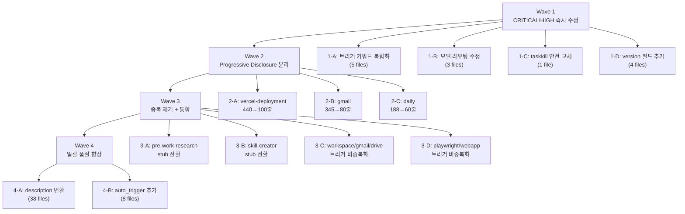

# Skill Audit Quality Improvement Work Plan

## 배경 (Background)

- **요청 내용**: skill-creator 품질 기준(FM, PD, TA, ST, TE) 5개 차원으로 39개 스킬 감사 후 발견된 시스템 차원 품질 문제 수정
- **해결하려는 문제**: bare keyword 충돌, 모델 라우팅 위반, 안전 규칙 위반, Progressive Disclosure 미적용, 스킬 중복

## 구현 범위 (Scope)

### 포함 항목
- Wave 1: CRITICAL/HIGH 즉시 수정 (트리거 키워드, 모델 라우팅, 안전 규칙, version 필드)
- Wave 2: Progressive Disclosure 분리 (vercel-deployment, gmail, daily)
- Wave 3: 중복 제거 + 통합 (stub 전환, 트리거 비중복화)
- Wave 4: 일괄 품질 향상 (description 형식, auto_trigger 명시)

### 제외 항목
- 스킬 로직/워크플로우 자체 변경
- 새로운 스킬 생성
- 커맨드 파일(.claude/commands/) 수정

## 영향 파일 (Affected Files)

### 수정 예정 파일

| Wave | 파일 경로 | 수정 유형 |
|------|----------|----------|
| 1-A | `C:\claude\.claude\skills\check\SKILL.md` | 트리거 키워드 교체 |
| 1-A | `C:\claude\.claude\skills\create\SKILL.md` | 트리거 키워드 교체 |
| 1-A | `C:\claude\.claude\skills\pr\SKILL.md` | 트리거 키워드 교체 |
| 1-A | `C:\claude\.claude\skills\issue\SKILL.md` | 트리거 키워드 교체 |
| 1-A | `C:\claude\.claude\skills\commit\SKILL.md` | 트리거 키워드 교체 |
| 1-B | `C:\claude\.claude\skills\debug\SKILL.md` | model sonnet → opus |
| 1-B | `C:\claude\.claude\skills\parallel\SKILL.md` | architect/executor-high → opus |
| 1-B | `C:\claude\.claude\skills\confluence\SKILL.md` | `model:` → `model_preference:` |
| 1-C | `C:\claude\.claude\skills\webapp-testing\SKILL.md` | taskkill 4곳 제거 |
| 1-D | `C:\claude\.claude\skills\create\SKILL.md` | version 필드 추가 |
| 1-D | `C:\claude\.claude\skills\pr\SKILL.md` | version 필드 추가 |
| 1-D | `C:\claude\.claude\skills\session\SKILL.md` | version 필드 추가 |
| 1-D | `C:\claude\.claude\skills\issue\SKILL.md` | version 필드 추가 |
| 2-A | `C:\claude\.claude\skills\vercel-deployment\SKILL.md` | 440줄 → ~100줄 축소 |
| 2-B | `C:\claude\.claude\skills\gmail\SKILL.md` | 345줄 → ~80줄 축소 |
| 2-C | `C:\claude\.claude\skills\daily\SKILL.md` | 188줄 → ~60줄 축소 |
| 3-A | `C:\claude\.claude\skills\pre-work-research\SKILL.md` | redirect stub 전환 |
| 3-B | `C:\claude\.claude\skills\skill-creator\SKILL.md` | redirect stub 전환 |
| 3-C | `C:\claude\.claude\skills\google-workspace\SKILL.md` | Gmail/Drive 키워드 제거 |
| 3-D | `C:\claude\.claude\skills\playwright-wrapper\SKILL.md` | 중복 키워드 제거 |
| 3-D | `C:\claude\.claude\skills\webapp-testing\SKILL.md` | 중복 키워드 제거 |
| 4 | 38개 SKILL.md 전체 | description 형식 + auto_trigger |

### 신규 생성 파일

| Wave | 파일 경로 |
|------|----------|
| 2-A | `C:\claude\.claude\skills\vercel-deployment\references\deployment-guide.md` |
| 2-B | `C:\claude\.claude\skills\gmail\references\gmail-workflows.md` |
| 2-C | `C:\claude\.claude\skills\daily\references\daily-phases.md` |

## 위험 요소 (Risks)

### 잠재적 부작용

1. **트리거 키워드 변경으로 기존 호출 실패**: 사용자가 bare keyword "check", "create", "pr" 등으로 호출하던 패턴이 더 이상 매칭되지 않음. `/slash` 커맨드로 대체 가능하므로 영향은 미미.
2. **Progressive Disclosure 분리 후 references 파일 Read 누락**: SKILL.md에서 references/ 파일 참조 지시가 누락되면 에이전트가 상세 워크플로우에 접근 불가. SKILL.md에 명시적 Read 지시문 포함 필수.
3. **stub 전환 시 기존 사용 패턴 파괴**: pre-work-research 또는 skill-creator를 직접 호출하던 워크플로우가 redirect 메시지만 받게 됨.
4. **description 일괄 변경 시 의미 손실**: 38개 스킬의 description을 기계적으로 변환하면 원래 의도가 희석될 수 있음.

### Edge Cases

1. **google-workspace에서 Gmail 키워드 제거 후 gmail 스킬이 설치되지 않은 환경**: google-workspace가 Gmail 기능을 커버하지 못하고 gmail 스킬도 매칭 안 됨 → gmail 스킬의 트리거에 "gmail api" 포함 여부 확인 필요.
2. **playwright-wrapper와 webapp-testing 키워드 분리 후 "E2E 테스트" 요청**: 현재 둘 다 "E2E 테스트"를 트리거로 가짐 → 분리 후 어느 쪽에도 매칭되지 않을 수 있음. playwright-wrapper에 "E2E 테스트" 유지 권장.
3. **confluence의 `model:` → `model_preference:` 변경**: frontmatter 스키마에서 `model_preference`가 실제 지원되는 필드인지 검증 필요 (webapp-testing에서 사용 중이므로 유효).

## 태스크 목록 (Tasks)

### Wave 1: CRITICAL/HIGH 즉시 수정

#### Task 1-A: 트리거 키워드 복합화 (5개 스킬)

**수정 방법**: 각 SKILL.md frontmatter의 `triggers.keywords` 배열 교체

| 스킬 | 파일:라인 | 현재 키워드 | 수정 후 키워드 |
|------|----------|------------|--------------|
| check | `check/SKILL.md:7-9` | "check", "/check", "검사" | "/check", "코드 검사", "품질 검사", "QA 실행" |
| create | `create/SKILL.md:6` | "create" | "/create", "PRD 생성", "PR 생성", "문서 생성" |
| pr | `pr/SKILL.md:6` | "pr" | "/pr", "PR 리뷰", "풀리퀘스트", "PR 생성" |
| issue | `issue/SKILL.md:7-10` | "issue", "/issue", "이슈", "github issue", "버그 리포트" | "/issue", "이슈 관리", "github issue", "버그 리포트" |
| commit | `commit/SKILL.md:7-10` | "commit", "커밋", "git commit", "/commit" | "/commit", "커밋 생성", "git commit", "변경사항 커밋" |

**Acceptance Criteria**: 모든 5개 스킬의 frontmatter에 bare keyword가 없음. 각 키워드가 2단어 이상이거나 `/` prefix를 가짐.

#### Task 1-B: 모델 라우팅 수정 (3개 스킬)

| 스킬 | 파일:라인 | 변경 |
|------|----------|------|
| debug | `debug/SKILL.md:19` | `model="sonnet"` → `model="opus"` |
| parallel | `parallel/SKILL.md:18-19` (executor), `parallel/SKILL.md:30-33` (테이블) | architect → `model="opus"`, executor-high → `model="opus"` |
| confluence | `confluence/SKILL.md:10` | `model: sonnet` → `model_preference: sonnet` |

**Acceptance Criteria**:
- debug의 architect 호출부에 `model="opus"` 명시
- parallel의 에이전트 테이블에서 architect=opus, executor-high=opus
- confluence frontmatter에 `model:` 키가 없고 `model_preference:` 키 존재

#### Task 1-C: 안전 규칙 위반 수정 (webapp-testing)

**파일**: `C:\claude\.claude\skills\webapp-testing\SKILL.md`
**위치**: 라인 115-117, 186 (taskkill /F /IM 4곳)

**수정 방법**: `taskkill /F /IM` 패턴을 `npx playwright test --timeout` 안전 종료 패턴으로 교체

```
# Before (라인 115-117)
taskkill /F /IM "chromium.exe" 2>$null
taskkill /F /IM "chrome.exe" 2>$null
taskkill /F /IM "firefox.exe" 2>$null

# After
npx playwright test --timeout 30000
# 또는 Playwright의 globalTeardown 설정 활용

# Before (라인 186)
taskkill /F /IM "chromium.exe"

# After
# Playwright 내장 브라우저 종료 (context.close() / browser.close())
```

**Acceptance Criteria**: SKILL.md 내에 `taskkill` 문자열이 0건. 브라우저 종료 로직이 Playwright 내장 API 또는 timeout으로 대체.

#### Task 1-D: version 필드 추가 (4개 스킬)

| 스킬 | 파일 | 추가 내용 |
|------|------|----------|
| create | `create/SKILL.md` | frontmatter에 `version: 1.0.0` |
| pr | `pr/SKILL.md` | frontmatter에 `version: 1.0.0` |
| session | `session/SKILL.md` | frontmatter에 `version: 1.0.0` |
| issue | `issue/SKILL.md` | frontmatter에 `version: 1.0.0` |

**Acceptance Criteria**: 4개 스킬 frontmatter에 `version:` 필드가 존재.

---

### Wave 2: Progressive Disclosure 분리

#### Task 2-A: vercel-deployment 분리 (440줄 → ~100줄)

**파일**: `C:\claude\.claude\skills\vercel-deployment\SKILL.md`
**신규**: `C:\claude\.claude\skills\vercel-deployment\references\deployment-guide.md`

**수정 방법**:
1. SKILL.md에서 frontmatter + 개요 + 사용법 핵심만 유지 (~100줄)
2. 상세 워크플로우/가이드를 `references/deployment-guide.md`로 이동
3. SKILL.md에 `상세 가이드: Read "references/deployment-guide.md"` 지시문 추가

**Acceptance Criteria**: SKILL.md가 120줄 이하. references/ 파일이 존재. SKILL.md에 Read 지시문 포함.

#### Task 2-B: gmail 분리 (345줄 → ~80줄)

**파일**: `C:\claude\.claude\skills\gmail\SKILL.md`
**신규**: `C:\claude\.claude\skills\gmail\references\gmail-workflows.md`

**수정 방법**:
1. SKILL.md에서 frontmatter + 개요 + MCP 도구 목록만 유지 (~80줄)
2. 워크플로우 상세를 `references/gmail-workflows.md`로 이동
3. SKILL.md에 Read 지시문 추가

**Acceptance Criteria**: SKILL.md가 100줄 이하. references/ 파일이 존재. SKILL.md에 Read 지시문 포함.

#### Task 2-C: daily 분리 (188줄 → ~60줄)

**파일**: `C:\claude\.claude\skills\daily\SKILL.md`
**신규**: `C:\claude\.claude\skills\daily\references\daily-phases.md`

**수정 방법**:
1. SKILL.md에서 frontmatter + 개요 + 서브커맨드만 유지 (~60줄)
2. 9-phase 상세를 `references/daily-phases.md`로 이동
3. SKILL.md에 Read 지시문 추가

**Acceptance Criteria**: SKILL.md가 80줄 이하. references/ 파일이 존재. SKILL.md에 Read 지시문 포함.

---

### Wave 3: 중복 제거 + 통합

#### Task 3-A: pre-work-research stub 전환

**파일**: `C:\claude\.claude\skills\pre-work-research\SKILL.md`

**수정 방법**: 전체 내용을 redirect stub으로 교체
```yaml
---
name: pre-work-research
description: "[DEPRECATED] /research web으로 통합됨"
version: 2.0.0
triggers:
  keywords: []
---
# pre-work-research (Deprecated)
이 스킬은 `/research web`으로 통합되었습니다. `/research web`을 사용하세요.
```

**Acceptance Criteria**: triggers.keywords가 빈 배열. description에 DEPRECATED 표시. 본문에 redirect 안내.

#### Task 3-B: skill-creator (local) stub 전환

**파일**: `C:\claude\.claude\skills\skill-creator\SKILL.md`

**수정 방법**: 설치된 plugin과 이름 충돌이므로 local 버전을 redirect stub으로 전환

**Acceptance Criteria**: triggers.keywords가 빈 배열. description에 DEPRECATED 표시.

#### Task 3-C: google-workspace + gmail + drive 트리거 비중복화

| 스킬 | 제거할 키워드 | 유지할 키워드 |
|------|-------------|-------------|
| google-workspace | "gmail api", "google drive", "구글 드라이브" | "google workspace", "google docs", "google sheets", "스프레드시트", "구글 문서", "gdocs" |
| gmail | (변경 없음) | "gmail", "지메일", "메일", "이메일" |
| drive | (변경 없음) | "drive 정리", "드라이브 정리", "파일 정리" 등 |

**Acceptance Criteria**: google-workspace의 키워드에 "gmail", "drive" 관련 단어가 없음. 3개 스킬 간 키워드 교집합이 0.

#### Task 3-D: playwright-wrapper + webapp-testing 트리거 비중복화

| 스킬 | 수정 후 키워드 |
|------|--------------|
| playwright-wrapper | "playwright", "Playwright CLI", "브라우저 자동화", "웹 스크래핑", "E2E 테스트", "스크린샷", "웹 자동화" |
| webapp-testing | "E2E docker", "Docker 테스트", "webapp test", "웹앱 E2E 테스트", "Docker 환경 테스트" |

**현재 중복 키워드**: "브라우저 테스트" (playwright-wrapper:라인11, webapp-testing:라인13)

**수정 방법**:
- webapp-testing에서 "브라우저 테스트", "playwright test" 제거
- playwright-wrapper에서 "E2E docker" 관련 키워드 없음 확인

**Acceptance Criteria**: 두 스킬 간 키워드 교집합이 0.

---

### Wave 4: 일괄 품질 향상

#### Task 4-A: description 3인칭 형식 변환 (38개 스킬)

모든 스킬의 `description`을 "This skill should be used when..." 형식으로 변환.

**예시**:
```yaml
# Before
description: 코드 품질 및 보안 검사

# After
description: >
  This skill should be used when the user requests code quality checks,
  security audits, or QA cycles. Runs lint, tests, and fix loops.
```

**Acceptance Criteria**: 38개 스킬의 description이 "This skill should be used when" 패턴으로 시작.

#### Task 4-B: auto_trigger 명시 (8개 스킬)

| 스킬 | 추가 내용 |
|------|----------|
| check | `auto_trigger: false` |
| debug | `auto_trigger: false` |
| parallel | `auto_trigger: false` |
| commit | `auto_trigger: false` |
| session | `auto_trigger: false` |
| issue | `auto_trigger: false` |
| create | `auto_trigger: false` |
| pr | `auto_trigger: false` |

**Acceptance Criteria**: 8개 스킬 frontmatter에 `auto_trigger: false` 필드 존재.

## 구현 흐름 (Implementation Flow)



## 커밋 전략 (Commit Strategy)

| 순서 | 커밋 메시지 | 포함 변경 |
|------|-----------|----------|
| 1 | `fix(skills): bare keyword를 복합 keyword로 교체 (5개 스킬)` | Task 1-A |
| 2 | `fix(skills): 모델 라우팅 Smart Routing v24.2 준수 (3개 스킬)` | Task 1-B |
| 3 | `fix(skills): webapp-testing taskkill 안전 종료 패턴 교체` | Task 1-C |
| 4 | `chore(skills): version 필드 누락 스킬 보완 (4개)` | Task 1-D |
| 5 | `refactor(skills): vercel-deployment Progressive Disclosure 분리` | Task 2-A |
| 6 | `refactor(skills): gmail Progressive Disclosure 분리` | Task 2-B |
| 7 | `refactor(skills): daily Progressive Disclosure 분리` | Task 2-C |
| 8 | `refactor(skills): pre-work-research + skill-creator stub 전환` | Task 3-A, 3-B |
| 9 | `fix(skills): google-workspace/gmail/drive 트리거 비중복화` | Task 3-C |
| 10 | `fix(skills): playwright-wrapper/webapp-testing 트리거 비중복화` | Task 3-D |
| 11 | `style(skills): description 3인칭 형식 통일 + auto_trigger 명시` | Task 4-A, 4-B |
