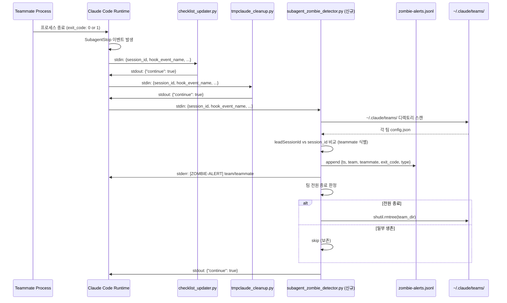
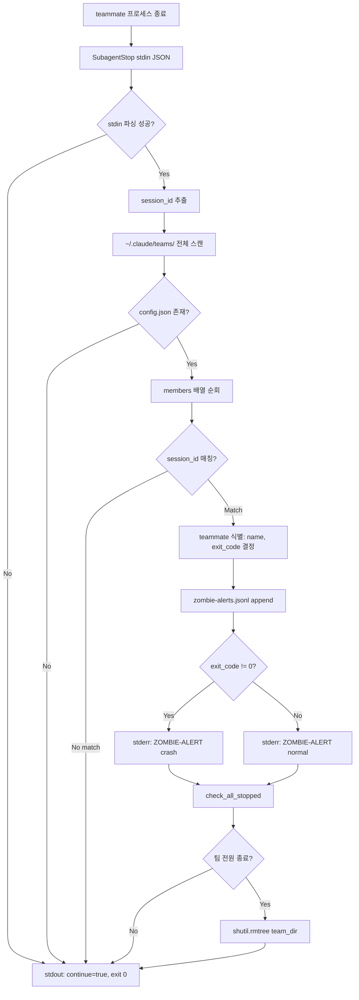

# Agent Teams 좀비 프로세스 감지 및 자동 정리 — 설계 문서

**문서 버전**: 1.0.0
**작성일**: 2026-02-23
**Plan**: `C:\claude\docs\01-plan\agent-teams-zombie-detection.plan.md`
**PRD**: `C:\claude\docs\00-prd\agent-teams-zombie-detection.prd.md`

---

## 목차

1. [아키텍처 개요](#1-아키텍처-개요)
2. [session_cleanup.py 수정 설계](#2-session_cleanuppy-수정-설계)
3. [subagent_zombie_detector.py 상세 설계](#3-subagent_zombie_detectorpy-상세-설계)
4. [settings.json 변경 설계](#4-settingsjson-변경-설계)
5. [테스트 설계](#5-테스트-설계)
6. [제약사항 체크리스트](#6-제약사항-체크리스트)

---

## 1. 아키텍처 개요

### 1.1 SubagentStop 이벤트 흐름

teammate 프로세스가 종료될 때 Claude Code는 `SubagentStop` 이벤트를 발생시키고, `settings.json`에 등록된 훅 체인이 순차적으로 실행된다.



### 1.2 신규 훅이 기존 체인에서 실행되는 위치

```
SubagentStop 이벤트 발생
        |
        v
[1] checklist_updater.py   ← 체크리스트 YAML 업데이트 (Task 도구 한정)
        |
        v
[2] tmpclaude_cleanup.py   ← tmpclaude-*-cwd 임시 파일 정리
        |
        v
[3] subagent_zombie_detector.py  (신규, 3번째)
        |
        +-- teams/ 스캔 → 이벤트 기록 → 팀 레지스트리 정리
        |
        v
    {"continue": true}
```

**순서 선택 근거**: zombie_detector가 팀 레지스트리(`config.json`)를 삭제할 수 있으므로, 기존 훅이 `config.json`을 읽을 수 있도록 후순위 배치. checklist_updater가 `cwd`에서 체크리스트를 읽고, tmpclaude_cleanup이 임시 파일을 정리한 뒤 팀 레지스트리를 삭제하면 안전하다.

### 1.3 데이터 흐름 다이어그램



## 2. session_cleanup.py 수정 설계

### 2.1 버그 위치 및 원인

**파일**: `C:\claude\.claude\hooks\session_cleanup.py`
**위치**: `cleanup_stale_agent_teams()` 함수 내 L88-93

**버그 재현 경로**:

```
config.json: {"createdAt": 1771836810399}  ← Unix ms int, 실측 데이터
                     |
                     v
L88: created = config.get("createdAt", "")  → 1771836810399 (int)
L89: if created:                             → True (int != 0)
L90: created_dt = datetime.fromisoformat(created.replace("Z", "+00:00"))
                                             ^^^^^^^^^^^^^^^^^^^^^^^^^
                                             int.replace() → AttributeError!
                     |
                     v
L96: except Exception as e:
         → errors 리스트에 추가, 삭제 skip → 좀비 팀 영구 잔류
```

### 2.2 import 추가 (L8, L12)

**변경 전**:
```python
import json
import os
import glob
import shutil
from datetime import datetime
from pathlib import Path
```

**변경 후**:
```python
import json
import os
import glob
import shutil
import sys
from datetime import datetime, timezone
from pathlib import Path
```

- `import sys`: stderr 출력용 (미지원 타입 경고)
- `timezone`: `timezone.utc` 통일 처리 (`created_dt.tzinfo` 의존 제거)

### 2.3 createdAt 파싱 로직 변경 전/후 상세 비교

**변경 전 (L88-93, 6줄)**:

```python
created = config.get("createdAt", "")
if created:
    created_dt = datetime.fromisoformat(created.replace("Z", "+00:00"))
    age_hours = (datetime.now(created_dt.tzinfo) - created_dt).total_seconds() / 3600
    if age_hours < ttl_hours:
        continue
```

**변경 후 (L88-103, 약 16줄)**:

```python
created = config.get("createdAt")
if created is not None and created != "":
    created_dt = None
    if isinstance(created, (int, float)) and created > 0:
        # Unix ms (13자리) vs Unix sec (10자리) 자동 감지
        ts = created / 1000 if created > 1e12 else float(created)
        created_dt = datetime.fromtimestamp(ts, tz=timezone.utc)
    elif isinstance(created, str) and created:
        created_dt = datetime.fromisoformat(created.replace("Z", "+00:00"))
    else:
        print(
            f"[session_cleanup] createdAt 타입 미지원: "
            f"{type(created).__name__}={created}",
            file=sys.stderr,
        )

    if created_dt is not None:
        age_hours = (datetime.now(timezone.utc) - created_dt).total_seconds() / 3600
        if age_hours < ttl_hours:
            continue
```

### 2.4 분기 처리 설계

| `createdAt` 값 | 타입 | 분기 | 처리 방법 |
|----------------|------|------|----------|
| `1771836810399` | int | `isinstance(int, float) and > 0` | `> 1e12` → ms → `/1000` → `fromtimestamp` |
| `1771836168` | int | `isinstance(int, float) and > 0` | `<= 1e12` → sec → `float(created)` → `fromtimestamp` |
| `"2026-02-23T10:00:00Z"` | str | `isinstance(str)` | `.replace("Z", "+00:00")` → `fromisoformat` |
| `0` | int | `isinstance(int, float) and > 0` 실패 | `created_dt = None` → TTL skip → 삭제 진행 |
| `""` | str | `created != ""` 실패 | if 블록 진입 안 함 → 삭제 진행 |
| `None` | NoneType | `created is not None` 실패 | if 블록 진입 안 함 → 삭제 진행 |
| `[]` | list | else 분기 | stderr 경고 → `created_dt = None` → 삭제 진행 |

### 2.5 핵심 변경점 요약

| 항목 | 변경 전 | 변경 후 |
|------|---------|---------|
| `createdAt` 기본값 | `""` (빈 문자열) | `None` (명시적 None 체크) |
| int 타입 처리 | 없음 (AttributeError) | `isinstance(int, float)` 분기 |
| ms/sec 자동 감지 | 없음 | `> 1e12` 기준 분기 |
| timezone 처리 | `created_dt.tzinfo` 의존 | `timezone.utc` 통일 |
| 미지원 타입 | except catch → skip | stderr 경고 후 삭제 진행 |

## 3. subagent_zombie_detector.py 상세 설계

### 3.1 SubagentStop stdin 입력 형식

Claude Code가 SubagentStop 훅에 전달하는 stdin JSON 구조:

```json
{
  "session_id": "78fe0576-1234-5678-abcd-ef0123456789",
  "hook_event_name": "SubagentStop",
  "stop_hook_active": false
}
```

> **주의**: stdin에 팀명이나 teammate 정보는 포함되지 않는다. `~/.claude/teams/` 디렉토리 전체 스캔을 통해 `session_id`와 `leadSessionId`를 비교하여 종료된 teammate를 식별해야 한다.

### 3.2 데이터 흐름 설계

```
stdin JSON 읽기 (session_id 추출)
       |
       v
~/.claude/teams/ 디렉토리 스캔
       |
       v
각 팀 config.json 읽기
  - name: 팀명
  - leadSessionId: Lead 세션 ID (비교 대상)
  - members: [{agentId, name, agentType, ...}]
       |
       v
session_id == leadSessionId?
  - Yes: Lead 세션 종료 → teammates 전체가 orphan 가능 (별도 처리)
  - No: teammate 종료 이벤트
       |
       v
zombie-alerts.jsonl append
  {"ts": <unix_ms>, "team": "...", "teammate": "...", "exit_code": 0, "type": "normal", "session_id": "..."}
       |
       v
stderr [ZOMBIE-ALERT] 출력
       |
       v
팀 전원 종료 확인
  - members에서 agentType != "team-lead" 필터
  - 각 member의 inbox 디렉토리 존재 여부 확인
  - ~/.claude/teams/{team}/inboxes/{agentId}/ 존재 → 활성
       |
       v
전원 종료? Yes → shutil.rmtree(team_dir)
           No  → skip (보존)
       |
       v
stdout {"continue": True} 출력, exit 0
```

### 3.3 함수 설계

| 함수 | 역할 | 입력 | 출력 |
|------|------|------|------|
| `main()` | 전체 흐름 조율, try-except 전체 감싸기 | - | stdout JSON |
| `parse_input(raw: str)` | stdin JSON 파싱, session_id 추출 | stdin 문자열 | `dict` or `None` |
| `find_team_by_session(session_id: str, teams_dir: Path)` | teams/ 스캔하여 session_id 매칭 | session_id, teams_dir | `(team_name, teammate_name, exit_code, team_dir)` or `None` |
| `write_alert(alert_data: dict, alert_file: Path)` | zombie-alerts.jsonl append | dict, Path | `bool` (성공 여부) |
| `warn_stderr(team: str, mate: str, exit_code: int)` | `[ZOMBIE-ALERT]` stderr 경고 | str, str, int | None |
| `check_all_stopped(team_dir: Path, config: dict)` | teammate 전원 종료 판정 | Path, dict | `bool` |
| `cleanup_team(team_dir: Path)` | 팀 레지스트리 디렉토리 삭제 | Path | `bool` |

### 3.4 팀 전원 종료 판정 로직

```python
def check_all_stopped(team_dir: Path, config: dict) -> bool:
    """
    팀 멤버 중 team-lead를 제외한 모든 teammate가 종료되었는지 확인.
    판정 기준: inboxes/{agentId}/ 디렉토리 존재 여부.
    """
    members = config.get("members", [])
    inboxes_dir = team_dir / "inboxes"

    for member in members:
        # team-lead는 체크 대상 제외
        if member.get("agentType") == "team-lead":
            continue

        agent_id = member.get("agentId", "")
        inbox_path = inboxes_dir / agent_id

        # inbox 디렉토리가 존재하면 아직 활성 상태
        if inbox_path.exists() and inbox_path.is_dir():
            return False

    # 모든 non-lead 멤버의 inbox가 없으면 전원 종료
    return True
```

### 3.5 JSONL 레코드 형식

```json
{
  "ts": 1771836168876,
  "team": "pdca-web-gui",
  "teammate": "executor",
  "exit_code": 0,
  "type": "normal",
  "session_id": "78fe0576-1234-5678-abcd-ef0123456789"
}
```

| 필드 | 타입 | 설명 |
|------|------|------|
| `ts` | int | 이벤트 발생 Unix ms timestamp |
| `team` | str | 팀 이름 (`config.json`의 `name`) |
| `teammate` | str | 종료된 teammate 이름 (`members[].name`) |
| `exit_code` | int | 프로세스 종료 코드 (0: 정상, 1+: 비정상) |
| `type` | str | `"normal"` (exit_code==0) or `"crash"` (exit_code!=0) |
| `session_id` | str | stdin에서 받은 종료 세션 ID |

### 3.6 방어 코드 패턴 (checklist_updater.py:L137 참조)

전체 `main()` 함수를 try-except로 감싸서, 어떤 예외가 발생해도 Lead 세션을 차단하지 않도록 보장한다. 파일 쓰기와 stderr 출력은 독립 try 블록으로 분리하여, 쓰기 실패 시에도 stderr 출력이 보장된다.

```python
def main():
    try:
        raw = sys.stdin.read()
        if not raw:
            return  # finally에서 {"continue": True} 출력

        hook_data = parse_input(raw)
        if hook_data is None:
            return

        session_id = hook_data.get("session_id", "")
        if not session_id:
            return

        teams_dir = Path.home() / ".claude" / "teams"
        alert_file = Path.home() / ".claude" / "zombie-alerts.jsonl"

        if not teams_dir.exists():
            return

        result = find_team_by_session(session_id, teams_dir)
        if result is None:
            return

        team_name, teammate_name, exit_code, team_dir, config = result
        alert_type = "crash" if exit_code != 0 else "normal"

        alert_data = {
            "ts": int(time.time() * 1000),
            "team": team_name,
            "teammate": teammate_name,
            "exit_code": exit_code,
            "type": alert_type,
            "session_id": session_id,
        }

        # 파일 쓰기 독립 try 블록
        try:
            write_alert(alert_data, alert_file)
        except Exception as e:
            print(f"[zombie-detector] write_alert failed: {e}", file=sys.stderr)

        # stderr 경고 독립 try 블록
        try:
            warn_stderr(team_name, teammate_name, exit_code)
        except Exception as e:
            print(f"[zombie-detector] warn_stderr failed: {e}", file=sys.stderr)

        # 팀 전원 종료 확인 및 정리
        try:
            if check_all_stopped(team_dir, config):
                cleanup_team(team_dir)
        except Exception as e:
            print(f"[zombie-detector] cleanup failed: {e}", file=sys.stderr)

    except Exception as e:
        print(f"[zombie-detector] error: {e}", file=sys.stderr)
    finally:
        # 항상 {"continue": True} 출력, exit 0 보장
        print(json.dumps({"continue": True}))
        sys.exit(0)
```

### 3.7 경로 설계 (pathlib.Path 사용)

| 경로 | 변수 | 구성 |
|------|------|------|
| `~/.claude/teams/` | `teams_dir` | `Path.home() / ".claude" / "teams"` |
| `~/.claude/teams/{team}/config.json` | `config_file` | `teams_dir / team_name / "config.json"` |
| `~/.claude/teams/{team}/inboxes/` | `inboxes_dir` | `team_dir / "inboxes"` |
| `~/.claude/zombie-alerts.jsonl` | `alert_file` | `Path.home() / ".claude" / "zombie-alerts.jsonl"` |

> **금지**: 경로 구분자 하드코딩 (`\`, `/`) 금지. 모든 경로는 `pathlib.Path` 연산자(`/`)로 구성.

### 3.8 표준 라이브러리 목록

외부 패키지 import 금지. 사용 가능 모듈:

```python
import json
import sys
import os
import time
import shutil
from pathlib import Path
from datetime import datetime, timezone
```

## 4. settings.json 변경 설계

### 4.1 변경 전/후 JSON 비교

**변경 전** (`SubagentStop` 섹션, hooks 2개):

```json
"SubagentStop": [
  {
    "matcher": "",
    "hooks": [
      {
        "type": "command",
        "command": "python3 C:/claude/.claude/hooks/checklist_updater.py"
      },
      {
        "type": "command",
        "command": "python3 C:/claude/.claude/hooks/tmpclaude_cleanup.py"
      }
    ]
  }
]
```

**변경 후** (`SubagentStop` 섹션, hooks 3개 — 신규 훅을 기존 2개 뒤에 추가):

```json
"SubagentStop": [
  {
    "matcher": "",
    "hooks": [
      {
        "type": "command",
        "command": "python3 C:/claude/.claude/hooks/checklist_updater.py"
      },
      {
        "type": "command",
        "command": "python3 C:/claude/.claude/hooks/tmpclaude_cleanup.py"
      },
      {
        "type": "command",
        "command": "python3 C:/claude/.claude/hooks/subagent_zombie_detector.py"
      }
    ]
  }
]
```

### 4.2 훅 순서 결정 근거

| 순서 | 훅 | 이유 |
|------|-----|------|
| 1 | `checklist_updater.py` | `checklist.yaml`을 체크리스트에서 읽음. `config.json` 의존 없음. 먼저 완료해야 정확한 상태 기록 가능. |
| 2 | `tmpclaude_cleanup.py` | `cwd`에서 임시 파일 삭제. `config.json` 의존 없음. 정리 완료 후 다음 단계 진행. |
| 3 | `subagent_zombie_detector.py` | `~/.claude/teams/` 스캔 후 팀 레지스트리 삭제 가능. 1, 2번 훅이 config.json을 읽을 수 있도록 후순위 배치. |

**핵심 규칙**: zombie_detector가 `shutil.rmtree(team_dir)`를 실행하면 `config.json`이 삭제된다. 따라서 `config.json`을 읽을 가능성이 있는 훅(현재 없지만 향후 추가될 수 있음)보다 뒤에 배치하는 것이 안전하다.

### 4.3 기존 훅 보존 검증

변경 후에도 기존 훅 2개(`checklist_updater.py`, `tmpclaude_cleanup.py`)가 동일한 순서로 유지된다. `matcher: ""` (모든 이벤트 매칭)도 변경 없음.

## 5. 테스트 설계

### 5.1 T1: test_session_cleanup_createdat.py (5개 케이스)

**파일 위치**: `C:\claude\tests\test_session_cleanup_createdat.py`

| # | 테스트 케이스 | 입력 `createdAt` | 예상 결과 |
|---|-------------|-----------------|----------|
| TC1 | Unix ms 정수 (신규 팀) | `1771836810399` (현재 시각) | TTL 미만 → 삭제 안 함 |
| TC2 | Unix ms 정수 (오래된 팀) | `1000000000000` (2001년) | TTL 초과 → 삭제 진행 |
| TC3 | ISO 8601 문자열 | `"2026-02-23T10:00:00Z"` | 정상 파싱 → TTL 판단 |
| TC4 | `0` 정수 | `0` | `created > 0` 실패 → 삭제 진행 |
| TC5 | `None` | `None` | `is not None` 실패 → 삭제 진행 |

**테스트 패턴 (pytest)**:
```python
import pytest
from unittest.mock import patch, MagicMock
from datetime import datetime, timezone

def test_createdat_unix_ms_recent():
    """Unix ms 정수(신규 팀)는 TTL 미만으로 삭제 안 해야 함"""
    # session_cleanup 함수를 import하여 createdAt 파싱 로직 단위 테스트
    ...

def test_createdat_unix_ms_old():
    """Unix ms 정수(오래된 팀)는 TTL 초과로 삭제 진행해야 함"""
    ...
```

### 5.2 T3: test_subagent_zombie_detector.py (7개 케이스)

**파일 위치**: `C:\claude\tests\test_subagent_zombie_detector.py`

| # | 테스트 케이스 | 입력 | 예상 결과 |
|---|-------------|------|----------|
| TC1 | 정상 종료 (exit_code=0) | `{"session_id": "abc", "exit_code": 0}` | JSONL type="normal", stderr 없음 |
| TC2 | 비정상 종료 (exit_code=1) | `{"session_id": "abc", "exit_code": 1}` | JSONL type="crash", stderr ZOMBIE-ALERT |
| TC3 | 팀 전원 종료 | 마지막 teammate 종료 | shutil.rmtree 호출 |
| TC4 | 팀 일부 생존 | 팀원 2명 중 1명 종료 | shutil.rmtree 미호출 |
| TC5 | 빈 stdin | `""` | stdout `{"continue": true}`, 예외 없음 |
| TC6 | config.json 없음 | teams 디렉토리에 config 없음 | JSONL 미기록, 정상 종료 |
| TC7 | JSONL 쓰기 실패 | filesystem readonly 시뮬레이션 | stderr 경고만, stdout continue |

## 6. 제약사항 체크리스트

| # | 제약사항 | 구현 대응 | 상태 |
|---|----------|----------|------|
| C-01 | 프로세스 전체 종료 명령 금지 | `taskkill`, `kill -9` 미사용. `shutil.rmtree`로 디렉토리만 삭제 | ✅ |
| C-02 | API 키 방식 인증 금지 | 외부 서비스 미연동. 로컬 파일 I/O만 사용 | ✅ |
| C-03 | 훅 스크립트는 `C:\claude\.claude\hooks\` 경로 | `subagent_zombie_detector.py`를 해당 경로에 생성 | ✅ |
| C-04 | `settings.json` 수정 허용 | `.claude/` 하위 경로 → `branch_guard.py` 허용 | ✅ |
| C-05 | 표준 라이브러리만 사용 | `json, sys, os, pathlib, datetime, shutil` — 외부 패키지 없음 | ✅ |
| C-06 | 알림 로그를 `~/.claude/` 전역 경로에 저장 | `Path.home() / ".claude" / "zombie-alerts.jsonl"` | ✅ |
