# OCR Hybrid Pipeline 설계 문서

**버전**: 1.0.0 | **작성일**: 2026-02-23 | **상태**: Draft
**Plan**: `C:\claude\docs\01-plan\ocr-hybrid-pipeline.plan.md`
**PRD**: `C:\claude\docs\00-prd\ocr-hybrid-pipeline.prd.md`

---

## 목차

1. [개요](#1-개요)
2. [아키텍처 다이어그램](#2-아키텍처-다이어그램)
3. [모듈별 상세 설계](#3-모듈별-상세-설계)
4. [데이터 흐름 다이어그램](#4-데이터-흐름-다이어그램)
5. [인터페이스 명세](#5-인터페이스-명세)
6. [의존성 그래프](#6-의존성-그래프)
7. [TDD 전략](#7-tdd-전략)
8. [에러 처리 전략](#8-에러-처리-전략)
9. [성능 고려사항](#9-성능-고려사항)
10. [구현 순서](#10-구현-순서)

---

## 1. 개요

### 1.1 목적

기존 `lib/ocr/` 모듈(Tesseract OCR 기반)을 확장하여 3-Layer Hybrid Pipeline을 구현한다. 단일 Vision LLM의 픽셀 좌표 부정확성 문제를 해결하기 위해 OpenCV 컨투어 감지, Tesseract OCR, Set-of-Mark(SoM) 시맨틱 레이블링을 조합한다.

### 1.2 핵심 원칙

| 원칙 | 내용 |
|------|------|
| **기존 코드 무수정** | `extractor.py`, `preprocessor.py`, `models.py` 기존 클래스 변경 없음 |
| **좌표는 OpenCV/Tesseract** | Vision LLM에 픽셀 좌표 추정 요청 금지 (SoM 핵심 원칙) |
| **단방향 의존성** | `hybrid_pipeline → graphic_detector/som_annotator → models` |
| **API 키 하드코딩 금지** | `lib/ai_auth/` 인증 흐름 사용 |

### 1.3 신규 파일 목록

| 파일 | 역할 | 타입 |
|------|------|------|
| `lib/ocr/graphic_detector.py` | Layer 1: cv2.findContours() 기반 비텍스트 요소 감지 | 신규 |
| `lib/ocr/som_annotator.py` | Layer 3: SoM 마커 삽입 + Vision LLM 시맨틱 레이블링 | 신규 |
| `lib/ocr/hybrid_pipeline.py` | 3-Layer 통합 오케스트레이터 | 신규 |
| `lib/ocr/models.py` | `UIElement`, `HybridAnalysisResult` dataclass 추가 | 확장 |
| `lib/ocr/__init__.py` | 신규 공개 API 노출 | 확장 |
| `.claude/rules/10-image-analysis.md` | `--coords`, `--ui`, `--mode hybrid` 옵션 문서 추가 | 업데이트 |
| `tests/test_ocr_graphic_detector.py` | Layer 1 단위 테스트 | 신규 |
| `tests/test_ocr_som_annotator.py` | Layer 3 단위 테스트 | 신규 |
| `tests/test_ocr_hybrid_pipeline.py` | 통합 파이프라인 테스트 | 신규 |

---

## 2. 아키텍처 다이어그램

### 2.1 클래스 다이어그램

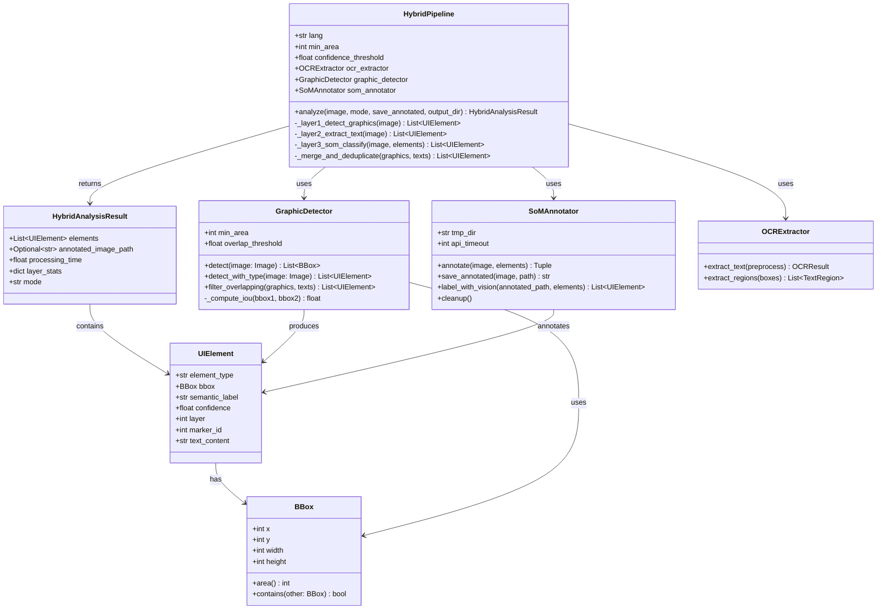

### 2.2 패키지 구조

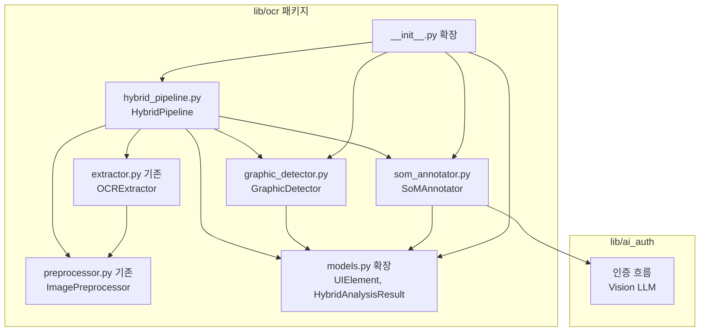

---

## 3. 모듈별 상세 설계

### 3.1 models.py 확장 (UIElement, HybridAnalysisResult)

**파일**: `C:\claude\lib\ocr\models.py`
**위치**: 파일 하단 (기존 `AnalysisResult` 클래스 이후 append)
**변경 원칙**: 기존 클래스(`BBox`, `Word`, `Line`, `Paragraph`, `TextBlock`, `LayoutInfo`, `TextRegion`, `TableDetection`, `OCRResult`, `AnalysisResult`) 수정 없음.

#### 추가할 import

기존 `from typing import List`에 `Optional` 추가가 필요하나, 기존 models.py의 `from dataclasses import dataclass, field`와 `from typing import List`는 수정하지 않는다. 신규 dataclass 상단에 독립적으로 필요한 경우만 조건부 처리.

> 확인 결과: `models.py` line 8에 `from typing import List`만 있고 `Optional`은 없음. `HybridAnalysisResult`의 `annotated_image_path: Optional[str]` 필드를 위해 파일 하단 추가 시 `from typing import Optional`을 신규 블록 직전에 삽입.

#### UIElement dataclass

```python
@dataclass
class UIElement:
    element_type: str       # "text" | "graphic"
    bbox: BBox              # 기존 BBox 재사용 (픽셀 좌표)
    semantic_label: str     # SoM 레이블 (기본값 "unknown", Layer 3에서 채움)
    confidence: float       # 0.0 ~ 1.0
    layer: int              # 1 (GraphicDetector) | 2 (OCRExtractor)
    marker_id: int          # SoM 마커 번호 (0 = 미할당)
    text_content: str = ""  # Layer 2 텍스트 요소용 (기본값 "")
```

**설계 결정사항**:
- `text_content`에 기본값(`""`)을 주어 Layer 1 그래픽 요소 생성 시 불필요한 인자 생략 가능
- `semantic_label` 기본값은 `"unknown"` (Vision LLM 미호출 또는 실패 시)
- `marker_id=0`은 SoM 마커가 아직 할당되지 않음을 의미
- `layer` 값: `1` = GraphicDetector 출처, `2` = OCRExtractor 출처, `3` = SoM 레이블이 부여된 요소

#### HybridAnalysisResult dataclass

```python
@dataclass
class HybridAnalysisResult:
    elements: List[UIElement]
    annotated_image_path: Optional[str]  # SoM 이미지 경로 (mode="coords"면 None)
    processing_time: float               # 전체 처리 시간 (초)
    layer_stats: dict                    # {"layer1": N, "layer2": M, "total": N+M}
    mode: str                            # "coords" | "ui" | "full"
```

**설계 결정사항**:
- `annotated_image_path`는 `Optional[str]` — `mode="coords"` 시 None
- `layer_stats` 키 명세: `{"layer1": int, "layer2": int, "total": int}`
- 기존 `AnalysisResult`와 완전히 분리된 별개 모델 (AnalysisResult는 Vision+OCR 텍스트 분석용)

#### 기존 모델과의 관계

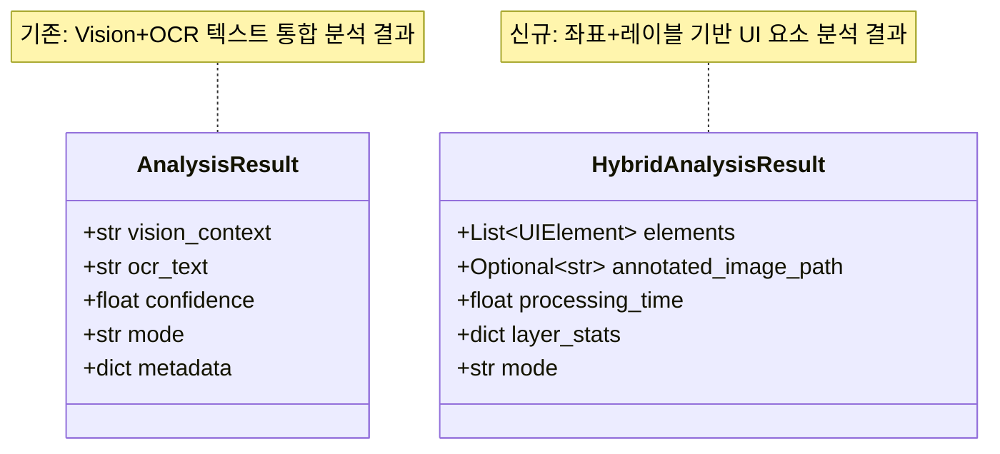

### 3.2 graphic_detector.py (GraphicDetector 클래스)

**파일**: `C:\claude\lib\ocr\graphic_detector.py` (신규)

#### 클래스 설계

```python
from typing import List, Optional
from PIL import Image
import cv2
import numpy as np
from .models import BBox, UIElement


class GraphicDetector:
    """
    OpenCV cv2.findContours() 기반 비텍스트 UI 요소 감지기.

    Layer 1 역할: 이미지 내 버튼, 아이콘, 이미지 블록, 입력 필드 등
    비텍스트 요소의 픽셀 BBox를 정밀하게 추출한다.
    """

    def __init__(
        self,
        min_area: int = 500,
        overlap_threshold: float = 0.5
    ):
        """
        Args:
            min_area: 최소 컨투어 면적 (px²). 기본값 500. 노이즈 필터링 기준.
            overlap_threshold: IoU 임계값. 이 값 초과 시 중복으로 판정. 기본값 0.5.
        """
        self.min_area = min_area
        self.overlap_threshold = overlap_threshold

    def detect(self, image: Image.Image) -> List[BBox]:
        """비텍스트 요소 BBox 리스트 반환."""
        ...

    def detect_with_type(self, image: Image.Image) -> List[UIElement]:
        """detect() 결과를 UIElement(element_type="graphic", layer=1)로 변환."""
        ...

    def filter_overlapping(
        self,
        graphic_elements: List[UIElement],
        text_elements: List[UIElement]
    ) -> List[UIElement]:
        """텍스트 BBox와 IoU overlap_threshold 초과 중복 그래픽 요소 제거."""
        ...

    def _compute_iou(self, bbox1: BBox, bbox2: BBox) -> float:
        """두 BBox 간 IoU(Intersection over Union) 계산."""
        ...
```

#### detect() 구현 흐름

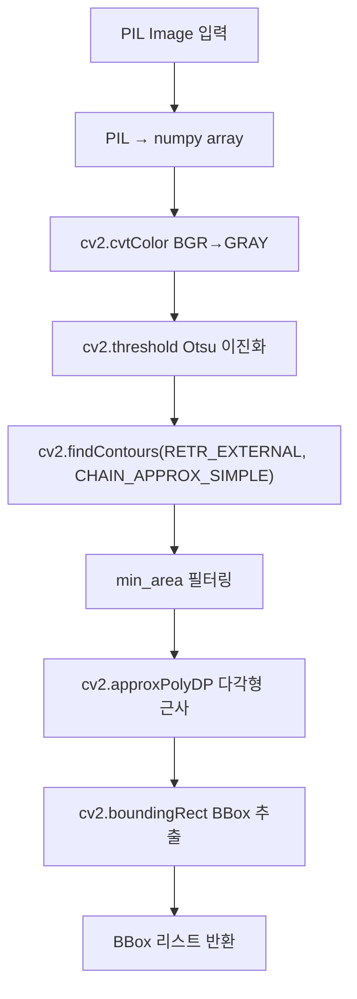

#### 핵심 구현 포인트

| 항목 | 결정 사항 |
|------|-----------|
| `findContours` 모드 | `RETR_EXTERNAL` + `CHAIN_APPROX_SIMPLE` (C-5 제약사항) |
| 이진화 방식 | Otsu 자동 임계값 (`cv2.THRESH_BINARY + cv2.THRESH_OTSU`) |
| 다각형 근사 | `cv2.approxPolyDP(contour, epsilon=0.02*perimeter, True)` |
| `confidence` 산출 | `contour_area / bbox_area` 비율 (1.0에 가까울수록 직사각형) |
| 최소 면적 | `min_area=500` 기본값, 조정 가능 |

#### IoU 계산 공식

```
intersection_x1 = max(bbox1.x, bbox2.x)
intersection_y1 = max(bbox1.y, bbox2.y)
intersection_x2 = min(bbox1.x + bbox1.width, bbox2.x + bbox2.width)
intersection_y2 = min(bbox1.y + bbox1.height, bbox2.y + bbox2.height)

intersection_area = max(0, intersection_x2 - intersection_x1) *
                    max(0, intersection_y2 - intersection_y1)

union_area = bbox1.area() + bbox2.area() - intersection_area
IoU = intersection_area / union_area if union_area > 0 else 0.0
```

### 3.3 som_annotator.py (SoMAnnotator 클래스)

**파일**: `C:\claude\lib\ocr\som_annotator.py` (신규)

#### 클래스 설계

```python
from typing import List, Dict, Tuple, Optional
from pathlib import Path
from PIL import Image
from .models import UIElement


class SoMAnnotator:
    """
    Set-of-Mark(SoM) 프롬프팅 기반 시맨틱 레이블러.

    Layer 3 역할: Layer 1+2에서 감지된 요소에 번호 마커를 삽입하고
    Vision LLM에 SoM 프롬프트를 전달하여 시맨틱 레이블을 획득한다.
    좌표 추정을 LLM에 절대 요청하지 않는다.
    """

    MARKER_COLOR: Tuple[int, int, int] = (255, 0, 0)  # 빨간색 (BGR)
    FONT_SCALE: float = 0.5
    TMP_DIR: str = r"C:\claude\lib\ocr\tmp"

    def __init__(
        self,
        tmp_dir: str = TMP_DIR,
        api_timeout: int = 20
    ):
        """
        Args:
            tmp_dir: 어노테이션 임시 이미지 저장 경로.
            api_timeout: Vision LLM API 타임아웃 (초). 기본값 20.
        """
        self.tmp_dir = Path(tmp_dir)
        self.api_timeout = api_timeout

    def annotate(
        self,
        image: Image.Image,
        elements: List[UIElement]
    ) -> Tuple[Image.Image, Dict[int, UIElement]]:
        """
        각 요소에 번호 마커 삽입 → annotated_image와 {marker_id: UIElement} 반환.

        Returns:
            Tuple: (어노테이션된 PIL Image, {marker_id: UIElement} 딕셔너리)
        """
        ...

    def save_annotated(
        self,
        image: Image.Image,
        output_path: str
    ) -> str:
        """어노테이션된 이미지 저장, 저장 경로 반환."""
        ...

    def label_with_vision(
        self,
        annotated_image_path: Path,
        elements: List[UIElement]
    ) -> List[UIElement]:
        """
        Vision LLM에 SoM 프롬프트 전달 → 시맨틱 레이블 획득.
        API 실패 시 semantic_label="unknown" 처리.
        """
        ...

    def cleanup(self):
        """tmp_dir 내 어노테이션 임시 이미지 정리."""
        ...
```

#### annotate() 마커 삽입 흐름

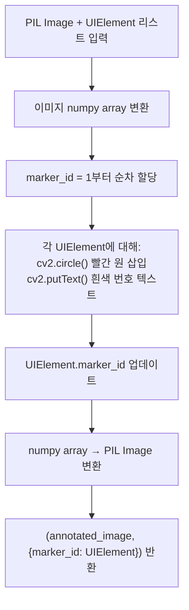

#### SoM 프롬프트 템플릿

```
이 이미지에 빨간 번호 마커가 표시된 UI 요소들이 있습니다.
각 번호의 요소가 무엇인지 시맨틱 레이블을 부여하세요.
좌표는 제공하지 마세요. 의미만 분류하세요.

JSON 형식으로만 응답하세요:
{"1": "submit_button", "2": "search_input", "3": "logo_image", ...}
```

**제약사항**: 프롬프트에 "좌표", "위치", "pixel", "x,y" 등 좌표 관련 요청 절대 포함 금지 (C-2).

#### label_with_vision() 흐름

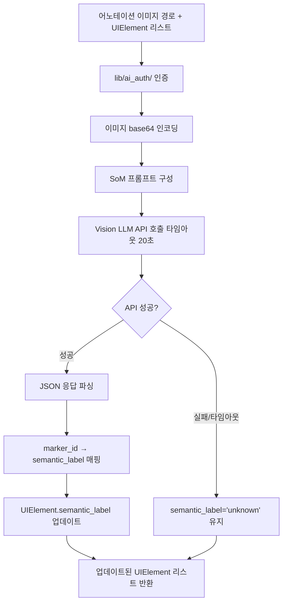

### 3.4 hybrid_pipeline.py (HybridPipeline 클래스)

**파일**: `C:\claude\lib\ocr\hybrid_pipeline.py` (신규)

#### 클래스 설계

```python
from typing import Union, Optional, List
from pathlib import Path
from PIL import Image
from .models import UIElement, HybridAnalysisResult
from .graphic_detector import GraphicDetector
from .som_annotator import SoMAnnotator
from .extractor import OCRExtractor


class HybridPipeline:
    """
    3-Layer Hybrid Pipeline 통합 오케스트레이터.

    Layer 1 (GraphicDetector) → Layer 2 (OCRExtractor) → Layer 3 (SoMAnnotator)
    순서로 실행하며 mode 파라미터로 실행 범위를 제어한다.
    """

    def __init__(
        self,
        ocr_extractor: Optional[OCRExtractor] = None,
        graphic_detector: Optional[GraphicDetector] = None,
        som_annotator: Optional[SoMAnnotator] = None,
        lang: str = "kor+eng",
        min_area: int = 500,
        confidence_threshold: float = 0.5
    ):
        self.lang = lang
        self.min_area = min_area
        self.confidence_threshold = confidence_threshold
        self._ocr_extractor = ocr_extractor
        self._graphic_detector = graphic_detector or GraphicDetector(min_area=min_area)
        self._som_annotator = som_annotator or SoMAnnotator()

    def analyze(
        self,
        image: Union[str, Image.Image],
        mode: str = "coords",   # "coords" | "ui" | "full"
        save_annotated: bool = False,
        output_dir: str = "/tmp"
    ) -> HybridAnalysisResult:
        """
        3-Layer 통합 분석 실행.

        Args:
            image: 이미지 파일 경로(str) 또는 PIL Image 객체.
            mode: 실행 범위. "coords"=Layer1+2, "ui"/"full"=Layer1+2+3.
            save_annotated: SoM 어노테이션 이미지 저장 여부.
            output_dir: 어노테이션 이미지 저장 디렉토리.

        Returns:
            HybridAnalysisResult
        """
        ...

    def _layer1_detect_graphics(
        self, image: Image.Image
    ) -> List[UIElement]:
        """Layer 1: GraphicDetector로 비텍스트 요소 감지."""
        ...

    def _layer2_extract_text(
        self, image: Image.Image
    ) -> List[UIElement]:
        """Layer 2: OCRExtractor로 텍스트 요소 추출 → UIElement 변환."""
        ...

    def _layer3_som_classify(
        self,
        image: Image.Image,
        elements: List[UIElement]
    ) -> List[UIElement]:
        """Layer 3: SoMAnnotator로 시맨틱 레이블 부여."""
        ...

    def _merge_and_deduplicate(
        self,
        graphics: List[UIElement],
        texts: List[UIElement]
    ) -> List[UIElement]:
        """IoU 기반 중복 제거. 텍스트 요소 우선 유지."""
        ...
```

#### mode별 실행 범위

| mode | Layer 1 | Layer 2 | Layer 3 | LLM 호출 | annotated_image_path |
|------|:-------:|:-------:|:-------:|:--------:|:-------------------:|
| `"coords"` | O | O | X | X | None |
| `"ui"` | O | O | O | O | tmp/ 경로 (save_annotated=False면 cleanup) |
| `"full"` | O | O | O | O | output_dir/ 경로 저장 |

#### analyze() 실행 흐름

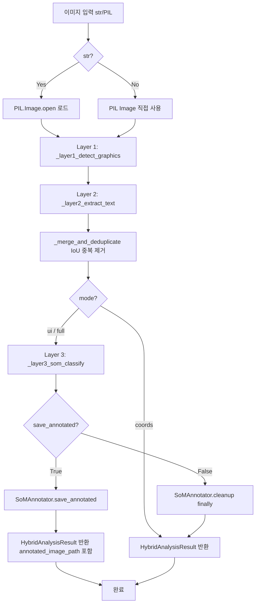

#### _layer2_extract_text() OCR → UIElement 변환

`OCRExtractor.extract_text()` 호출 후 `OCRResult.layout_info.blocks` 순회:

```python
for block in ocr_result.layout_info.blocks:
    for paragraph in block.paragraphs:
        for line in paragraph.lines:
            for word in line.words:
                if word.confidence >= self.confidence_threshold:
                    elements.append(UIElement(
                        element_type="text",
                        bbox=word.bbox,
                        semantic_label="text",
                        confidence=word.confidence,
                        layer=2,
                        marker_id=0,
                        text_content=word.text
                    ))
```

### 3.5 __init__.py 확장

**파일**: `C:\claude\lib\ocr\__init__.py`
**변경 원칙**: 기존 import 블록 및 `__all__` 변경 없음. 기존 항목 하단에 추가만.

#### 추가할 import 블록

```python
# Hybrid Pipeline (신규 추가)
from .graphic_detector import GraphicDetector
from .som_annotator import SoMAnnotator
from .hybrid_pipeline import HybridPipeline
from .models import UIElement, HybridAnalysisResult
```

#### __all__ 추가 항목

```python
# 기존 __all__ 리스트에 추가:
"GraphicDetector",
"SoMAnnotator",
"HybridPipeline",
"UIElement",
"HybridAnalysisResult",
```

#### 사용 예시 (docstring 업데이트)

```python
# 기존
from lib.ocr import OCRExtractor, ImagePreprocessor

# 신규 추가
from lib.ocr import HybridPipeline, UIElement, HybridAnalysisResult
from lib.ocr import GraphicDetector, SoMAnnotator
```

### 3.6 10-image-analysis.md 업데이트

**파일**: `C:\claude\.claude\rules\10-image-analysis.md`
**변경 원칙**: 기존 섹션 변경 없음. 새 섹션 추가만.

#### 추가할 섹션: Hybrid Pipeline 옵션

기존 "옵션 처리" 테이블 하단에 다음 섹션 추가:

```markdown
## Hybrid Pipeline 옵션 (신규)

| 옵션 | 실행 범위 | LLM 호출 | 설명 |
|------|-----------|----------|------|
| `--coords` | Layer 1+2만 | X | 좌표만 추출, 빠름. HybridPipeline.analyze(mode="coords") |
| `--ui` | Layer 1+2+3 | O | 시맨틱 레이블 포함. HybridPipeline.analyze(mode="ui") |
| `--mode hybrid` | Layer 1+2+3 | O | --ui와 동일. 기존 --mode 패턴 일관성 |

### CLI 예제

```bash
# 좌표만 추출 (빠름, LLM 호출 없음)
python -m lib.ocr extract "screenshot.png" --coords

# 시맨틱 레이블 포함 (Vision LLM 호출)
python -m lib.ocr extract "screenshot.png" --ui

# hybrid 모드 (--ui와 동일)
python -m lib.ocr extract "screenshot.png" --mode hybrid
```

### 기존 옵션과 조합

--coords, --ui, --mode hybrid 옵션은 --table, --preset 옵션과 독립적으로 동작한다.
```

---

## 4. 데이터 흐름 다이어그램

### 4.1 전체 파이프라인 흐름

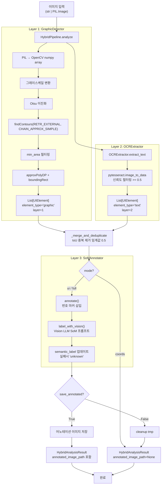

### 4.2 데이터 변환 체인

```mermaid
flowchart LR
    A["PIL.Image"] -->|numpy 변환| B["np.ndarray<br/>BGR/Gray"]
    B -->|findContours| C["List[Contour]"]
    C -->|boundingRect 변환| D["List[BBox]"]
    D -->|UIElement 래핑| E["List[UIElement]<br/>layer=1"]

    F["PIL.Image"] -->|OCRExtractor| G["OCRResult"]
    G -->|layout_info.blocks 순회| H["List[Word]"]
    H -->|UIElement 변환| I["List[UIElement]<br/>layer=2"]

    E --> J["_merge_and_deduplicate"]
    I --> J
    J --> K["List[UIElement]<br/>중복 제거됨"]
    K -->|SoM annotate| L["annotated PIL.Image<br/>marker_id 할당됨"]
    L -->|Vision LLM| M["{marker_id: label}"]
    M -->|semantic_label 업데이트| N["List[UIElement]<br/>layer=1,2,3"]
    N --> O["HybridAnalysisResult"]
```

---

## 5. 인터페이스 명세

### 5.1 GraphicDetector 공개 API

```python
class GraphicDetector:
    def __init__(
        self,
        min_area: int = 500,
        overlap_threshold: float = 0.5
    ) -> None: ...

    def detect(
        self,
        image: Image.Image
    ) -> List[BBox]:
        """비텍스트 요소 BBox 리스트 반환. 빈 이미지 → []."""

    def detect_with_type(
        self,
        image: Image.Image
    ) -> List[UIElement]:
        """detect() 결과를 UIElement(element_type='graphic', layer=1)로 반환."""

    def filter_overlapping(
        self,
        graphic_elements: List[UIElement],
        text_elements: List[UIElement]
    ) -> List[UIElement]:
        """텍스트와 IoU > overlap_threshold 중복 그래픽 제거. 텍스트 우선."""
```

### 5.2 SoMAnnotator 공개 API

```python
class SoMAnnotator:
    def __init__(
        self,
        tmp_dir: str = r"C:\claude\lib\ocr\tmp",
        api_timeout: int = 20
    ) -> None: ...

    def annotate(
        self,
        image: Image.Image,
        elements: List[UIElement]
    ) -> Tuple[Image.Image, Dict[int, UIElement]]:
        """마커 삽입. marker_id는 1부터 순차 할당. (annotated_image, id_map) 반환."""

    def save_annotated(
        self,
        image: Image.Image,
        output_path: str
    ) -> str:
        """이미지 저장. 저장된 절대 경로 반환."""

    def label_with_vision(
        self,
        annotated_image_path: Path,
        elements: List[UIElement]
    ) -> List[UIElement]:
        """Vision LLM으로 semantic_label 부여. 실패 시 'unknown' 유지."""

    def cleanup(self) -> None:
        """tmp_dir 내 임시 파일 삭제."""
```

### 5.3 HybridPipeline 공개 API

```python
class HybridPipeline:
    def __init__(
        self,
        ocr_extractor: Optional[OCRExtractor] = None,
        graphic_detector: Optional[GraphicDetector] = None,
        som_annotator: Optional[SoMAnnotator] = None,
        lang: str = "kor+eng",
        min_area: int = 500,
        confidence_threshold: float = 0.5
    ) -> None: ...

    def analyze(
        self,
        image: Union[str, Image.Image],
        mode: str = "coords",
        save_annotated: bool = False,
        output_dir: str = "/tmp"
    ) -> HybridAnalysisResult:
        """
        3-Layer 통합 분석.
        mode: "coords" | "ui" | "full"
        반환: HybridAnalysisResult (elements, annotated_image_path, processing_time, layer_stats, mode)
        """
```

### 5.4 HybridAnalysisResult 필드 명세

| 필드 | 타입 | 설명 | mode="coords"일 때 |
|------|------|------|-------------------|
| `elements` | `List[UIElement]` | 전체 UI 요소 리스트 | Layer1+2 요소 |
| `annotated_image_path` | `Optional[str]` | SoM 어노테이션 이미지 경로 | `None` |
| `processing_time` | `float` | 처리 시간 (초) | Layer1+2 시간 |
| `layer_stats` | `dict` | `{"layer1": N, "layer2": M, "total": N+M}` | 동일 |
| `mode` | `str` | 실행 모드 | `"coords"` |

### 5.5 UIElement 필드 명세

| 필드 | 타입 | Layer 1 값 | Layer 2 값 |
|------|------|-----------|-----------|
| `element_type` | `str` | `"graphic"` | `"text"` |
| `bbox` | `BBox` | OpenCV boundingRect | Tesseract word bbox |
| `semantic_label` | `str` | `"unknown"` (SoM 전) | `"text"` (SoM 전) |
| `confidence` | `float` | contour_area/bbox_area | OCR word confidence |
| `layer` | `int` | `1` | `2` |
| `marker_id` | `int` | `0` (마커 미할당) | `0` (마커 미할당) |
| `text_content` | `str` | `""` | OCR 단어 텍스트 |

---

## 6. 의존성 그래프

### 6.1 모듈 의존성 (단방향)

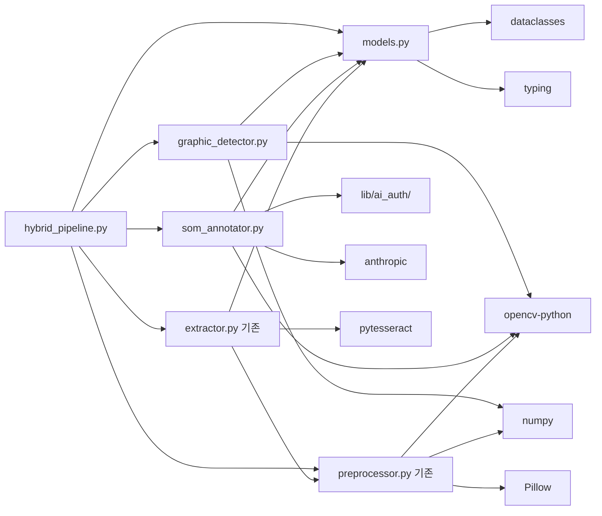

### 6.2 외부 패키지 의존성

| 패키지 | 버전 | 사용 모듈 | 설치 상태 |
|--------|------|----------|-----------|
| `opencv-python` | >=4.5 | `graphic_detector`, `som_annotator`, `preprocessor` | 기존 설치됨 |
| `numpy` | >=1.21 | `graphic_detector`, `preprocessor` | 기존 설치됨 |
| `Pillow` | >=9.0 | 모든 모듈 | 기존 설치됨 |
| `pytesseract` | >=0.3 | `extractor` | 기존 설치됨 |
| `anthropic` | >=0.18 | `som_annotator` (Layer 3) | 기존 설치됨 |

**신규 pip 패키지 추가 없음** (NFR-D4).

### 6.3 순환 의존성 방지 규칙

```
금지: models.py → 다른 모듈 import
금지: extractor.py → graphic_detector.py import
금지: graphic_detector.py → hybrid_pipeline.py import
허용: hybrid_pipeline.py → 모든 하위 모듈 import
```

의존성 방향: `hybrid_pipeline → graphic_detector/som_annotator/extractor → models`

---

## 7. TDD 전략

### 7.1 테스트 파일 매핑

| 테스트 파일 | 대상 파일 | TDD 순서 | 커버리지 목표 |
|------------|-----------|:--------:|:------------:|
| `tests/test_ocr_graphic_detector.py` | `graphic_detector.py` | 1st | 90%+ |
| `tests/test_ocr_som_annotator.py` | `som_annotator.py` | 2nd | 85%+ |
| `tests/test_ocr_hybrid_pipeline.py` | `hybrid_pipeline.py` | 3rd | 85%+ |

### 7.2 테스트 케이스 상세

#### test_ocr_graphic_detector.py (6개 케이스)

```python
# Fixtures
@pytest.fixture
def synthetic_image_with_shapes():
    """PIL.ImageDraw로 사각형, 원 등 도형이 포함된 합성 이미지 생성"""
    img = Image.new("RGB", (400, 300), "white")
    draw = ImageDraw.Draw(img)
    draw.rectangle([50, 50, 150, 100], outline="black", width=3)
    draw.ellipse([200, 80, 280, 160], outline="black", width=3)
    return img

@pytest.fixture
def empty_image():
    return Image.new("RGB", (200, 200), "white")

# 테스트 케이스
def test_detect_elements_basic(synthetic_image_with_shapes):
    """도형 포함 이미지에서 UIElement 리스트 반환 확인"""

def test_min_area_filter(synthetic_image_with_shapes):
    """min_area 이하 소형 컨투어 필터링 확인"""

def test_empty_image(empty_image):
    """단색 이미지에서 빈 리스트 반환"""

def test_filter_overlapping():
    """텍스트 BBox와 겹치는 그래픽 요소가 제거됨"""

def test_element_type_graphic(synthetic_image_with_shapes):
    """반환 UIElement.element_type == 'graphic'"""

def test_layer_value(synthetic_image_with_shapes):
    """반환 UIElement.layer == 1"""
```

#### test_ocr_som_annotator.py (5개 케이스)

```python
# Fixtures
@pytest.fixture
def sample_elements():
    return [
        UIElement(element_type="graphic", bbox=BBox(10, 10, 50, 30),
                  semantic_label="unknown", confidence=0.9, layer=1, marker_id=0),
        UIElement(element_type="text", bbox=BBox(70, 20, 80, 20),
                  semantic_label="text", confidence=0.85, layer=2, marker_id=0,
                  text_content="Submit")
    ]

@pytest.fixture
def mock_vision_client():
    """Vision LLM API mock — SoM JSON 응답 시뮬레이션"""
    with patch("lib.ocr.som_annotator.anthropic.Anthropic") as mock:
        mock.return_value.messages.create.return_value.content = [
            MagicMock(text='{"1": "button", "2": "label"}')
        ]
        yield mock

# 테스트 케이스
def test_annotate_creates_image(sample_elements, tmp_path):
    """마커 삽입 후 어노테이션 이미지 생성 확인"""

def test_marker_ids_assigned(sample_elements):
    """각 UIElement에 고유 marker_id 할당 확인"""

def test_label_with_vision_success(sample_elements, mock_vision_client, tmp_path):
    """Vision LLM mock으로 semantic_label 할당 확인"""

def test_label_with_vision_failure(sample_elements, tmp_path):
    """API 실패 시 semantic_label='unknown' 유지"""

def test_cleanup(sample_elements, tmp_path):
    """tmp_dir 내 임시 파일 정리 확인"""
```

#### test_ocr_hybrid_pipeline.py (6개 케이스)

```python
# Fixtures
@pytest.fixture
def mock_graphic_detector():
    detector = MagicMock(spec=GraphicDetector)
    detector.detect_with_type.return_value = [
        UIElement(element_type="graphic", bbox=BBox(0, 0, 50, 50),
                  semantic_label="unknown", confidence=0.8, layer=1, marker_id=0)
    ]
    detector.filter_overlapping.return_value = detector.detect_with_type.return_value
    return detector

@pytest.fixture
def mock_ocr_extractor():
    """pytesseract mock으로 OCR 결과 시뮬레이션"""
    ...

# 테스트 케이스
def test_run_coords_mode(mock_graphic_detector, mock_ocr_extractor, tmp_path):
    """mode='coords'에서 Layer 1+2만 실행, LLM 호출 없음 확인"""

def test_run_ui_mode(mock_graphic_detector, mock_ocr_extractor, mock_som_annotator, tmp_path):
    """mode='ui'에서 Layer 1+2+3 전체 실행 확인"""

def test_result_has_layer_stats(mock_graphic_detector, mock_ocr_extractor, tmp_path):
    """HybridAnalysisResult.layer_stats 키 존재 확인"""

def test_result_processing_time(mock_graphic_detector, mock_ocr_extractor, tmp_path):
    """processing_time > 0 확인"""

def test_empty_image_handling(tmp_path):
    """빈 이미지에서 elements=[] 반환"""

def test_confidence_threshold_filter(mock_graphic_detector, tmp_path):
    """신뢰도 < 0.5 텍스트 결과 필터링 확인"""
```

### 7.3 Mock 전략

| 대상 | Mock 방법 | 위치 |
|------|----------|------|
| Tesseract pytesseract | `conftest.py`의 `mock_pytesseract` fixture 재사용 | `lib/ocr/tests/conftest.py` |
| Vision LLM (anthropic.Anthropic) | `unittest.mock.patch` — SoM JSON 응답 시뮬레이션 | 각 테스트 파일 |
| 합성 이미지 | `PIL.ImageDraw`로 도형+텍스트 합성 | `@pytest.fixture` |
| GraphicDetector/SoMAnnotator | `MagicMock(spec=...)` | hybrid_pipeline 테스트 |

### 7.4 테스트 실행 명령어

```bash
# 개별 실행
pytest C:\claude\tests\test_ocr_graphic_detector.py -v
pytest C:\claude\tests\test_ocr_som_annotator.py -v
pytest C:\claude\tests\test_ocr_hybrid_pipeline.py -v

# 통합 실행
pytest C:\claude\tests\test_ocr_graphic_detector.py C:\claude\tests\test_ocr_som_annotator.py C:\claude\tests\test_ocr_hybrid_pipeline.py -v

# 기존 OCR 테스트 회귀 확인
pytest C:\claude\lib\ocr\tests\ -v
```

---

## 8. 에러 처리 전략

### 8.1 에러 유형 및 처리

| 에러 시나리오 | 발생 위치 | 처리 방식 | 결과 |
|-------------|---------|---------|------|
| 이미지 파일 없음/로드 실패 | `HybridPipeline.analyze()` 진입 전 | 기존 `ImageLoadError` 발생 | 파이프라인 진입 전 실패 |
| Tesseract 미설치 | `_layer2_extract_text()` | 기존 `TesseractNotFoundError` 전파 | Layer 2 실패 → graceful fallback (Layer 1 결과만) |
| cv2.findContours 실패 | `GraphicDetector.detect()` | try-except → 빈 리스트 반환 | Layer 1 결과 = [] |
| Vision LLM API 타임아웃 (>20초) | `SoMAnnotator.label_with_vision()` | `semantic_label="unknown"` 유지 + 경고 로그 | Layer 3 스킵, Layer 1+2 결과 반환 |
| Vision LLM JSON 파싱 실패 | `SoMAnnotator.label_with_vision()` | `semantic_label="unknown"` 유지 + 경고 로그 | 동일 |
| lib/ai_auth 인증 실패 | `SoMAnnotator.label_with_vision()` | `semantic_label="unknown"` 유지 + 경고 로그 | 동일 |
| 대형 이미지 (>4096px) | `HybridPipeline._layer1_detect_graphics()` | 리사이즈 후 좌표 역산 + 경고 로그 | 처리 가능 |

### 8.2 Fallback 계층 구조

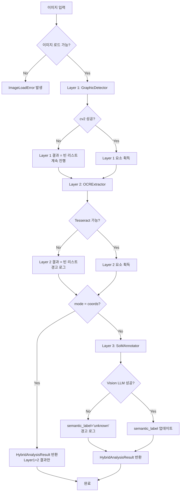

### 8.3 finally 블록 보장

`HybridPipeline.analyze()` 내부에서 `SoMAnnotator.cleanup()`은 반드시 `finally` 블록에서 호출:

```python
try:
    result = self._run_pipeline(image, mode, ...)
finally:
    if mode in ("ui", "full"):
        self._som_annotator.cleanup()
```

---

## 9. 성능 고려사항

### 9.1 성능 목표 (NFR-P 기준)

| 측정 항목 | 목표 | 측정 환경 |
|----------|------|---------|
| Layer 1 (`GraphicDetector`) | 3초 이내 | 1920×1080, CPU |
| Layer 2 (`OCRExtractor`) | 기존 성능 유지 | 변경 없음 |
| Layer 3 (`SoMAnnotator`) | 30초 이내 (API 포함) | API 타임아웃 20초 |
| 전체 `mode="coords"` | 5초 이내 | 1920×1080, CPU |
| 전체 `mode="ui"` | 35초 이내 | API 포함 |

### 9.2 이미지 크기 제한

| 이미지 크기 | 처리 방식 |
|-----------|---------|
| 표준 (≤1920×1080) | 그대로 처리 |
| HD (≤4096×4096) | 경고 로그 + 처리 |
| 초대형 (>4096px 어느 한 축) | 자동 리사이즈 (max 4096px) + 좌표 역산 |

**리사이즈 비율 보존 전략**:
```python
MAX_DIM = 4096
if max(image.width, image.height) > MAX_DIM:
    scale = MAX_DIM / max(image.width, image.height)
    new_size = (int(image.width * scale), int(image.height * scale))
    resized = image.resize(new_size, Image.LANCZOS)
    # BBox 좌표 역산: bbox.x /= scale 등
```

### 9.3 메모리 최적화

| 최적화 항목 | 방법 |
|-----------|------|
| 이미지 복사 최소화 | OpenCV 배열은 view 사용, 불필요한 copy() 제거 |
| 어노테이션 이미지 조기 정리 | finally 블록에서 cleanup() 보장 |
| OCRResult 재사용 | Layer 2에서 OCRResult 캐싱 (동일 이미지 중복 호출 방지) |

### 9.4 LLM 비용 최적화

| 전략 | 설명 |
|------|------|
| 기본 mode="coords" | Vision LLM 호출 없는 좌표 전용 모드가 기본값 |
| 명시적 opt-in | `mode="ui"` 또는 `mode="full"`로 명시해야만 LLM 호출 |
| 요소 수 제한 | SoM 마커 최대 50개 제한 (초과 시 상위 confidence 요소만) |

---

## 10. 구현 순서 (T-1 ~ T-10 매핑)

### 10.1 태스크 의존성 그래프

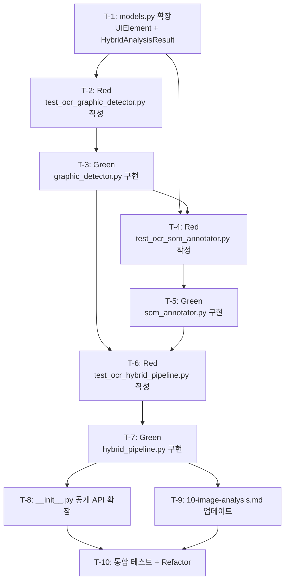

### 10.2 태스크 상세

| 태스크 | 파일 | 설명 | Acceptance Criteria |
|--------|------|------|---------------------|
| **T-1** | `models.py` | `UIElement`, `HybridAnalysisResult` dataclass 추가 (파일 하단 append) | 기존 테스트 통과 유지 |
| **T-2** | `tests/test_ocr_graphic_detector.py` | TDD Red — 6개 테스트 케이스 작성 | `--collect-only` 성공, 실행 시 ImportError/FAILED |
| **T-3** | `lib/ocr/graphic_detector.py` | TDD Green — GraphicDetector 구현 | 6개 테스트 전체 통과, ruff 린트 통과 |
| **T-4** | `tests/test_ocr_som_annotator.py` | TDD Red — 5개 테스트 케이스 작성 | `--collect-only` 성공, 실행 시 ImportError/FAILED |
| **T-5** | `lib/ocr/som_annotator.py` | TDD Green — SoMAnnotator 구현 | 5개 테스트 전체 통과, SoM 프롬프트 좌표 요청 없음 확인 |
| **T-6** | `tests/test_ocr_hybrid_pipeline.py` | TDD Red — 6개 테스트 케이스 작성 | `--collect-only` 성공, 실행 시 ImportError/FAILED |
| **T-7** | `lib/ocr/hybrid_pipeline.py` | TDD Green — HybridPipeline 구현 | 6개 테스트 전체 통과, mode="coords" 시 LLM 호출 없음 |
| **T-8** | `lib/ocr/__init__.py` | 신규 공개 API 5개 항목 추가 | `from lib.ocr import HybridPipeline, UIElement, HybridAnalysisResult` 성공 |
| **T-9** | `.claude/rules/10-image-analysis.md` | `--coords`, `--ui`, `--mode hybrid` 옵션 문서 추가 | 기존 옵션 변경 없음 |
| **T-10** | 테스트 파일 3개 + `lib/ocr/` | 통합 테스트 전체 실행 + 기존 OCR 회귀 확인 + ruff 린트 | 신규 17개 + 기존 테스트 전체 통과 |

### 10.3 커밋 전략

| 순서 | 커밋 메시지 | 포함 태스크 |
|:----:|------------|:-----------:|
| 1 | `feat(ocr): UIElement, HybridAnalysisResult 데이터 모델 추가` | T-1 |
| 2 | `test(ocr): GraphicDetector TDD Red 테스트 추가` | T-2 |
| 3 | `feat(ocr): GraphicDetector cv2.findContours 기반 비텍스트 요소 감지 구현` | T-3 |
| 4 | `test(ocr): SoMAnnotator TDD Red 테스트 추가` | T-4 |
| 5 | `feat(ocr): SoMAnnotator Set-of-Mark 마커 삽입 + Vision LLM 레이블링 구현` | T-5 |
| 6 | `test(ocr): HybridPipeline TDD Red 테스트 추가` | T-6 |
| 7 | `feat(ocr): HybridPipeline 3-Layer 통합 오케스트레이터 구현` | T-7 |
| 8 | `feat(ocr): __init__.py 공개 API 확장 + image-analysis 규칙 업데이트` | T-8, T-9 |
| 9 | `refactor(ocr): Hybrid Pipeline 통합 테스트 통과 + 린트 정리` | T-10 |
