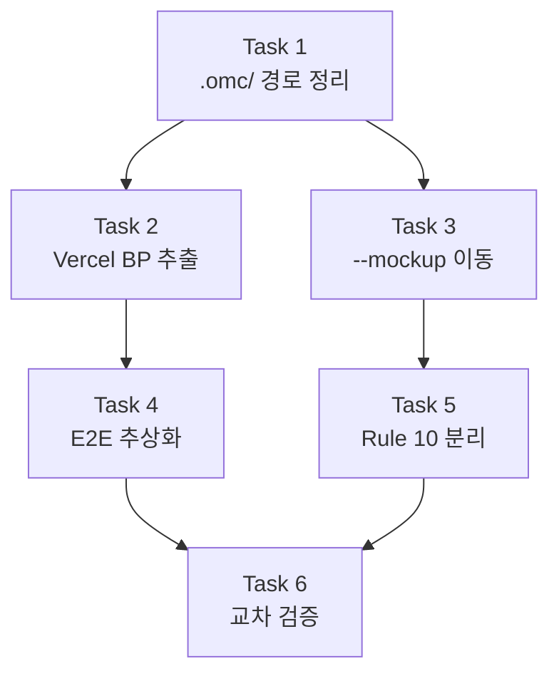

# Workflow Generalization Design Document

## 1. 배경 및 목적

`/auto` PDCA 워크플로우(SKILL.md 515줄 + REFERENCE.md 1741줄)에 도메인 특화 요소가 범용 워크플로우 코어에 직접 포함되어 있어 유지보수성과 확장성을 저해한다.

**문제 요소:**
- `--mockup` 상세 워크플로우 55줄이 SKILL.md 코어에 인라인
- Vercel BP 47개 규칙이 REFERENCE.md에 직접 포함
- E2E 프레임워크가 Playwright로 하드코딩
- Rule 10 이미지 분석(76줄)이 매 세션 자동 로드
- `.omc/` 경로 잔재가 Slack/Gmail 워크플로우에 잔존

**목표:** 기존 기능 동작에 영향 없이 구조만 정리하는 순수 리팩토링. 도메인 특화 요소를 전문 파일로 분리하여 코어 워크플로우의 범용성을 확보한다.

## 2. 구현 범위

### 포함 항목

| # | 제안 | 대상 | 변경 유형 |
|---|------|------|-----------|
| 1 | --mockup 상세 이동 | SKILL.md 228-283줄 → mockup-hybrid SKILL.md | 코드 이동 |
| 2 | Vercel BP 규칙 추출 | REFERENCE.md 1417-1448줄 → references/vercel-bp-rules.md | 파일 분리 |
| 3 | E2E 프레임워크 추상화 | SKILL.md 389줄, REFERENCE.md 1260줄 | 인라인 수정 |
| 4 | Rule 10 이미지 분석 분리 | rules/10-image-analysis.md → skills/auto/guidelines/ | 파일 이동 |
| 5 | .omc/ 경로 정리 | REFERENCE.md 1559줄, 1604줄 | 경로 교체 |

### 제외 항목

- 워크플로우 로직 변경 (순수 구조 정리만)
- 새로운 기능 추가
- PRD 생성 (리팩토링이므로 `--skip-prd` 적용)
- E2E 테스트 (`--skip-e2e` 적용)
- 이슈 생성 (`--no-issue` 적용)

## 3. 상세 설계

### 3.1 Task 1: .omc/ 경로 정리

**목적:** REFERENCE.md 내 `.omc/` 잔재를 `.claude/context/`로 교체

#### 디렉토리 생성

```
C:\claude\.claude\context\
├── slack\        # .omc/slack-context/ 대체
│   └── .gitkeep
└── gmail\        # .omc/gmail-context/ 대체
    └── .gitkeep
```

#### 수정 대상: REFERENCE.md

**변경 1 — 1559줄 (--slack Step 4)**

Before:
```
`.omc/slack-context/<채널ID>.md` 생성 (프로젝트 개요, 핵심 결정사항, 관련 문서, 기술 스택, 미해결 이슈, 원본 메시지)
```

After:
```
`.claude/context/slack/<채널ID>.md` 생성 (프로젝트 개요, 핵심 결정사항, 관련 문서, 기술 스택, 미해결 이슈, 원본 메시지)
```

**변경 2 — 1604줄 (--gmail Step 4)**

Before:
```
`.omc/gmail-context/<timestamp>.md` 생성
```

After:
```
`.claude/context/gmail/<timestamp>.md` 생성
```

#### 잔재 검증

REFERENCE.md 전체에서 `.omc/` 패턴 grep 결과 2건만 존재 (1559줄, 1604줄). 추가 잔재 없음 확인 완료.

### 3.2 Task 2: Vercel BP 규칙 추출

**목적:** REFERENCE.md의 Vercel BP 47개 규칙(32줄 코드 블록)을 독립 참조 파일로 추출

#### 신규 파일: `C:\claude\.claude\references\vercel-bp-rules.md`

REFERENCE.md 1417-1448줄의 코드 블록 전체를 이동:

```markdown
# Vercel Best Practices 검증 규칙

Phase 4 Step 4.2에서 code-reviewer teammate prompt에 동적 주입하는 규칙.

> 주입 시 이 파일의 전체 내용을 Read하여 code-reviewer prompt에 포함.

## 규칙 목록

(REFERENCE.md 1418-1448줄의 === Vercel Best Practices 검증 규칙 === 블록 전체)
```

포함 카테고리: React 성능(4항목), Next.js 패턴(5항목), 접근성(4항목), 보안(3항목), 성능(3항목)

#### REFERENCE.md 변경: 1413-1448줄 대체

Before (1413-1448줄, 36줄):
```
## Vercel BP 검증 규칙

Phase 4 Step 4.2에서 code-reviewer teammate prompt에 동적 주입하는 규칙:

{코드 블록 전체 32줄}
```

After (8줄로 축소):
```markdown
## Vercel BP 검증 규칙

Phase 4 Step 4.2에서 code-reviewer teammate prompt에 동적 주입하는 규칙:

> 상세: `.claude/references/vercel-bp-rules.md`
>
> 주입 시 해당 파일을 Read하여 code-reviewer prompt에 포함 (절대 경로: `C:\claude\.claude\references\vercel-bp-rules.md`)
```

#### REFERENCE.md 유지 항목: 1450-1452줄

동적 주입 조건은 REFERENCE.md에 그대로 유지 (워크플로우 로직의 일부):
```
**동적 주입 조건:**
- `Glob("next.config.*")` 결과 존재 또는 `package.json` 내 `"react"` dependency 존재 시 주입
- 웹 프로젝트가 아닌 경우 생략
```

#### 영향 범위

기존 `.claude/references/` 디렉토리에 8개 파일이 존재. `vercel-bp-rules.md`가 9번째 파일로 추가. 충돌 없음.

### 3.3 Task 3: --mockup 상세 이동

**목적:** SKILL.md의 --mockup 실행 경로 상세(228-283줄, 56줄)를 mockup-hybrid 스킬로 이동

#### 3-A: SKILL.md 정리 (228-283줄 대체)

Before (228-283줄, 56줄):
```
**--mockup 실행 경로** (`11-ascii-diagram.md` 기준 타입 판별):
{ASCII 흐름도 + Step 3.0.2 PNG 캡처 코드 블록 + Step 3.0.3 문서 삽입 규칙 + 금지 사항}
```

After (6줄로 축소):
```markdown
**--mockup 실행 경로**: mockup-hybrid 스킬 참조 (`.claude/skills/mockup-hybrid/SKILL.md`)
- 파일 지정: 문서 내 ASCII 다이어그램 감지 → Mermaid/HTML 자동 변환
- 화면명 지정: designer teammate → HTML 생성 → PNG 캡처 → 문서 삽입
- 상세 워크플로우 (캡처, 문서 삽입, 폴백): mockup-hybrid SKILL.md `/auto 연동` 섹션 참조
```

#### 3-B: SKILL.md 금지 사항 정리 (515줄)

SKILL.md 515줄은 단일 줄에 모든 금지 사항이 연결되어 있다. 이 줄에서 mockup 관련 금지 사항을 분리한다.

Before (515줄 내 해당 부분):
```
... / **executor가 `docs/mockups/*.html` 직접 생성 금지** (반드시 designer 에이전트 + --mockup 라우트 경유) / ...
```

After (동일 위치):
```
... / **mockup 관련 금지 사항**: mockup-hybrid SKILL.md 참조 / ...
```

#### 3-C: mockup-hybrid SKILL.md 보강

`C:\claude\.claude\skills\mockup-hybrid\SKILL.md` 말미(257줄 이후)에 `/auto 연동` 섹션 추가:

```markdown
## /auto 연동

`/auto --mockup` 실행 시 아래 워크플로우가 적용된다.

### Step 3.0.2: PNG 캡처 (Lead 직접 Bash 실행 -- designer 완료 후)

{SKILL.md 253-262줄의 Python 캡처 코드 블록 그대로 이동}

- 성공: `docs/images/mockups/{name}.png` 생성 -> Step 3.0.3 성공 경로
- 실패 (Playwright 미설치 등): `CAPTURE_FAILED` 출력 -> Step 3.0.3 폴백 경로

### Step 3.0.3: 문서 삽입 (Lead 직접 Edit 실행 -- 대상 문서가 있는 경우만)

- **캡처 성공 시**: `generate_markdown_embed()` 결과를 Edit로 대상 문서에 삽입
  - `` + `[HTML 원본](docs/mockups/{name}.html)`
- **캡처 실패 시 (CAPTURE_FAILED)**: HTML 링크로 폴백
  - `[{name} 목업](docs/mockups/{name}.html)` + 경고 메시지
- **대상 문서 없음**: 삽입 스킵 (HTML/PNG 파일만 생성된 상태로 완료)

### 금지 사항

- executor 또는 executor-high가 `docs/mockups/*.html`을 직접 Write하는 것은 금지
- UI 목업 생성 시 반드시 designer 에이전트 경유
- `--bnw`: deprecated (B&W Refined Minimal은 HTML 목업 기본 스타일. 별도 플래그 불필요)
```

#### 3-D: --slack, --gmail 워크플로우

REFERENCE.md의 `--slack` (1531-1563줄)과 `--gmail` (1566-1614줄) 워크플로우는 이미 독립 섹션으로 분리되어 있으므로 추가 이동 불필요. `.omc/` 경로만 Task 1에서 처리.

### 3.4 Task 4: E2E 프레임워크 추상화

**목적:** Playwright 하드코딩을 다중 프레임워크 감지로 교체

#### 4-A: SKILL.md 389줄 수정

Before (389줄):
```python
    and Glob("playwright.config.{ts,js}")         # Playwright 설정 존재
```

After:
```python
    and (                                          # E2E 프레임워크 설정 존재
        Glob("playwright.config.{ts,js}")
        or Glob("cypress.config.{ts,js}")
        or Glob("vitest.config.{ts,js}")           # browser mode
    )
```

#### 4-B: REFERENCE.md 1260줄 E2E runner prompt 수정

Before (1260-1264줄):
```
         prompt="[Phase 4 E2E Background] Playwright E2E 테스트 백그라운드 실행.
         1. npx playwright test --reporter=list 실행
         2. 결과 요약: 총 테스트 수, PASS 수, FAIL 수
         3. 실패 시: 실패 테스트명 + 에러 메시지 (첫 3줄)
         4. 출력 형식: E2E_PASSED 또는 E2E_FAILED + 실패 상세 목록
```

After:
```
         prompt="[Phase 4 E2E Background] E2E 테스트 백그라운드 실행.
         1. 프레임워크 감지:
            - playwright.config.* -> npx playwright test --reporter=list
            - cypress.config.* -> npx cypress run --reporter spec
            - vitest.config.* (browser) -> npx vitest run --reporter verbose
         2. 감지된 프레임워크로 실행 (첫 번째 매칭 우선)
         3. 결과 요약: 총 테스트 수, PASS 수, FAIL 수
         4. 실패 시: 실패 테스트명 + 에러 메시지 (첫 3줄)
         5. 출력 형식: E2E_PASSED 또는 E2E_FAILED + 실패 상세 목록
```

#### 4-C: REFERENCE.md 1331줄 설명 수정

Before:
```
- e2e-runner: Playwright E2E 테스트 (백그라운드 병렬, 포그라운드 검증과 동시 실행)
```

After:
```
- e2e-runner: E2E 테스트 (백그라운드 병렬, 포그라운드 검증과 동시 실행 - Playwright/Cypress/Vitest 자동 감지)
```

#### 우선순위 규칙

`or` 연산자의 short-circuit 특성으로 첫 번째 매칭(Playwright)이 우선된다. 프로젝트에 복수 프레임워크가 공존하는 경우 감지 순서: Playwright > Cypress > Vitest.

### 3.5 Task 5: Rule 10 이미지 분석 분리

**목적:** `.claude/rules/10-image-analysis.md`(76줄)를 스킬 가이드라인으로 이동하여 매 세션 자동 로드에서 제외

#### 5-A: 디렉토리 생성

```
C:\claude\.claude\skills\auto\guidelines\
└── image-analysis.md    # Rule 10에서 이동
```

#### 5-B: 파일 이동

- **원본**: `C:\claude\.claude\rules\10-image-analysis.md` (76줄)
- **대상**: `C:\claude\.claude\skills\auto\guidelines\image-analysis.md`
- 내용 동일 복사 후 원본 삭제 (git mv 또는 copy + delete)

#### 5-C: 참조 업데이트 대상

코드베이스 전체 grep 결과, `10-image-analysis` 참조가 있는 파일 목록:

| # | 파일 (절대 경로) | 참조 유형 | 처리 |
|---|------------------|-----------|------|
| 1 | `C:\claude\.claude\rules\08-skill-routing.md` | 규칙 목록에는 미포함 (간접 참조 없음) | 변경 불필요 |
| 2 | `C:\claude\.claude\skills\auto\SKILL.md` 224줄 | `11-ascii-diagram.md` 참조만 (10번 직접 참조 없음) | 변경 불필요 |
| 3 | `C:\claude\docs\00-prd\workflow-improvement.prd.md` 154줄 | `rules-media/` 제안 문서 (미구현 과거 제안) | 이력 문서 -- 변경 불필요 |
| 4 | `C:\claude\docs\00-prd\ocr-hybrid-pipeline.prd.md` | PRD 내 이력 참조 (96, 118, 255줄) | 이력 문서 -- 변경 불필요 |
| 5 | `C:\claude\docs\01-plan\ocr-hybrid-pipeline.plan.md` | Plan 내 이력 참조 | 이력 문서 -- 변경 불필요 |
| 6 | `C:\claude\docs\02-design\ocr-hybrid-pipeline.design.md` | Design 내 이력 참조 | 이력 문서 -- 변경 불필요 |
| 7 | `C:\claude\docs\04-report\*.md` (4개 파일) | 보고서 내 이력 참조 | 이력 문서 -- 변경 불필요 |
| 8 | `C:\claude\docs\workflow-review-v23.html` | HTML 보고서 | 이력 문서 -- 변경 불필요 |
| 9 | `C:\Users\AidenKim\.claude\projects\C--claude\memory\MEMORY.md` | 규칙 테이블 | **업데이트 필요** |

**결론:** 활성 코드 참조 0건. MEMORY.md 규칙 테이블만 업데이트 필요.

#### 5-D: MEMORY.md 업데이트

규칙 테이블에서 Rule 10 행을 수정:

Before:
```
| 10-image-analysis | 10-image-analysis.md | "이미지 분석", "OCR", "텍스트 추출" 키워드 |
```

After:
```
| 10-image-analysis | (삭제됨 → .claude/skills/auto/guidelines/image-analysis.md) | 이미지 분석 키워드 → 스킬 가이드라인으로 이동 |
```

#### 5-E: 규칙 번호 관리

`.claude/rules/` 디렉토리에서 번호 갭(9→11) 발생. 재넘버링하지 않음 -- 번호 변경 시 연쇄 참조 깨짐 위험.

### 3.6 Task 6: 교차 검증

**목적:** 모든 변경사항의 교차 참조 정합성 검증

#### grep 검증 패턴 목록

| # | 패턴 | 대상 범위 | 예상 결과 |
|---|------|-----------|-----------|
| 1 | `\.omc/` | REFERENCE.md | 0건 |
| 2 | `\.omc/` | 전체 `.claude/skills/` | 0건 |
| 3 | `10-image-analysis\.md` | `.claude/rules/`, `.claude/skills/` | 0건 (활성 참조) |
| 4 | `Playwright E2E 테스트 백그라운드` | REFERENCE.md | 0건 (추상화된 표현으로 교체됨) |
| 5 | `vercel-bp-rules\.md` | `.claude/references/` | 1건 (파일 존재 확인) |
| 6 | `vercel-bp-rules\.md` | REFERENCE.md | 1건 (참조 포인터) |

#### 검증 체크리스트

```
[ ] 1. REFERENCE.md 내 `.omc/` 문자열 0건
[ ] 2. SKILL.md Step 3.0 영역에 --mockup 상세 코드 블록 0건
[ ] 3. mockup-hybrid SKILL.md에 `/auto 연동` 섹션 존재
[ ] 4. `.claude/references/vercel-bp-rules.md` 파일 존재 + 47개 규칙 포함
[ ] 5. REFERENCE.md에 Vercel BP 참조 포인터 + 동적 주입 조건 유지
[ ] 6. SKILL.md E2E 감지 조건에 3개 프레임워크 패턴 포함
[ ] 7. REFERENCE.md E2E runner prompt에 프레임워크 분기 로직 존재
[ ] 8. `.claude/rules/10-image-analysis.md` 파일 미존재
[ ] 9. `.claude/skills/auto/guidelines/image-analysis.md` 파일 존재
[ ] 10. `.claude/context/slack/` 및 `.claude/context/gmail/` 디렉토리 존재
[ ] 11. MEMORY.md 규칙 테이블에 Rule 10 경로 변경 반영
[ ] 12. 모든 참조 포인터가 유효한 파일을 가리킴
```

## 4. 영향 분석

각 태스크별 기존 기능 동작에 대한 영향 없음 증명:

| Task | 변경 요약 | 기존 동작 영향 | 증명 |
|------|-----------|---------------|------|
| Task 1 | `.omc/` → `.claude/context/` 경로 교체 | **없음** | `.omc/` 디렉토리는 현재 미사용 상태 (OMC 플러그인 제거됨). 경로 문자열만 교체하므로 워크플로우 로직 변경 없음. 런타임 시 디렉토리가 없으면 생성하는 로직은 에이전트 레벨에서 처리됨 |
| Task 2 | Vercel BP 규칙 블록 → 참조 파일 분리 | **없음** | code-reviewer prompt 주입 시 Read 호출이 추가되지만, 이는 에이전트 prompt 구성 단계에서 자동 처리됨. 규칙 내용 자체는 변경 없음. 동적 주입 조건은 REFERENCE.md에 유지 |
| Task 3 | --mockup 상세 → mockup-hybrid SKILL.md | **없음** | `/auto --mockup` 실행 시 mockup-hybrid 스킬을 이미 참조하는 구조. 라우팅 포인터가 상세 워크플로우를 대체하므로 실행 흐름 동일. 캡처/삽입 로직은 mockup-hybrid에서 동일하게 작동 |
| Task 4 | Playwright 하드코딩 → 3개 프레임워크 감지 | **없음** | `or` 연산자 첫 번째 항목이 Playwright이므로 기존 Playwright 프로젝트는 동일 동작. 비-Playwright 프로젝트에서는 E2E가 이미 스킵되었으므로 영향 없음 |
| Task 5 | Rule 10 → 스킬 가이드라인 이동 | **없음** | `.claude/rules/`에서 자동 로드 → `/auto` 스킬 가이드라인으로 이동. 이미지 분석 키워드 트리거 시 동일 내용이 스킬 컨텍스트로 로드됨. 비-이미지 분석 세션에서 불필요한 76줄 자동 로드가 제거되는 것은 개선 효과 |
| Task 6 | 교차 검증 | **없음** | 검증만 수행, 코드 변경 없음 |

## 5. 위험 요소 및 완화

### Risk 1: 참조 깨짐 (HIGH)

- **설명**: Rule 10 파일 이동 시 해당 파일을 참조하는 다른 규칙/문서의 경로가 깨질 수 있음
- **설계 레벨 완화**:
  - Task 5-C에서 코드베이스 전체 grep 수행 완료 — 활성 코드 참조 0건 확인
  - `.claude/settings.json`이나 Hook에서 rules 디렉토리를 glob으로 로드하는 경우 — 파일 삭제 시 자동으로 로드 대상에서 제외 (안전)
  - Task 6 교차 검증에서 `10-image-analysis.md` 패턴 최종 확인
  - 이력 문서(docs/ 하위 PRD, Plan, Design, Report)는 시점 기록이므로 경로 업데이트 불필요

### Risk 2: mockup-hybrid SKILL.md 중복 (MEDIUM)

- **설명**: 이동한 캡처/삽입 워크플로우가 기존 내용과 의미적으로 중복될 수 있음
- **설계 레벨 완화**:
  - mockup-hybrid SKILL.md 현재 내용 분석 완료: 기존 = 3-Tier 라우팅/생성 (1-257줄), 추가 = `/auto 연동` (캡처+삽입+폴백)
  - `/auto 연동` 섹션 헤더로 명확히 분리하여 독립 실행 시 혼란 방지
  - 기존 내용과 중복되는 부분 없음 확인 (기존: 라우팅 규칙, 추가: 후처리 워크플로우)

### Risk 3: Vercel BP 동적 주입 실패 (LOW)

- **설명**: 규칙 추출 후 code-reviewer prompt 주입 시 참조 파일 Read 필요
- **설계 레벨 완화**:
  - REFERENCE.md 참조 포인터에 절대 경로 명시: `C:\claude\.claude\references\vercel-bp-rules.md`
  - "주입 시 해당 파일을 Read하여 prompt에 포함" 지시를 명시적으로 포함
  - code-reviewer 에이전트는 Read 도구 접근 가능 (기존 에이전트 정의에서 확인)

### Risk 4: E2E 다중 프레임워크 우선순위 충돌 (LOW)

- **설명**: 복수 프레임워크 공존 시 어느 것을 실행할지 모호
- **설계 레벨 완화**:
  - `or` short-circuit으로 Playwright > Cypress > Vitest 순서 확정
  - E2E runner prompt에 "첫 번째 감지된 프레임워크 사용" 명시
  - 실제 복수 프레임워크 공존 확률 매우 낮음

### Risk 5: .claude/context/ 디렉토리 권한/gitignore (LOW)

- **설명**: 새 디렉토리가 git 추적 대상이 되거나 차단될 수 있음
- **설계 레벨 완화**:
  - `.gitkeep` 파일로 빈 디렉토리 유지
  - `.gitignore` 확인: `.claude/` 하위는 차단되지 않음 (현재 `.claude/` 전체가 추적 대상)
  - 런타임 생성 파일(`<채널ID>.md`, `<timestamp>.md`)은 `.gitignore`에 추가 권장 (별도 이슈)

## 6. 커밋 전략

6개 순차 커밋. 각 커밋은 독립적으로 동작 가능해야 한다.

| 순서 | 커밋 메시지 | Task | 변경 파일 |
|:----:|------------|:----:|-----------|
| 1 | `refactor(auto): .omc/ 경로를 .claude/context/로 교체` | 1 | REFERENCE.md (1559, 1604줄), `.claude/context/{slack,gmail}/.gitkeep` 생성 |
| 2 | `refactor(auto): Vercel BP 규칙을 references/로 추출` | 2 | REFERENCE.md (1413-1448줄 대체), `.claude/references/vercel-bp-rules.md` 생성 |
| 3 | `refactor(auto): --mockup 상세를 mockup-hybrid 스킬로 이동` | 3 | SKILL.md (228-283줄 축소, 515줄 수정), mockup-hybrid/SKILL.md (연동 섹션 추가) |
| 4 | `refactor(auto): E2E 프레임워크 감지 추상화` | 4 | SKILL.md (389줄), REFERENCE.md (1260-1264줄, 1331줄) |
| 5 | `refactor(rules): Rule 10 이미지 분석을 스킬 가이드라인으로 이동` | 5 | `rules/10-image-analysis.md` 삭제, `skills/auto/guidelines/image-analysis.md` 생성, MEMORY.md 업데이트 |
| 6 | `refactor(auto): 교차 참조 정합성 검증 완료` | 6 | 잔여 참조 수정 (있는 경우만) |

### 실행 순서 다이어그램



- Task 1은 선행 필수 (Task 2-5에서 REFERENCE.md 수정 시 충돌 방지)
- Task 2, 3은 병렬 가능 (수정 영역 비중복)
- Task 4, 5는 병렬 가능 (수정 파일 비중복)
- Task 6은 모든 태스크 완료 후 실행
