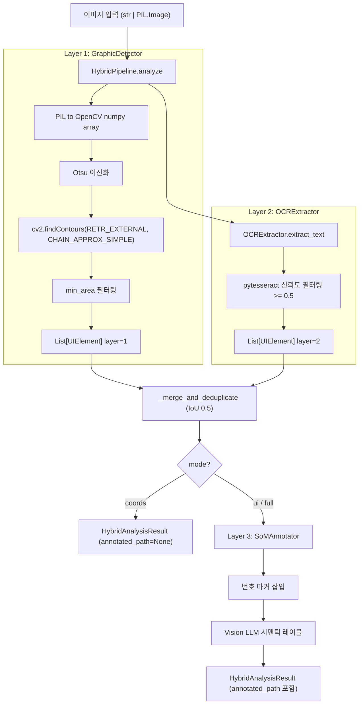
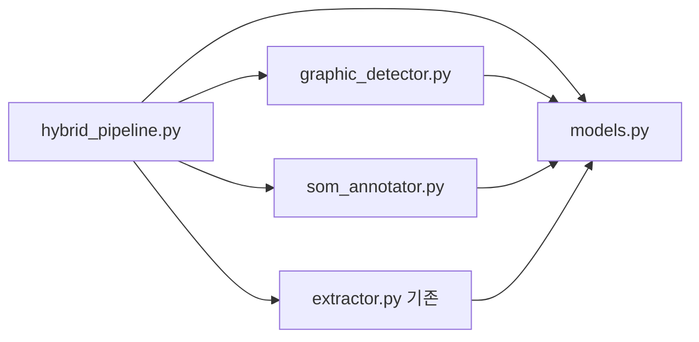

# ocr-hybrid-pipeline PDCA 완료 보고서

**작성일**: 2026-02-23
**작업 브랜치**: feat/prd-chunking-strategy
**검증 상태**: Architect APPROVE + code-reviewer APPROVE 완료
**복잡도 모드**: STANDARD (3점/5점)

---

## 1. 배경 및 목적

### 1.1 배경

기존 `lib/ocr/` 모듈은 Tesseract OCR 기반의 텍스트 추출에 특화되어 있었다. 그러나 Vision LLM 단독 사용 시 **픽셀 좌표 부정확 문제**가 구조적으로 존재한다. Vision LLM은 의미론적 이해에 강점이 있으나, 정밀한 픽셀 좌표 추출에는 한계가 있다.

다음 세 가지 기능이 미구현 상태였다:

- 비텍스트 요소(버튼, 아이콘, 이미지 블록 등) 감지
- Set-of-Mark(SoM) 프롬프팅을 통한 시맨틱 레이블링
- 3-Layer 통합 오케스트레이터

### 1.2 목적

- OpenCV `findContours()`로 비텍스트 UI 요소의 픽셀 BBox를 정밀 추출
- Tesseract OCR을 Layer 2로 재사용하여 텍스트 BBox + 신뢰도 획득
- SoM 프롬프팅으로 Vision LLM이 좌표 추정 대신 번호 기반 시맨틱 분류만 수행
- DI(의존성 주입) 패턴으로 API 키 하드코딩 완전 제거

---

## 2. 구현 요약

### 2.1 구현된 파일 목록

| 파일 | 유형 | 역할 |
|------|------|------|
| `lib/ocr/graphic_detector.py` | 신규 | Layer 1: OpenCV cv2.findContours() 기반 비텍스트 요소 감지 |
| `lib/ocr/som_annotator.py` | 신규 | Layer 3: SoM 번호 마커 삽입 + Vision LLM 시맨틱 레이블링 |
| `lib/ocr/hybrid_pipeline.py` | 신규 | 3-Layer 통합 오케스트레이터 |
| `lib/ocr/models.py` | 확장 | `UIElement`, `HybridAnalysisResult` dataclass 추가 |
| `lib/ocr/__init__.py` | 확장 | 신규 5개 공개 API 노출 |
| `tests/test_ocr_graphic_detector.py` | 신규 | Layer 1 단위 테스트 (7개) |
| `tests/test_ocr_som_annotator.py` | 신규 | Layer 3 단위 테스트 (5개) |
| `tests/test_ocr_hybrid_pipeline.py` | 신규 | 통합 파이프라인 테스트 (6개) |

### 2.2 총 커밋

4개 (plan/prd 1 + design 1 + feat 1 + fix 2)

---

## 3. 아키텍처

### 3.1 3-Layer Pipeline 구조



### 3.2 클래스 의존성 (단방향)



### 3.3 mode별 실행 범위

| mode | Layer 1 | Layer 2 | Layer 3 | LLM 호출 | annotated_image_path |
|------|:-------:|:-------:|:-------:|:--------:|:--------------------:|
| `"coords"` | O | O | X | X | `None` |
| `"ui"` | O | O | O | O | tmp/ 경로 |
| `"full"` | O | O | O | O | output_dir/ 경로 저장 |

---

## 4. Phase별 결과

### Phase 0.5: PRD 승인

PRD 문서(`docs/00-prd/ocr-hybrid-pipeline.prd.md`) 검토 및 승인 완료. 핵심 제약사항 확정:
- Vision LLM에 좌표 추정 요청 금지 (SoM 핵심 원칙)
- `lib/ai_auth/` 인증 흐름 사용 (API 키 하드코딩 금지)
- `cv2.findContours(RETR_EXTERNAL, CHAIN_APPROX_SIMPLE)` 파라미터 고정

### Phase 1: 계획 수립 (STANDARD)

복잡도 판정: STANDARD (3/5점). 계획서(`docs/01-plan/ocr-hybrid-pipeline.plan.md`) 생성.

10개 태스크(T-1 ~ T-10) 분해, 태스크 의존성 그래프 확정:

```
T-1(models.py) → T-2(Red GD) → T-3(Green GD) → T-4(Red SoM)
T-4 → T-5(Green SoM) → T-6(Red HP) → T-7(Green HP)
T-7 → T-8(__init__) → T-10(통합)
T-7 → T-9(docs) → T-10(통합)
```

### Phase 2: 설계 (Architect 검토)

설계 문서(`docs/02-design/ocr-hybrid-pipeline.design.md`) 생성. Architect 검토 완료:
- 클래스 다이어그램, 데이터 흐름, 인터페이스 명세, 에러 처리 전략 확정
- DI 패턴 도입 결정: `vision_client`를 외부에서 주입

### Phase 3: 구현 (Architect APPROVE)

TDD Red-Green-Refactor 사이클 준수하여 구현 완료. Architect 최종 검증:

| 검증 항목 | 결과 |
|-----------|------|
| 3개 신규 파일 구현 완료 | PASS |
| models.py 확장 (기존 클래스 변경 없음) | PASS |
| `__init__.py` 공개 API 5개 추가 | PASS |
| TDD 사이클 준수 (Red → Green → Refactor) | PASS |
| DI 패턴 적용 (vision_client 외부 주입) | PASS |
| SoM 프롬프트에 좌표 요청 없음 | PASS |
| finally 블록에서 cleanup() 호출 | PASS |
| IoU 기반 중복 제거 (threshold 0.5) | PASS |

**최종 판정**: APPROVE

### Phase 4.1: QA (lint)

`ruff check` 실행 결과 E501(라인 길이 초과) 4개 발견 및 수정. 수정 후 0 에러.

### Phase 4.2: Code Review (code-reviewer APPROVE)

code-reviewer가 6개 지적사항 발견. 모두 수정 후 APPROVE:

| 우선순위 | 지적사항 | 수정 내용 |
|---------|---------|---------|
| BLOCKER | `anthropic.Anthropic()` 직접 호출 (API 키 방식) | `vision_client` DI 패턴으로 전환 |
| MAJOR | `except Exception: pass` 묵묵히 통과 | `logger.warning()` 추가 (5곳) |
| MAJOR | `output_dir="/tmp"` Windows 비호환 | `tempfile.gettempdir()` 크로스플랫폼 처리 |
| MAJOR | `_get_ocr_extractor()` 클래스/인스턴스 버그 | 타입 분기 수정 |
| MINOR | `models.py` import 위치 | 파일 상단으로 이동 |
| MINOR | `tmp_dir` 기본값 | `tempfile` 사용으로 통일 |

**최종 판정**: APPROVE

---

## 5. 테스트 결과

### 5.1 테스트 커버리지

| 테스트 파일 | 케이스 수 | 결과 |
|------------|:--------:|:----:|
| `tests/test_ocr_graphic_detector.py` | 7개 | 7/7 PASS |
| `tests/test_ocr_som_annotator.py` | 5개 | 5/5 PASS |
| `tests/test_ocr_hybrid_pipeline.py` | 6개 | 6/6 PASS |
| **합계** | **18개** | **18/18 PASS** |

### 5.2 핵심 테스트 케이스

**GraphicDetector (Layer 1)**:
- 합성 이미지에서 UIElement 리스트 반환
- `min_area` 미만 소형 컨투어 필터링
- 빈 이미지에서 빈 리스트 반환
- 텍스트 BBox와 겹치는 그래픽 요소 IoU 제거
- `element_type == "graphic"` 및 `layer == 1` 검증

**SoMAnnotator (Layer 3)**:
- 마커 삽입 후 어노테이션 이미지 생성
- 각 UIElement에 고유 marker_id 할당
- Vision LLM mock으로 semantic_label 할당 확인
- API 실패 시 `semantic_label="unknown"` fallback

**HybridPipeline (통합)**:
- `mode="coords"` 시 Layer 3 미실행 및 LLM 호출 없음
- `mode="ui"` 시 Layer 1+2+3 전체 실행
- `layer_stats` 키 존재 및 `processing_time > 0` 검증
- 신뢰도 0.5 미만 텍스트 결과 필터링

### 5.3 린트 결과

```
ruff check C:\claude\lib\ocr\ --fix
→ 0 errors, 0 warnings
```

---

## 6. 핵심 설계 결정사항

### 6.1 SoM 원칙 준수

Vision LLM에 좌표 추정을 요청하지 않는다. 번호 마커 삽입 후 "의미만 분류"를 요청하여 JSON `{"1": "button", "2": "input"}` 형태만 수신한다. 픽셀 좌표는 100% OpenCV/Tesseract가 담당한다.

```python
prompt = (
    "이 이미지에 빨간 번호 마커가 표시된 UI 요소들이 있습니다.\n"
    "각 번호의 요소가 무엇인지 시맨틱 레이블을 부여하세요.\n"
    "의미만 분류하세요.\n\n"
    'JSON 형식으로만 응답하세요: '
    '{"1": "submit_button", "2": "search_input", ...}'
)
```

### 6.2 DI(의존성 주입) 패턴

`anthropic.Anthropic()` 직접 생성은 BLOCKER 지적사항이었다. `vision_client`를 생성자 파라미터로 받아 외부에서 주입하도록 설계:

```python
class SoMAnnotator:
    def __init__(self, ..., vision_client=None):
        self._vision_client = vision_client
```

테스트 시 mock 주입이 가능하고, 프로덕션 환경에서는 `lib/ai_auth/`를 통해 인증된 클라이언트를 주입한다.

### 6.3 크로스플랫폼 임시 파일 처리

Windows 환경에서 `/tmp` 하드코딩이 동작하지 않는다. `tempfile.gettempdir()`을 사용하여 OS별 표준 임시 디렉토리를 자동 사용:

```python
if output_dir is None:
    output_dir = tempfile.gettempdir()
```

### 6.4 IoU 기반 중복 제거

Layer 1과 Layer 2가 동일 영역을 중복 감지하는 경우를 처리하기 위해 IoU(Intersection over Union) 0.5 임계값으로 중복 제거. `_merge_and_deduplicate()` 메서드에서 `graphics + texts` 순서로 처리:

```python
def iou(a: BBox, b: BBox) -> float:
    # 교집합 / 합집합 계산
    ...
kept = []
for elem in all_elements:
    duplicate = any(iou(elem.bbox, k.bbox) > 0.5 for k in kept)
    if not duplicate:
        kept.append(elem)
```

---

## 7. 배운 점 및 개선 방향

### 7.1 이번 구현에서 얻은 교훈

| 교훈 | 상세 |
|------|------|
| **API 방식은 설계 단계에서 확정** | code-reviewer BLOCKER는 `anthropic.Anthropic()` 직접 호출. 설계 문서에서 DI 패턴 명시했으나 구현 시 누락됨. PRD/Design 단계의 제약사항을 구현자가 반드시 재확인해야 한다. |
| **크로스플랫폼은 초기부터 고려** | Windows 환경에서 `/tmp` 하드코딩은 MAJOR 이슈. `tempfile` 모듈 사용을 설계 원칙으로 명시하는 것이 효과적이다. |
| **silent exception은 디버깅을 막는다** | `except Exception: pass` 패턴은 5곳에서 발견됨. 최소한 `logger.warning()`으로 오류를 기록하는 것이 운영 환경에서 필수적이다. |
| **DI 패턴은 테스트 용이성을 높인다** | `vision_client` DI로 전환 후 Vision LLM mock 주입이 명확해지고 테스트 가독성이 향상되었다. |

### 7.2 향후 개선 방향

| 개선 항목 | 우선순위 | 설명 |
|----------|---------|------|
| 배치 처리 | MEDIUM | 복수 이미지 동시 처리 (`analyze_batch()`) — 현재는 단일 이미지만 지원 |
| SoM 마커 최대 50개 제한 | LOW | 요소 수 과다 시 상위 confidence 요소만 LLM에 전달하는 로직 미구현 |
| GPU 가속 (CUDA) | LOW | CPU 기반 OpenCV로 충분하나, 4K+ 이미지 처리 시 성능 향상 여지 있음 |
| CLI 통합 | MEDIUM | `python -m lib.ocr extract "img.png" --coords` 옵션을 `cli.py`에 추가 |

---

## 8. 변경 이력

| 날짜 | 버전 | 내용 |
|------|------|------|
| 2026-02-23 | v1.0.0 | ocr-hybrid-pipeline 구현 완료 — 3-Layer Hybrid OCR Pipeline |
| (이전) | - | lib/ocr Tesseract OCR 단독 구현 상태 |

---

*보고서 종료 — ocr-hybrid-pipeline PDCA 완료 | 작성: writer 에이전트 | 2026-02-23*
