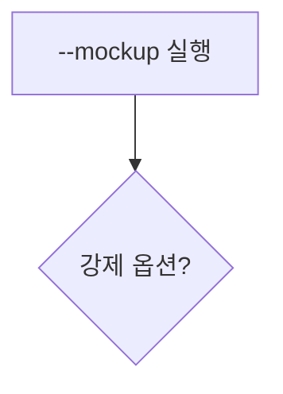
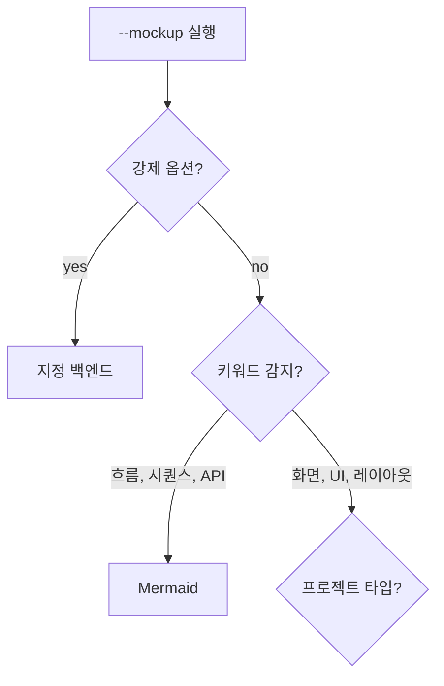
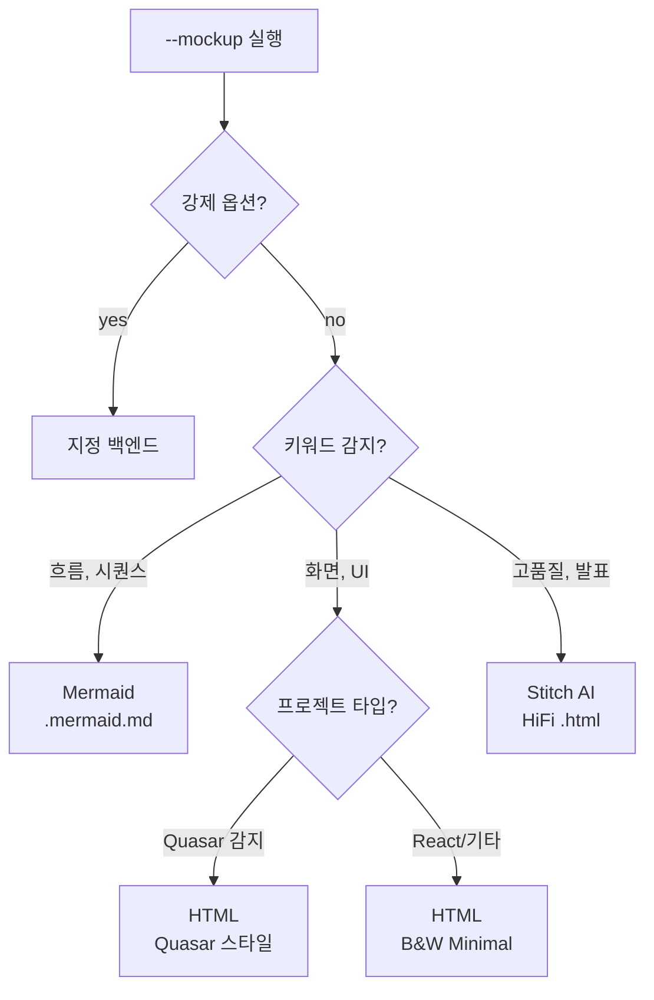
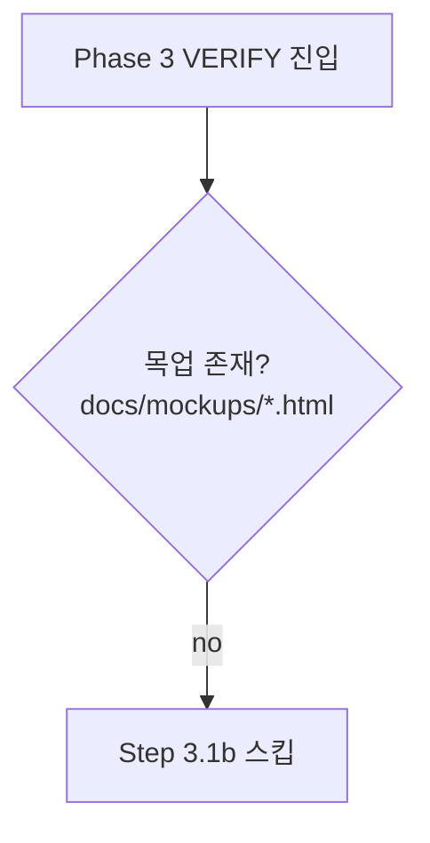
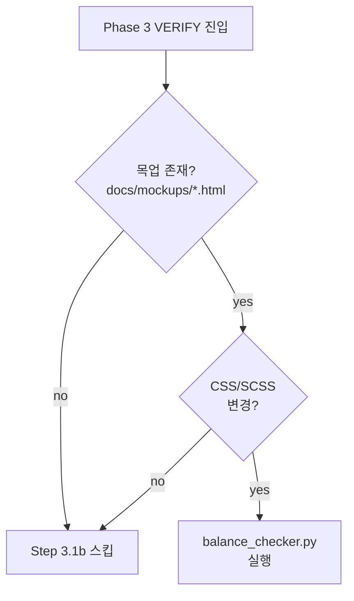
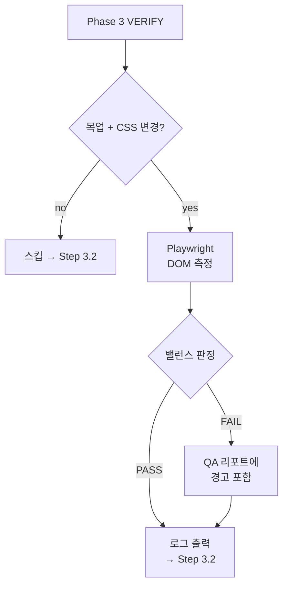
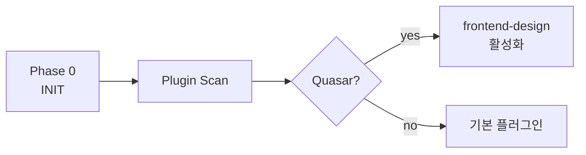
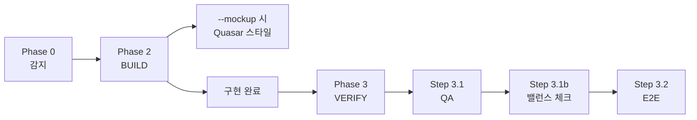
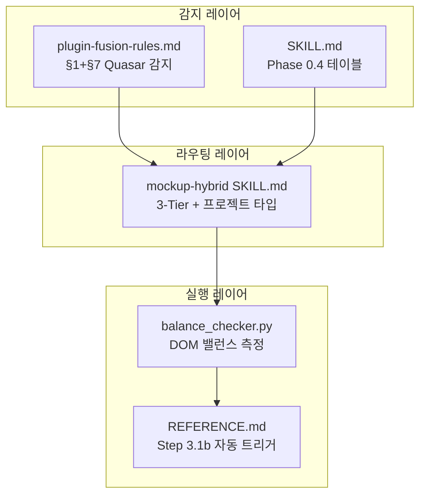

# UI 설계 워크플로우 자동화 — Mockup Diagrams

> 구현 범위: Quasar 자동 감지, `--mockup` 3-Tier 라우팅, UI Layout Verification (Step 3.1b)

---

## 1. `--mockup` 3-Tier 라우팅 (with Quasar 자동 감지)

사용자가 `--mockup`을 실행하면, 라우터가 6단계 우선순위로 최적 백엔드를 결정합니다.

### Stage 1: 진입점

`--mockup mermaid`, `--mockup html`, `--mockup hifi` 등 명시적 지정 여부를 먼저 확인합니다.

### Stage 2: 키워드 + 프로젝트 타입 분기

키워드가 UI/화면 계열이면, 프로젝트 타입을 추가 확인합니다.

### Stage 3: 완성 — Quasar 자동 감지 포함

> **[NEW]** Quasar 감지: `package.json` quasar dep 또는 `quasar.config.*` 존재 시 자동 적용. `--quasar` 명시 불필요.

---

## 2. UI Layout Verification (Phase 3 Step 3.1b)

CSS/SCSS 변경 + HTML 목업 존재 시 자동 실행되는 레이아웃 밸런스 검증입니다.

### Stage 1: 트리거 조건

### Stage 2: CSS 변경 확인

### Stage 3: 완성 — 측정 + 판정

**측정 항목 4가지:**

| 항목 | 기준 |
|------|------|
| 열 높이 편차 | ≤ 50px |
| 정보 밀도 편차 | ≤ 20% |
| 여백 비율 | 25-35% |
| 스크롤 필요 열 | ≤ 1개 |

---

## 3. 전체 통합 — /auto Phase 흐름 내 위치

### Stage 1: Phase 0 감지

### Stage 2: Phase 2-3 연결

> Phase 0에서 Quasar 감지 → Phase 2 `--mockup` 시 자동 스타일 적용 → Phase 3 목업 밸런스 자동 검증.

---

## 모듈 의존성

> 감지 → 라우팅 → 실행의 3레이어 구조. 각 레이어는 자료 결합도(1단계)로 연결.
