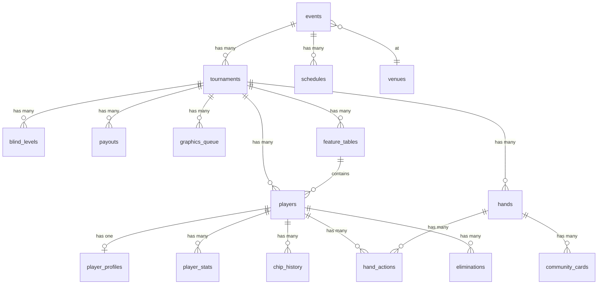

# PRD-0004 Part 3: Database Schema

**Part 3 of 7** | [← Data Sources](./02-data-sources.md) | [GFX Tables →](./04-gfx-tables.md)

> Index: [PRD-0004](../0004-prd-caption-database-schema.md)

---

## 3. Complete Database Schema

### 3.1 ERD Diagram (Mermaid)



### 3.2 테이블 목록 (20개)

| # | 테이블 | 설명 | PRD-0003 | 신규 | GFX |
|---|--------|------|:--------:|:----:|:---:|
| 1 | `events` | 이벤트 (WSOP LV, Cyprus 등) | O | - | - |
| 2 | `venues` | 장소 정보 | O | - | - |
| 3 | `tournaments` | 토너먼트 정보 | O | - | - |
| 4 | `players` | 플레이어 정보 | O | - | - |
| 5 | `player_profiles` | 플레이어 프로필 상세 | O | - | - |
| 6 | `player_stats` | 플레이어 통계 (VPIP, PFR) | O | - | O |
| 7 | `chip_history` | 칩 변동 히스토리 | O | - | O |
| 8 | `hand_actions` | 핸드 액션 로그 | O | - | O |
| 9 | `payouts` | 상금 구조 | O | - | - |
| 10 | `blind_levels` | 블라인드 레벨 | O | - | - |
| 11 | `graphics_queue` | 그래픽 큐 | O | - | - |
| 12 | `commentators` | 코멘테이터 정보 | O | - | - |
| 13 | `schedules` | 방송 스케줄 | O | - | - |
| 14 | `hands` | 핸드 메타정보 (GFX 확장) | - | **O** | O |
| 15 | `community_cards` | 커뮤니티 카드 | - | **O** | O |
| 16 | `feature_tables` | 피처 테이블 관리 | - | **O** | - |
| 17 | `eliminations` | 탈락 상세 정보 | - | **O** | O |
| 18 | `soft_contents` | 소프트 콘텐츠 큐 | - | **O** | - |
| 19 | `gfx_sessions` | **pokerGFX 세션 데이터** | - | **O** | O |
| 20 | `hand_players` | **핸드별 플레이어 상태** | - | **O** | O |

> **GFX**: pokerGFX JSON에서 데이터를 수신하는 테이블

---

## 4. Table Definitions - Core Tables (PRD-0003 확장)

### 4.1.1 events

```sql
CREATE TABLE events (
    id UUID PRIMARY KEY DEFAULT gen_random_uuid(),
    name VARCHAR(255) NOT NULL,
    event_code VARCHAR(50) UNIQUE NOT NULL,  -- 'WSOP_2026_LV', 'WSOP_2025_SC_CYPRUS'
    venue_id UUID REFERENCES venues(id),
    start_date DATE NOT NULL,
    end_date DATE NOT NULL,
    status VARCHAR(20) DEFAULT 'scheduled',  -- 'scheduled', 'running', 'completed'
    logo_url TEXT,
    sponsor_logos JSONB DEFAULT '[]',  -- [{"name": "LuxonPay", "url": "..."}]
    created_at TIMESTAMP DEFAULT CURRENT_TIMESTAMP,
    updated_at TIMESTAMP DEFAULT CURRENT_TIMESTAMP
);

CREATE INDEX idx_events_code ON events(event_code);
CREATE INDEX idx_events_status ON events(status);
```

**자막 매핑**: Event Name, Venue/Location, Broadcast Schedule

### 4.1.2 venues

```sql
CREATE TABLE venues (
    id UUID PRIMARY KEY DEFAULT gen_random_uuid(),
    name VARCHAR(255) NOT NULL,
    city VARCHAR(100),
    country CHAR(2),  -- ISO 3166-1 alpha-2
    address TEXT,
    drone_shot_url TEXT,  -- 드론샷 이미지/영상 URL
    photo_urls JSONB DEFAULT '[]',  -- 다양한 각도 사진
    created_at TIMESTAMP DEFAULT CURRENT_TIMESTAMP
);
```

**자막 매핑**: Venue/Location

### 4.1.3 tournaments

```sql
CREATE TABLE tournaments (
    id UUID PRIMARY KEY DEFAULT gen_random_uuid(),
    event_id UUID NOT NULL REFERENCES events(id) ON DELETE CASCADE,
    name VARCHAR(255) NOT NULL,
    buy_in DECIMAL(10,2) NOT NULL,
    starting_chips INTEGER NOT NULL,
    current_level INTEGER DEFAULT 1,
    current_day INTEGER DEFAULT 1,  -- Day 1, 2, 3, Final

    -- 참가자 정보
    registered_players INTEGER DEFAULT 0,
    remaining_players INTEGER DEFAULT 0,

    -- 상금 정보
    prize_pool DECIMAL(15,2) DEFAULT 0,
    bubble_line INTEGER,  -- ITM 진입 라인
    is_itm BOOLEAN DEFAULT FALSE,

    -- 등록 상태
    is_registration_open BOOLEAN DEFAULT TRUE,
    registration_closes_at TIMESTAMP,

    -- 평균 스택 (계산값)
    avg_stack INTEGER,

    status VARCHAR(20) DEFAULT 'scheduled',
    created_at TIMESTAMP DEFAULT CURRENT_TIMESTAMP,
    updated_at TIMESTAMP DEFAULT CURRENT_TIMESTAMP
);

CREATE INDEX idx_tournaments_event ON tournaments(event_id);
CREATE INDEX idx_tournaments_status ON tournaments(status);
CREATE INDEX idx_tournaments_day ON tournaments(current_day);
```

**자막 매핑**: Tournament Info, Event Info, Tournament Leaderboard, L-Bar

### 4.1.4 players

```sql
CREATE TABLE players (
    id UUID PRIMARY KEY DEFAULT gen_random_uuid(),
    tournament_id UUID NOT NULL REFERENCES tournaments(id) ON DELETE CASCADE,

    -- 기본 정보
    name VARCHAR(255) NOT NULL,
    nationality CHAR(2) NOT NULL,  -- ISO 3166-1 alpha-2
    photo_url TEXT,

    -- 칩/좌석 정보
    chips INTEGER NOT NULL DEFAULT 0,
    seat_number INTEGER,  -- 1-10
    table_number INTEGER,

    -- 피처 테이블 여부
    is_feature_table BOOLEAN DEFAULT FALSE,
    feature_table_id UUID REFERENCES feature_tables(id),

    -- 탈락 정보
    is_eliminated BOOLEAN DEFAULT FALSE,
    eliminated_at TIMESTAMP,
    final_rank INTEGER,
    payout_received DECIMAL(12,2),

    -- 순위 정보 (실시간 계산)
    current_rank INTEGER,
    rank_change INTEGER DEFAULT 0,  -- +/- from previous
    bb_count DECIMAL(10,2),  -- chips / big_blind
    avg_stack_percentage DECIMAL(6,2),  -- chips / avg_stack * 100

    registration_time TIMESTAMP DEFAULT CURRENT_TIMESTAMP,
    created_at TIMESTAMP DEFAULT CURRENT_TIMESTAMP,
    updated_at TIMESTAMP DEFAULT CURRENT_TIMESTAMP
);

CREATE INDEX idx_players_tournament ON players(tournament_id);
CREATE INDEX idx_players_chips ON players(chips DESC);
CREATE INDEX idx_players_table ON players(table_number, seat_number);
CREATE INDEX idx_players_feature ON players(is_feature_table) WHERE is_feature_table = TRUE;
CREATE INDEX idx_players_eliminated ON players(is_eliminated);
CREATE INDEX idx_players_rank ON players(current_rank);
```

**자막 매핑**:
- Tournament Leaderboard (chips, current_rank, rank_change, bb_count)
- Feature Table Leaderboard (chips, seat_number, nationality)
- Mini Chip Counts (chips, rank_change)
- At Risk of Elimination (chips, bb_count, current_rank)
- Elimination Banner (final_rank, payout_received)

### 4.1.5 player_profiles

```sql
CREATE TABLE player_profiles (
    id UUID PRIMARY KEY DEFAULT gen_random_uuid(),
    player_id UUID UNIQUE NOT NULL REFERENCES players(id) ON DELETE CASCADE,

    -- 외부 ID
    hendon_mob_id VARCHAR(50),
    gpi_id VARCHAR(50),

    -- WSOP 성적
    wsop_bracelets INTEGER DEFAULT 0,
    wsop_rings INTEGER DEFAULT 0,
    wsop_final_tables INTEGER DEFAULT 0,

    -- 전체 성적
    total_earnings DECIMAL(15,2) DEFAULT 0,
    final_tables INTEGER DEFAULT 0,

    -- 프로필 정보
    biography TEXT,
    notable_wins JSONB DEFAULT '[]',  -- [{"event": "...", "year": 2023, "prize": 1000000}]
    hometown VARCHAR(255),
    age INTEGER,
    profession VARCHAR(255),

    -- 소셜 링크
    social_links JSONB DEFAULT '{}',  -- {"twitter": "...", "instagram": "..."}

    -- 키플레이어 태그
    is_key_player BOOLEAN DEFAULT FALSE,
    key_player_reason TEXT,  -- "2-time bracelet winner", "Online qualifier"

    created_at TIMESTAMP DEFAULT CURRENT_TIMESTAMP,
    updated_at TIMESTAMP DEFAULT CURRENT_TIMESTAMP
);

CREATE INDEX idx_profiles_hendon ON player_profiles(hendon_mob_id);
CREATE INDEX idx_profiles_bracelets ON player_profiles(wsop_bracelets DESC);
CREATE INDEX idx_profiles_earnings ON player_profiles(total_earnings DESC);
CREATE INDEX idx_profiles_key_player ON player_profiles(is_key_player) WHERE is_key_player = TRUE;
```

**자막 매핑**:
- Player Profile (wsop_bracelets, total_earnings, hometown)
- Player Intro Card (biography, notable_wins, profession)
- Heads-Up Comparison (wsop_bracelets, total_earnings)

### 4.1.6 player_stats

```sql
CREATE TABLE player_stats (
    id UUID PRIMARY KEY DEFAULT gen_random_uuid(),
    player_id UUID NOT NULL REFERENCES players(id) ON DELETE CASCADE,
    tournament_id UUID NOT NULL REFERENCES tournaments(id) ON DELETE CASCADE,

    -- 핸드 통계
    hands_played INTEGER DEFAULT 0,
    hands_won INTEGER DEFAULT 0,

    -- VPIP/PFR (PRD-0001 4.2.4)
    vpip DECIMAL(5,2) DEFAULT 0,  -- Voluntarily Put $ In Pot (0-100%)
    pfr DECIMAL(5,2) DEFAULT 0,   -- Pre-Flop Raise (0-100%)

    -- 고급 통계
    aggression_factor DECIMAL(5,2),  -- (Bet + Raise) / Call
    showdown_win_rate DECIMAL(5,2),
    three_bet_percentage DECIMAL(5,2),
    fold_to_three_bet DECIMAL(5,2),
    c_bet_percentage DECIMAL(5,2),  -- Continuation Bet

    -- All-in 통계
    all_in_count INTEGER DEFAULT 0,
    all_in_won INTEGER DEFAULT 0,

    last_calculated_at TIMESTAMP DEFAULT CURRENT_TIMESTAMP,
    UNIQUE(player_id, tournament_id)
);

CREATE INDEX idx_stats_player ON player_stats(player_id);
CREATE INDEX idx_stats_vpip ON player_stats(vpip);
CREATE INDEX idx_stats_pfr ON player_stats(pfr);
```

**자막 매핑**:
- VPIP Stats (vpip, pfr)
- Heads-Up Comparison (aggression_factor, showdown_win_rate)

### 4.1.7 chip_history

```sql
CREATE TABLE chip_history (
    id UUID PRIMARY KEY DEFAULT gen_random_uuid(),
    player_id UUID NOT NULL REFERENCES players(id) ON DELETE CASCADE,
    tournament_id UUID NOT NULL REFERENCES tournaments(id) ON DELETE CASCADE,

    -- 핸드/레벨 정보
    hand_id UUID REFERENCES hands(id),
    hand_number INTEGER NOT NULL,
    level_number INTEGER NOT NULL,

    -- 칩 정보
    chips INTEGER NOT NULL,
    chips_change INTEGER DEFAULT 0,  -- +/- from previous hand

    -- 계산값
    bb_count DECIMAL(10,2),  -- chips / big_blind
    avg_stack_percentage DECIMAL(6,2),  -- chips / avg_stack * 100

    -- 데이터 소스
    source VARCHAR(20) DEFAULT 'rfid',  -- 'rfid', 'manual', 'csv'

    timestamp TIMESTAMP DEFAULT CURRENT_TIMESTAMP
);

CREATE INDEX idx_chip_history_player ON chip_history(player_id);
CREATE INDEX idx_chip_history_tournament ON chip_history(tournament_id);
CREATE INDEX idx_chip_history_hand ON chip_history(hand_number DESC);
CREATE INDEX idx_chip_history_timestamp ON chip_history(timestamp DESC);
CREATE INDEX idx_chip_history_player_recent ON chip_history(player_id, hand_number DESC);
```

**자막 매핑**:
- Chip Flow (최근 15개 레코드)
- Chip Comparison (2인 이상 비교)
- Chip Stack Bar (순위별 스택)

### 4.1.8 payouts

```sql
CREATE TABLE payouts (
    id UUID PRIMARY KEY DEFAULT gen_random_uuid(),
    tournament_id UUID NOT NULL REFERENCES tournaments(id) ON DELETE CASCADE,

    -- 순위 범위
    place_start INTEGER NOT NULL,  -- 1, 2, 3, 4 (for 4-5), 6 (for 6-9), ...
    place_end INTEGER NOT NULL,    -- 1, 2, 3, 5, 9, ...

    -- 상금 정보
    amount DECIMAL(12,2) NOT NULL,
    percentage DECIMAL(5,2),  -- of total prize pool

    -- 버블 표시
    is_current_bubble BOOLEAN DEFAULT FALSE,

    -- 달성 여부
    is_reached BOOLEAN DEFAULT FALSE,

    created_at TIMESTAMP DEFAULT CURRENT_TIMESTAMP,
    UNIQUE(tournament_id, place_start, place_end)
);

CREATE INDEX idx_payouts_tournament ON payouts(tournament_id);
CREATE INDEX idx_payouts_place ON payouts(place_start, place_end);
CREATE INDEX idx_payouts_bubble ON payouts(is_current_bubble) WHERE is_current_bubble = TRUE;
```

**자막 매핑**:
- Payouts (Main) (전체 상금 구조)
- Mini Payouts (현재/다음 페이점프)
- At Risk of Elimination (payout_at_risk)

### 4.1.9 blind_levels

```sql
CREATE TABLE blind_levels (
    id UUID PRIMARY KEY DEFAULT gen_random_uuid(),
    tournament_id UUID NOT NULL REFERENCES tournaments(id) ON DELETE CASCADE,

    -- 레벨 정보
    level_number INTEGER NOT NULL,
    small_blind INTEGER NOT NULL,
    big_blind INTEGER NOT NULL,
    ante INTEGER DEFAULT 0,
    big_blind_ante INTEGER DEFAULT 0,  -- BBA (Big Blind Ante)

    -- 시간 정보
    duration_minutes INTEGER NOT NULL,

    -- 브레이크
    is_break BOOLEAN DEFAULT FALSE,
    break_duration_minutes INTEGER,

    -- 상태
    is_current BOOLEAN DEFAULT FALSE,
    started_at TIMESTAMP,
    ends_at TIMESTAMP,

    created_at TIMESTAMP DEFAULT CURRENT_TIMESTAMP,
    UNIQUE(tournament_id, level_number)
);

CREATE INDEX idx_blinds_tournament ON blind_levels(tournament_id);
CREATE INDEX idx_blinds_level ON blind_levels(level_number);
CREATE INDEX idx_blinds_current ON blind_levels(is_current) WHERE is_current = TRUE;
```

**자막 매핑**:
- Blind Level (current_level, blinds, ante, duration)
- L-Bar (Standard) (blinds 정보)
- Chips In Play (칩 단위 계산 기준)

### 4.1.10 commentators

```sql
CREATE TABLE commentators (
    id UUID PRIMARY KEY DEFAULT gen_random_uuid(),

    -- 기본 정보
    name VARCHAR(255) NOT NULL,
    photo_url TEXT,

    -- 프로필
    credentials TEXT,  -- "WSOP Bracelet Winner", "Professional Poker Player"
    biography TEXT,

    -- 소셜 링크
    social_links JSONB DEFAULT '{}',

    -- 활성 상태
    is_active BOOLEAN DEFAULT TRUE,

    created_at TIMESTAMP DEFAULT CURRENT_TIMESTAMP
);
```

**자막 매핑**: Commentator Profile

### 4.1.11 schedules

```sql
CREATE TABLE schedules (
    id UUID PRIMARY KEY DEFAULT gen_random_uuid(),
    event_id UUID REFERENCES events(id) ON DELETE CASCADE,

    -- 스케줄 정보
    date DATE NOT NULL,
    time_start TIME NOT NULL,
    time_end TIME,
    event_name VARCHAR(255) NOT NULL,
    channel VARCHAR(100),

    -- 방송 상태
    is_live BOOLEAN DEFAULT FALSE,
    is_current BOOLEAN DEFAULT FALSE,  -- 현재 방송 중

    created_at TIMESTAMP DEFAULT CURRENT_TIMESTAMP
);

CREATE INDEX idx_schedules_event ON schedules(event_id);
CREATE INDEX idx_schedules_date ON schedules(date);
CREATE INDEX idx_schedules_current ON schedules(is_current) WHERE is_current = TRUE;
```

**자막 매핑**: Broadcast Schedule

### 4.1.12 graphics_queue

```sql
CREATE TABLE graphics_queue (
    id UUID PRIMARY KEY DEFAULT gen_random_uuid(),
    tournament_id UUID REFERENCES tournaments(id) ON DELETE SET NULL,

    -- 그래픽 정보
    graphic_type VARCHAR(50) NOT NULL,  -- 26개 자막 유형 코드
    trigger_event VARCHAR(50) NOT NULL,  -- 트리거 이벤트

    -- 데이터 페이로드
    payload JSONB NOT NULL DEFAULT '{}',

    -- 우선순위 (1 = 최고, 10 = 최저)
    priority INTEGER DEFAULT 5,

    -- 상태
    status VARCHAR(20) DEFAULT 'pending',  -- 'pending', 'rendering', 'displayed', 'dismissed', 'failed'
    error_message TEXT,

    -- 타임스탬프
    created_at TIMESTAMP DEFAULT CURRENT_TIMESTAMP,
    rendered_at TIMESTAMP,
    displayed_at TIMESTAMP,
    dismissed_at TIMESTAMP
);

CREATE INDEX idx_queue_tournament ON graphics_queue(tournament_id);
CREATE INDEX idx_queue_status ON graphics_queue(status);
CREATE INDEX idx_queue_priority ON graphics_queue(priority);
CREATE INDEX idx_queue_pending ON graphics_queue(status, priority, created_at) WHERE status = 'pending';
```

---

**Previous**: [← Part 2: Data Sources](./02-data-sources.md) | **Next**: [Part 4: GFX Tables →](./04-gfx-tables.md)
