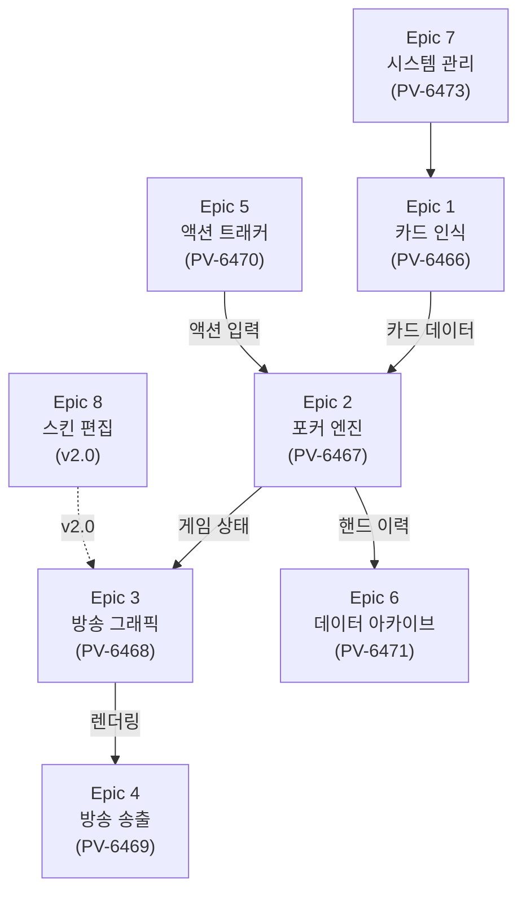

# EBS Epic 구조 재설계 — 기획자 관점

## 1. 개요

### 1.1 목적

현재 Jira PV 보드(PV-6466~PV-6473)의 7개 Epic은 개발자가 기술 모듈 단위로 설계한 구조다. 기획자 관점에서 "무엇을 만들어야 하는가"가 아니라 "어떤 기술 컴포넌트가 있는가"로 구성되어 있어, Settings UI 93개 요소와 Protocol 99개 명령이 Epic에 분배되지 않은 채 떠 있다.

이 문서는 기획자 관점에서 Epic을 8개로 재설계하고, 모든 UI 요소와 Protocol 명령을 도메인 Epic에 분배한다.

### 1.2 범위

| 포함 | 제외 |
|------|------|
| EBS 앱 개발 (GfxServer + ActionTracker + HandEvaluation) | 방송 준비 워크플로우 (운영 절차) |
| Settings UI 93개 요소 분배 | Story/Sub-task 상세 분해 |
| Protocol 99개 명령 분배 | Jira 이슈 생성 (승인 후 별도) |

### 1.3 v1.0 → v2.0 변경 요약

| 항목 | v1.0 | v2.0 |
|------|------|------|
| Epic 수 | 10개 (기존 7 + 신규 3) | 8개 (기존 7 확장 + 신규 1) |
| Settings UI | 별도 Epic A로 분리 | **도메인 Epic에 직접 분배** |
| Protocol | 별도 Epic C로 분리 | **도메인 Epic에 직접 분배** |
| Skin Editor | Epic B (v2.0) | Epic 8 (v2.0) — 동일 |
| 관점 | 기술 모듈 + UI/Protocol 별도 | **기획자 도메인 통합** |

---

## 2. 8-Epic 구조 요약

| # | Epic | Jira Key | 스코프 | Story 수 | Settings UI | Protocol |
|:-:|------|----------|:------:|:--------:|:-----------:|:--------:|
| 1 | 카드 인식 시스템 | PV-6512 | v1.0 | 6 | 5개 (Y-03~Y-07) | 12개 (Card+RFID) |
| 2 | 포커 게임 엔진 | PV-6519 | v1.0 | 8 | 9개 (Rules Tab) | 39개 (Game+Player+Betting) |
| 3 | 방송 그래픽 시스템 | PV-6528 | v1.0 | 8 | 37개 (GFX+Display) | 17개 (Display) |
| 4 | 방송 송출 파이프라인 | PV-6537 | v1.0 | 5 | 20개 (I/O Tab) | 13개 (Media) |
| 5 | 액션 트래커 | PV-6543 | v1.0 | 8 | 2개 (System-AT) | — |
| 6 | 데이터 아카이브 | PV-6552 | v1.0 | 4 | — | 3개 (History) |
| 7 | 시스템 관리 | PV-6557 | v1.0 | 5 | 20개 (Main+System-Admin) | 12개 (Connection+Slave) |
| 8 | 스킨 편집 시스템 | PV-6563 | v2.0 | 4 | — | — |
| | **합계** | | | **48** | **93** | **96+** |

> **기존 Epic 참조**: PV-6466~PV-6473 (v1.0 기술 모듈 단위). 신규 Epic은 기획자 관점 도메인 통합 재구조화.

---

## 3. Epic 상세

### 3.1 Epic 1: 카드 인식 시스템 (PV-6466 확장)

RFID 하드웨어 연동 + 카드 상태 추적 + 오류 복구 + RFID 설정 UI + 카드 관련 TCP 명령

| Story | 내용 | PRD 매핑 |
|-------|------|----------|
| 1.1 | RFID 리더기 연동 (Seat×10, Board, Muck) | §3 |
| 1.2 | 이중 연결 복구 (무선/유선 전환, 30초 재연결) | §3.2 |
| 1.3 | 카드 상태 머신 (5단계: DECK→DETECTED→DEALT→REVEALED/MUCKED) | §3.3 |
| 1.4 | 수동 복구 (52장 그리드, 재스캔, Miss Deal) | §3.4, §18 |
| 1.5 | RFID 장비 설정 UI (Y-03~Y-07) | UI PRD Ch.9 |
| 1.6 | 카드 관련 TCP 명령 처리 | Protocol: Card(9)+RFID(3) |

**Settings UI 분배** (5개): System Tab RFID 관련 Y-03~Y-07
**Protocol 분배** (12개): Card 9개 + RFID 3개

### 3.2 Epic 2: 포커 게임 엔진 (PV-6467 확장)

포커 규칙 적용 + 게임 상태 관리 + 베팅 + 핸드 평가 + 승률 계산 + 규칙 설정 UI + TCP 명령

| Story | 내용 | PRD 매핑 |
|-------|------|----------|
| 2.1 | 22개 포커 변형 규칙 (Community 12, Draw 7, Stud 3) | §4.1 |
| 2.2 | 게임 상태 전이 (Pre-flop~River, Draw/Stud 특화) | §4.2 |
| 2.3 | 베팅 구조 (NL/PL/FL + 7가지 Ante) | §4.3 |
| 2.4 | 특수 규칙 (Bomb Pot, Run It Twice) | §4.4 |
| 2.5 | 핸드 평가기 (Lookup Table, 3가지 평가 룰: High/Hi-Lo/Lowball) | §5 |
| 2.6 | 승률 계산 엔진 (시뮬레이션 분리, 스트리트별 재계산) | §5 |
| 2.7 | 규칙 설정 UI (Rules Tab G-32~G-56, 9개 요소) | UI PRD Ch.7 |
| 2.8 | 게임/플레이어/베팅 TCP 명령 처리 | Protocol: Game(13)+Player(21)+Betting(5) |

**Settings UI 분배** (9개): Rules Tab 전체
**Protocol 분배** (39개): Game 13개 + Player 21개 + Betting 5개

### 3.3 Epic 3: 방송 그래픽 시스템 (PV-6468 확장)

오버레이 렌더링 + 실시간 시각화 + 애니메이션 + 그래픽/디스플레이 설정 UI + TCP 명령

| Story | 내용 | PRD 매핑 |
|-------|------|----------|
| 3.1 | Player Info Panel 렌더링 | §6.1 |
| 3.2 | 홀카드/커뮤니티카드 표시 | §6.1 |
| 3.3 | Bottom Info Strip (블라인드, 팟) | §6.1 |
| 3.4 | Action Badge + 실시간 승률 바 | §6.2 |
| 3.5 | 11개 Animation Class 매핑 | §6.3 |
| 3.6 | 그래픽 설정 UI (GFX Tab, 24개 요소) | UI PRD Ch.6 |
| 3.7 | 디스플레이 설정 UI (Display Tab, 13개 요소) | UI PRD Ch.8 |
| 3.8 | 디스플레이 관련 TCP 명령 처리 | Protocol: Display(17) |

**Settings UI 분배** (37개): GFX Tab 24개 + Display Tab 13개
**Protocol 분배** (17개): Display 17개

### 3.4 Epic 4: 방송 송출 파이프라인 (PV-6469 확장)

NDI/HDMI/SDI 출력 + 외부 데이터 API + 입출력 설정 UI

| Story | 내용 | PRD 매핑 |
|-------|------|----------|
| 4.1 | NDI/HDMI 실시간 그래픽 합성 출력 | §7.1 |
| 4.2 | SDI 출력 해상도/프레임레이트 설정 | §7.1 |
| 4.3 | LiveApi 실시간 delta 스트리밍 | §7.2 |
| 4.4 | 핸드 단위 JSON Export + live_export 트리거 | §7.2 |
| 4.5 | 입출력 설정 UI (I/O Tab, 20개 요소) | UI PRD Ch.5 |

**Settings UI 분배** (20개): I/O Tab 전체
**Protocol 분배** (13개): Media 13개

### 3.5 Epic 5: 액션 트래커 (PV-6470 대폭 확장)

운영자 태블릿 클라이언트 — 기존 3 Stories → 8 Stories (UI PRD Ch.10 26개 기능 반영)

| Story | 내용 | PRD 매핑 |
|-------|------|----------|
| 5.1 | 서버 자동 검색 및 접속 | §8.3, AT-01~AT-03 |
| 5.2 | 덱 등록 (52장 UID 매핑) | §8.1, AT-04~AT-06 |
| 5.3 | 좌석별 플레이어 등록 + 칩 스택 | §8.1, AT-07~AT-10 |
| 5.4 | 베팅 금액 입력 UI | §8.2, AT-11~AT-14 |
| 5.5 | 플레이어 액션 조작 (Fold/Check/Call/Raise) | §8.2, AT-15~AT-18 |
| 5.6 | 게임 상태 동기화 (GameInfoResponse) | §8.3, AT-19~AT-22 |
| 5.7 | AT 전용 설정 (System Tab AT 관련 2개) | UI PRD Ch.9 |
| 5.8 | 오류 복구 인터페이스 (Miss Deal, 재스캔 연동) | AT-23~AT-26 |

**Settings UI 분배** (2개): System Tab AT 관련
**Protocol 분배**: 없음 (AT는 WebSocket 클라이언트, Epic 2/7의 Protocol 소비자)

### 3.6 Epic 6: 데이터 아카이브 (PV-6471 유지)

핸드 히스토리 + 리플레이 + Export + 통계

| Story | 내용 | PRD 매핑 |
|-------|------|----------|
| 6.1 | 핸드 히스토리 자동 저장 (메타+홀카드+보드+베팅) | §9.1 |
| 6.2 | Playback 리플레이 (타임라인 동기화, 크로마키) | §9.2 |
| 6.3 | 데이터 수동 편집 + CSV/JSON Export | §9.3 |
| 6.4 | 플레이어 통계 (VPIP, PFR, 3Bet%) + LIVE Stats API | §9.4 |

**Settings UI 분배**: 없음
**Protocol 분배** (3개): History 3개

### 3.7 Epic 7: 시스템 관리 (PV-6473 확장)

인증 + 라이선스 + 시스템 설정 + 메인 윈도우 + Connection/Slave 프로토콜

| Story | 내용 | PRD 매핑 |
|-------|------|----------|
| 7.1 | 로그인 인증 (관리자/운영자) | §10.1 |
| 7.2 | 라이선스 검증 및 활성화 | §10.1 |
| 7.3 | 서버 포트/네트워크/보안 설정 | §10.2, Y-01~Y-02 |
| 7.4 | 언어/백업/데이터 관리 | §10.2, Y-08~Y-13 |
| 7.5 | 메인 윈도우 (M-01~M-14) | UI PRD Ch.4 |

**Settings UI 분배** (20개): Main Window 14개 + System Tab 관리 6개 (Y-01~Y-02, Y-08~Y-13)
**Protocol 분배** (12개): Connection 9개 + Slave 3개

### 3.8 Epic 8: 스킨 편집 시스템 (신규 — v2.0)

Skin Editor 독립 도구 — UI PRD Ch.11 44개 요소

| Story | 내용 | PRD 매핑 |
|-------|------|----------|
| 8.1 | 좌표 편집기 (드래그&드롭 위치 조정) | SK-01~SK-12 |
| 8.2 | 폰트/색상 편집기 | SK-13~SK-24 |
| 8.3 | 프리셋 관리 (저장/불러오기/내보내기) | SK-25~SK-36 |
| 8.4 | 실시간 미리보기 | SK-37~SK-44 |

**Settings UI 분배**: 없음 (독립 도구)
**Protocol 분배**: 없음

---

## 4. Settings UI 93개 분배

| Tab | 요소 수 | 요소 범위 | 분배 Epic |
|-----|:-------:|----------|-----------|
| Main Window | 14 | M-01~M-14 | Epic 7 시스템 관리 |
| I/O Tab | 20 | S-xx + O-xx | Epic 4 방송 송출 |
| GFX Tab | 24 | G-01~G-22s | Epic 3 방송 그래픽 |
| Rules Tab | 9 | G-32~G-56 | Epic 2 포커 엔진 |
| Display Tab | 13 | G-40~G-51c | Epic 3 방송 그래픽 |
| System Tab — RFID | 5 | Y-03~Y-07 | Epic 1 카드 인식 |
| System Tab — AT | 2 | AT 관련 | Epic 5 액션 트래커 |
| System Tab — Admin | 6 | Y-01~Y-02, Y-08~Y-13 | Epic 7 시스템 관리 |
| **합계** | **93** | | **전수 분배 완료** |

---

## 5. Protocol 99개 분배

| 카테고리 | 명령 수 | 분배 Epic |
|---------|:-------:|-----------|
| Connection | 9 | Epic 7 시스템 관리 |
| Game | 13 | Epic 2 포커 엔진 |
| Player | 21 | Epic 2 포커 엔진 |
| Betting | 5 | Epic 2 포커 엔진 |
| Card | 9 | Epic 1 카드 인식 |
| RFID | 3 | Epic 1 카드 인식 |
| Display | 17 | Epic 3 방송 그래픽 |
| Media | 13 | Epic 4 방송 송출 |
| History | 3 | Epic 6 데이터 아카이브 |
| Slave | 3 | Epic 7 시스템 관리 |
| **합계** | **96+** | **전수 분배 완료** |

---

## 6. v1.0 / v2.0 스코프 분리

### 6.1 v1.0 Broadcast Ready (7 Epic)

| Epic | Jira Key | Story 수 |
|------|----------|:--------:|
| 카드 인식 시스템 | PV-6466 | 6 |
| 포커 게임 엔진 | PV-6467 | 8 |
| 방송 그래픽 시스템 | PV-6468 | 8 |
| 방송 송출 파이프라인 | PV-6469 | 5 |
| 액션 트래커 | PV-6470 | 8 |
| 데이터 아카이브 | PV-6471 | 4 |
| 시스템 관리 | PV-6473 | 5 |

### 6.2 v2.0 Operational Excellence (1 Epic)

| Epic | Jira Key | Story 수 |
|------|----------|:--------:|
| 스킨 편집 시스템 | 신규 생성 | 4 |

### 6.3 v2.0 Defer 요소

| 카테고리 | 요소 | 수량 |
|---------|------|:----:|
| Skin Editor | SK-01~SK-26 | 26 |
| Graphic Editor | GE 공통 10 + Player 8 | 18 |
| GFX Tab Defer | G-23(PIP), G-14s/G-15s(Skin), G-22s(Stats) | 4 |
| Rules Tab Defer | G-54(Rabbit Hunting), G-39(Nit Game) | 2 |
| Display Tab Defer | G-40~G-42(Outs), G-26~G-31(Leaderboard), G-37(Equities) | 12 |
| System Tab Defer | Y-08(HW Panel), Y-24(업데이트) | 2 |
| AT 특수 기능 | AT-022~AT-026 (TAG/CHOP/RUN IT/MISS DEAL) | 5 |

---

## 7. Epic 의존 관계

### 7.1 의존 그래프



### 7.2 권장 구현 순서

```
Phase 1 (병렬): Epic 7 시스템 관리 + Epic 1 카드 인식
Phase 2:        Epic 2 포커 게임 엔진
Phase 3 (병렬): Epic 3 방송 그래픽 + Epic 5 액션 트래커
Phase 4 (병렬): Epic 4 방송 송출 + Epic 6 데이터 아카이브
Phase 5 (v2.0): Epic 8 스킨 편집 시스템
```

### 7.3 병렬 실행 가능 조건

| Phase | 병렬 Epic | 조건 |
|:-----:|----------|------|
| 1 | 시스템 관리 + 카드 인식 | 독립 도메인 |
| 3 | 방송 그래픽 + 액션 트래커 | 엔진 vs 클라이언트, 인터페이스 계약만 공유 |
| 4 | 방송 송출 + 데이터 아카이브 | Output pipeline vs Data storage |

---

## 8. 구현 상태

| 항목 | 상태 | 비고 |
|------|:----:|------|
| v1.0 PRD (10-Epic) | ✅ 완료 | 아카이브 (이 문서 v1.0) |
| v2.0 PRD (8-Epic) 재설계 | ✅ 완료 | 기획자 관점 도메인 통합 |
| Settings UI 93개 전수 분배 | ✅ 완료 | 7개 Epic에 분배 |
| Protocol 96+개 전수 분배 | ✅ 완료 | 6개 Epic에 분배 |
| Jira 신규 Epic+Story 생성 | ✅ 완료 | 8 Epic (PV-6512~PV-6563) + 48 Story |
| 기존 Epic (PV-6466~PV-6473) | 📌 유지 | EDIT 권한 없음, 신규 Epic으로 대체 |
| Story Sub-task 상세 분해 | ⏳ 예정 | Epic 승인 후 별도 작업 |

---

## Changelog

| 날짜 | 버전 | 변경 내용 | 결정 근거 |
|------|------|-----------|----------|
| 2026-03-05 | v2.1 | Story 금지 규칙 추가 — Epic/작업만 허용 | Story 타입 대신 작업(11514) 사용 표준화 |
| 2026-03-05 | v2.0 | 10-Epic → 8-Epic 전면 재설계 | 기획자 관점 재구조화, Settings UI/Protocol 도메인 분배 |
| 2026-03-05 | v1.0 | 최초 작성 | pokergfx-prd-v2.md + EBS-UI-Design.md 교차 분석 |
