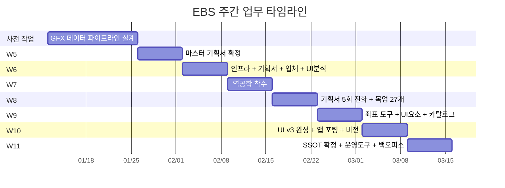
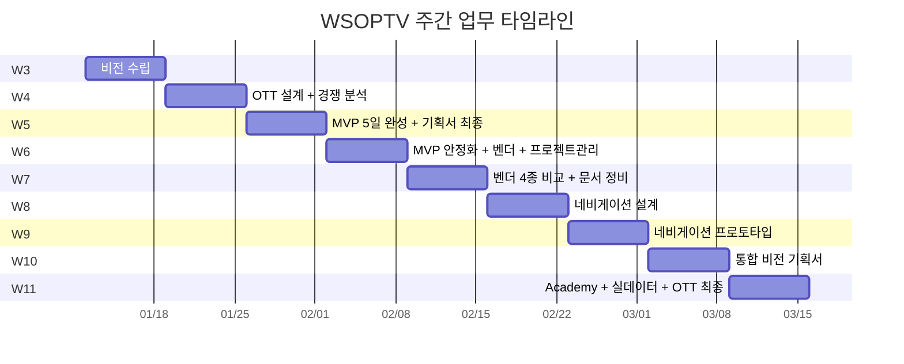

# 2026년 Q1 주간 업무 보고서

---

# Section A: EBS (1/26 공식 합류)

---

## 합류 전 사전 작업 (1/12~25)

| 업무 | 내용 |
|------|------|
| GFX 데이터 파이프라인 설계 | 방송 그래픽 JSON → 데이터베이스 → After Effects 자막 템플릿으로 이어지는 3계층 데이터 흐름 설계. 5계층 아키텍처 문서, ERD, 필드별 매핑 로직, 렌더링 제약조건 정의 |
| 파이프라인 대시보드 MVP | GFX 데이터 파이프라인 현황을 모니터링하는 대시보드 설계 및 프로토타입 개발 |
| 데이터 매핑 v2.0 재설계 | GFX → DB → AEP 3계층 매핑을 WSOP+ 및 Cuesheet까지 통합하여 재설계 |

---

## W5 (1/26~2/1) — 합류 + 프로젝트 기본 문서 확정

| 업무 | 내용 |
|------|------|
| 마스터 기획서 확정 | EBS 전체 프로젝트 마스터 기획서 v5.5.0 확정. 단계별 문서 구조 개편, MCU/RFID 하드웨어 선택 가이드, 하드웨어 입문 문서 대규모 개선 |

---

## W6 (2/2~8) — 인프라 설계 + 업체 컨택 + 기존 시스템 분석

| 업무 | 내용 |
|------|------|
| 시스템 인프라 설계 | EBS 인프라 아키텍처 전면 재설계. 개발 단계(Phase) 번호 체계 재정렬, 전체 문서 구조 정리 |
| 하드웨어 기획서 정비 | 중복 내용 제거(667→508줄), 초보자 하드웨어 가이드 재구성, 기획서 v9.0 전면 재작성, Google Drive 동기화 체계 확정 |
| 업체 RFI 및 견적 관리 | 업체 컨택 자동화 시스템 구축, RFI(정보 요청서) 회신 완료, SIT Korea RFI 초안 작성, 업체 관리 시스템 v6.0 |
| 기존 방송 시스템 UI 분석 | PokerGFX(기존 방송 그래픽 시스템) UI 분석 매뉴얼 v3.0 작성. 화면 요소별 annotated 오버레이 이미지 제작 |

---

## W7 (2/9~15) — 기존 시스템 역공학 시작

| 업무 | 내용 |
|------|------|
| 역공학 프로젝트 착수 (2/13) | 기존 PokerGFX 시스템의 RFID 카드 리더 + GUI 모니터링 코드 분석 착수. 역공학 스크립트 개발, 빌드 패키지 생성 |
| 역공학 기획서 초안 | 기존 시스템 클론 개발 기획서 작성(v1.0→v1.2). 비즈니스 맥락 반영, 기술 설계 초안, 문서 체계 수립 |

---

## W8 (2/16~22) — 역공학 기획서 대규모 진화 + 화면 목업 27개

| 업무 | 내용 |
|------|------|
| 역공학 기획서 5회 메이저 업데이트 | v7→v28: 용어 통일, **99개 명령어 카탈로그** 작성 + 용어 사전 분리, 구조 재편, 핵심 개념 재정의, 다이어그램 형식 변환(ASCII→Mermaid) |
| 인터페이스 설계 + 화면 목업 27개 | 기존 시스템의 모든 화면 인터페이스를 설계하고, **27개 HTML 목업**을 B&W 와이어프레임으로 제작, PNG 캡처 |
| 서버 UI 설계 | 서버 관리 화면 설계 + 목업 제작 |

---

## W9 (2/23~3/1) — 오버레이 좌표 측정 + UI 요소 설계 고도화

| 업무 | 내용 |
|------|------|
| 오버레이 좌표 정밀 측정 도구 개발 | 화면 오버레이 요소의 정확한 좌표를 측정하는 도구(coord-picker v2.0) 설계 및 구현 완료. 미검증 좌표 전체 제거 후 수동 재측정(10/11개), 표시 위치 최적화 |
| GFX 탭 UI 요소 설계 고도화 | 방송 화면 탭별 UI 요소 설계를 7회에 걸쳐 정밀 업데이트. 소스 순서 재정의, 해상도별 비교, 탭 순서 변경, 기존 매뉴얼 공식 설명 통합, 불필요 기능 정리(Keep/Drop/Defer), 문서 경량화(1755→1393줄) |
| 주요 화면 설계 스펙 3종 | 메인 윈도우 설계 스펙, 단계별 화면 요소 설계, 설계 시사점 분석 |
| 오버레이 분석 범위 확장 | Sources 탭 분석 박스 12→18개 확장, 6개 탭 재작업, 매뉴얼 v3.2 기반 참조 문서 |
| 역공학 기획서 v29 + 오류 복구 가이드 | 전체 시스템 구조 섹션 추가(v29.3.0), 오버레이 분석 실패 시 복구 절차 설계(v2.0) |
| UI 요소 카탈로그 전면 재설계 | 실제 화면 annotation 이미지 6개 반영, 참조 컬럼 통일, JSON 함수 정합성 확인 |

---

## W10 (3/2~8) — 신규 시스템 UI 설계 완성 + 앱 포팅 + 에코시스템 비전

| 업무 | 내용 |
|------|------|
| **EBS UI Design v3 완성** | 신규 시스템 UI 전면 재설계 — 9인 테이블 템플릿 + 오버레이 가장자리 배치. ASCII 와이어프레임 33개를 HTML/PNG 목업으로 교체. Console 설정 화면 4탭 + 목업 6종 신규 제작. 좌석 배치 템플릿 A-D 설계. 레거시 HTML 7개를 단일 소스로 통합 |
| **기존 시스템 Flutter 앱 포팅 완성** | 역설계 기반 7개 모듈(M1-M7) 전체 구현. 방송 파이프라인 연결, 7개 기능 화면 + 앱 라우터 구현(**앱 실행 가능 상태 달성**). 6탭 UI, RFID 카드 리더 TLS 연동 POC. **3대 핵심 문제 해결**: 패 평가 엔진 + 캔버스 렌더러 + 파일 기반 DB |
| EBS 에코시스템 비전 수립 | EBS를 독립 관리 플랫폼으로 포지셔닝하는 비전 문서 작성. 킥오프 기획서 v2.2(6단계 로드맵 시각화), 설계 원칙 확정(비디오 처리는 외부 위임, EBS는 순수 그래픽 렌더러) |
| Console 화면 Flutter 프로토타입 | EBS Console 관리 화면을 Flutter로 프로토타입 구현(24개 Dart 파일) |
| Sources 탭 설계 확장 | 오버레이 25→30개로 1:1 확장, 4개 문서 간 정합성 통일 |

---

## W11 (3/9~15) — UI 설계 최종 확정 + 운영 도구 설계 + 시스템 통합

| 업무 | 내용 |
|------|------|
| **EBS UI 설계 최종본(SSOT) 확정** | 신규 시스템 UI 설계 문서를 단일 정본(SSOT)으로 확정. 구버전 참조 통일, GFX 탭 순위표 컨트롤 추가, 기획서 3~6장을 별도 설계 문서로 분리 |
| **실시간 운영 도구(Action Tracker) 설계** | 방송 중 실시간 운영을 위한 Action Tracker 설계 문서 통합 신규 작성 |
| 백오피스 기획서 + 용어 체계 통합 | 백오피스(관리자 화면) 기획서 풀스펙 완성. 레거시 용어(PokerGFX)를 신규 용어(EBS)로 전면 교체(10개 파일, 42건) |

---

## EBS 주간 업무량 타임라인

---

---

# Section B: WSOPTV

---

## W3 (1/12~18) — 프로젝트 비전 수립

| 업무 | 내용 |
|------|------|
| WSOPTV 비전 문서 | 고급 시청 모드(Advanced Mode) 기획, 콘텐츠 전략 기획, 경영진 비전 노트 및 분석 보고서 작성 |
| 영문 기획서 시각화 | 기획서 내 Mermaid 다이어그램을 이미지로 변환하여 가독성 개선 |

---

## W4 (1/19~25) — OTT 플랫폼 설계 착수 + 경쟁사 분석

| 업무 | 내용 |
|------|------|
| 경쟁 OTT 플랫폼 분석 | NBA TV, Triton Poker Plus, WPT TV 3개 경쟁 서비스 상세 분석 보고서 작성 |
| **OTT 플랫폼 기획서 작성 (12회 업데이트)** | v5.0→v8.5: 3대 콘텐츠 원천 기반 설계, NBA League Pass 대응 구독 모델, 고급 시청 모드 분리, 전체 페이지 레이아웃, Multi-view 시청 방식(NBA TV 참고), 예능 카테고리 추가, 기획서 명칭 변경, Google Docs 동기화 |
| OTT 데이터베이스 설계 | WSOP 브랜드 기반 DB 스키마 v2.0 설계 |
| NBA TV 스타일 화면 목업 | OTT 솔루션 기획서 + B&W 와이어프레임, UX 흐름도, 오버레이 기반 분석 목업, 멀티뷰 화면 선택기 |

---

## W5 (1/26~2/1) — MVP 앱 초고속 개발 (5일)

| 업무 | 내용 |
|------|------|
| **WSOPTV MVP 앱 v1→v5 (5일 완성)** | 기획서 기반 POC 완성, 9개 솔루션 매트릭스, 멀티뷰/통계 화면 설계 6종, 픽셀 단위 규격 정의, NBA TV 레이아웃 클론 재설계, Flutter+Rive 애니메이션 프레임워크 전환, UI/UX v3→v5 전면 재설계, Vercel 배포 완료 |
| OTT 기획서 최종화 | v10.0 용어 재정의 + 문서 분리, WSOPTV Station 전체 아키텍처 설계, 경영진 요약에 실제 UI 이미지 반영 |

---

## W6 (2/2~8) — MVP 안정화 + 스트리밍 벤더 탐색

| 업무 | 내용 |
|------|------|
| MVP 앱 안정화 (v5.0→v5.3) | 비디오 재생 문제 디버깅(11회 수정), 비디오 에러 처리 개선, E2E 테스트 16/16 통과 확인, 정보 탭 실제 데이터 연동 |
| OTT 프로젝트 관리 체계 구축 | 일일 업무 동기화 시스템, Gmail/Slack 칸반보드 연동, 프로젝트 관리 도구 구축, Slack 자동 상태 업데이트 |
| Vimeo 스트리밍 벤더 평가 | Vimeo 기본 템플릿 기반 전략 수립, 시청 방식 용어 정의, Phase 1 와이어프레임, Vimeo 견적 분석 |

---

## W7 (2/9~15) — 스트리밍 벤더 4종 비교 분석

| 업무 | 내용 |
|------|------|
| **스트리밍 벤더 4종 비교** | Brightcove 인프라 대역폭 분석, **Vimeo vs Brightcove 상세 비교(v5-v7)**, CDN 대역폭 비용 추정(ABR 1.15x 적용), **AWS + 카테노이드** 티어별 견적 추가 |
| OTT 문서 구조 대정비 | 구버전 기획서/의사결정문서/전략/보고서 일괄 정리, 186개 파일 아카이브 이관, 폴더명 표준화(kebab→underscore) |

---

## W8 (2/16~22) — 화면 네비게이션 설계

| 업무 | 내용 |
|------|------|
| **WSOPTV 네비게이션 설계** | NBA TV 네비게이션 구조 분석, WSOPTV 화면 네비게이션 설계 전면 재검토(v3.0.1) |

---

## W9 (2/23~3/1) — 네비게이션 프로토타입 구현

| 업무 | 내용 |
|------|------|
| 네비게이션 프로토타입 완성 | 설계한 네비게이션 전략 v2.0을 HTML/CSS로 자립 실행 가능하게 구현 완료. 중복 다이어그램 정리, Mermaid 정규화 |

---

## W10 (3/2~8) — 전체 비전 재정립

| 업무 | 내용 |
|------|------|
| **WSOPTV 통합 비전 기획서 작성** | 기존 기획서 7건 아카이빙 후, GG Ecosystem 관점에서 **통합 비전 기획서(Foundation) 신규 작성** |
| OTT 기획서 구독자 중심 재설계 | 기존 기술 중심에서 구독자 중심으로 전면 재설계(v18.0.0) |

---

## W11 (3/9~15) — WSOP Academy + 실데이터 통합 + OTT 최종

| 업무 | 내용 |
|------|------|
| **WSOP Academy 프로모션 홈페이지** | 영문 홈페이지 신규 구현, v2.0 비주얼 리디자인, 품질 검수 26/28건 일괄 수정, Figma 디자인 에셋 통합 + CI/CD + E2E 자동 테스트, 프로모션 레퍼런스 리서치 |
| **WSOPLIVE 실데이터 → EBS 연동** | WSOP+ 실제 운영 데이터를 EBS가 활용할 수 있도록 DB API 통합 프로젝트 착수. Confluence 기반 기존 시스템 분석, 스키마/API 설계, EBS 적용 전략 기획서, 신규 입사자 교육 커리큘럼(2주 10일), 모노레포 구조 재편 |
| **OTT 기획서 최종판 완성** | WSOPTV OTT 기획서 v1.0.0 최종 확정 + Quasar White 스타일 화면 목업 10개 제작 |
| 스트리밍 벤더 중립화 | 특정 벤더(Vimeo) 종속 문서를 벤더 중립적으로 전환, Phase 1 문서 아카이브 이관 |

---

## WSOPTV 주간 업무량 타임라인

